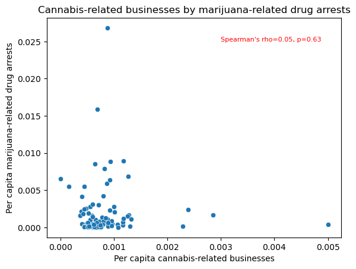

```python
# Import and select county-level data for analysis with cannabis businesses from the Association of Minnesota Counties.
# Specifically, we would like to compare the growth of cannabis businesses against population, economic, and social indicators.
# Removed asterisks and notes from worksheets.
# Renamed 

#From worksheet: Demographics
#2020 Population
#2020 Households
#Below Poverty Line: All Ages (2020) (Estimate)
#Percent Below Poverty Line: All Ages (2020) (Estimate)

#From worksheet: Taxes_State Aids:
#Total Tax (2020)
#Number of Businesses (2020)

#From worksheet: Public Safety
#Total Serious Crimes (2021)
#Drug Abuse Arrests: Marijuana (2020)
#Drug Abuse Arrests: Total (2020)

import pandas as pd
import numpy as py

# Load the data sheet from the Association of Minnesota Counties from multiple worksheets.
df1=pd.read_excel('Minnesota DataPile October 2022.xlsx', sheet_name='Demographics', usecols=['County', '2020 Population', '2020 Households', 'Percent Below Poverty Line: All Ages (2020 Estimate)'])
df2=pd.read_excel('Minnesota DataPile October 2022.xlsx', sheet_name='Taxes_State Aids', usecols=['County', 'Total Tax (2020)', 'Number of Businesses (2020)'])
df3=pd.read_excel('Minnesota DataPile October 2022.xlsx', sheet_name='Public Safety', usecols=['County', 'Total serious crimes (2021)', 'Drug Abuse Arrests: Marijuana (2020)', 'Drug Abuse Arrests: Total (2020)'])

# Merge df1 and df2
merged_df = pd.merge(df1, df2, on='County', how='outer')

# Merge the result with df3
county_df = pd.merge(merged_df, df3, on='County', how='outer')

print(county_df)


```

                 County  2020 Population  2020 Households  \
    0            Aitkin            15697             7199   
    1             Anoka           363887           133879   
    2            Becker            35183            14371   
    3          Beltrami            46228            17678   
    4            Benton            41379            16479   
    ..              ...              ...              ...   
    82         Watonwan            11253             4476   
    83           Wilkin             6506             2735   
    84           Winona            49671            20111   
    85           Wright           141337            50509   
    86  Yellow Medicine             9528             4040   
    
        Percent Below Poverty Line: All Ages (2020 Estimate)  Total Tax (2020)  \
    0                                            0.121807              9470509   
    1                                            0.055704            267942597   
    2                                            0.101981             27972843   
    3                                            0.176668             45388132   
    4                                            0.081128             35083441   
    ..                                                ...                  ...   
    82                                           0.121390              4251631   
    83                                           0.097295              1301824   
    84                                           0.126190             28700155   
    85                                           0.048402             97695190   
    86                                           0.092464              3352272   
    
        Number of Businesses (2020)  Total serious crimes (2021)  \
    0                           481                        242.0   
    1                          7297                       6642.0   
    2                           967                        451.0   
    3                          1169                       1659.0   
    4                           924                        510.0   
    ..                          ...                          ...   
    82                          276                        120.0   
    83                          138                         56.0   
    84                         1203                        873.0   
    85                         3363                       1024.0   
    86                          323                        103.0   
    
        Drug Abuse Arrests: Marijuana (2020)  Drug Abuse Arrests: Total (2020)  
    0                                     26                                86  
    1                                    162                               543  
    2                                     17                                53  
    3                                     33                               165  
    4                                     18                                33  
    ..                                   ...                               ...  
    82                                    28                                60  
    83                                    36                               108  
    84                                   315                               540  
    85                                    19                                31  
    86                                     4                                22  
    
    [87 rows x 9 columns]
    


```python
#Check counties
pd.set_option('display.max_rows', None)  # Show all rows
print(county_df['County'])
```

    0                Aitkin
    1                 Anoka
    2                Becker
    3              Beltrami
    4                Benton
    5             Big Stone
    6            Blue Earth
    7                 Brown
    8               Carlton
    9                Carver
    10                 Cass
    11             Chippewa
    12              Chisago
    13                 Clay
    14           Clearwater
    15                 Cook
    16           Cottonwood
    17            Crow Wing
    18               Dakota
    19                Dodge
    20              Douglas
    21            Faribault
    22             Fillmore
    23             Freeborn
    24              Goodhue
    25                Grant
    26             Hennepin
    27              Houston
    28              Hubbard
    29               Isanti
    30               Itasca
    31              Jackson
    32              Kanabec
    33            Kandiyohi
    34              Kittson
    35          Koochiching
    36        Lac qui Parle
    37                 Lake
    38    Lake of the Woods
    39             Le Sueur
    40              Lincoln
    41                 Lyon
    42             Mahnomen
    43             Marshall
    44               Martin
    45               McLeod
    46               Meeker
    47           Mille Lacs
    48             Morrison
    49                Mower
    50               Murray
    51             Nicollet
    52               Nobles
    53               Norman
    54              Olmsted
    55           Otter Tail
    56           Pennington
    57                 Pine
    58            Pipestone
    59                 Polk
    60                 Pope
    61               Ramsey
    62             Red Lake
    63              Redwood
    64             Renville
    65                 Rice
    66                 Rock
    67               Roseau
    68                Scott
    69            Sherburne
    70               Sibley
    71            St. Louis
    72              Stearns
    73               Steele
    74              Stevens
    75                Swift
    76                 Todd
    77             Traverse
    78              Wabasha
    79               Wadena
    80               Waseca
    81           Washington
    82             Watonwan
    83               Wilkin
    84               Winona
    85               Wright
    86      Yellow Medicine
    Name: County, dtype: object
    


```python
county_df.head()
```


<div>
<style scoped>
    .dataframe tbody tr th:only-of-type {
        vertical-align: middle;
    }

    .dataframe tbody tr th {
        vertical-align: top;
    }

    .dataframe thead th {
        text-align: right;
    }
</style>
<table border="1" class="dataframe">
  <thead>
    <tr style="text-align: right;">
      <th></th>
      <th>County</th>
      <th>2020 Population</th>
      <th>2020 Households</th>
      <th>Percent Below Poverty Line: All Ages (2020 Estimate)</th>
      <th>Total Tax (2020)</th>
      <th>Number of Businesses (2020)</th>
      <th>Total serious crimes (2021)</th>
      <th>Drug Abuse Arrests: Marijuana (2020)</th>
      <th>Drug Abuse Arrests: Total (2020)</th>
    </tr>
  </thead>
  <tbody>
    <tr>
      <th>0</th>
      <td>Aitkin</td>
      <td>15697</td>
      <td>7199</td>
      <td>0.121807</td>
      <td>9470509</td>
      <td>481</td>
      <td>242.0</td>
      <td>26</td>
      <td>86</td>
    </tr>
    <tr>
      <th>1</th>
      <td>Anoka</td>
      <td>363887</td>
      <td>133879</td>
      <td>0.055704</td>
      <td>267942597</td>
      <td>7297</td>
      <td>6642.0</td>
      <td>162</td>
      <td>543</td>
    </tr>
    <tr>
      <th>2</th>
      <td>Becker</td>
      <td>35183</td>
      <td>14371</td>
      <td>0.101981</td>
      <td>27972843</td>
      <td>967</td>
      <td>451.0</td>
      <td>17</td>
      <td>53</td>
    </tr>
    <tr>
      <th>3</th>
      <td>Beltrami</td>
      <td>46228</td>
      <td>17678</td>
      <td>0.176668</td>
      <td>45388132</td>
      <td>1169</td>
      <td>1659.0</td>
      <td>33</td>
      <td>165</td>
    </tr>
    <tr>
      <th>4</th>
      <td>Benton</td>
      <td>41379</td>
      <td>16479</td>
      <td>0.081128</td>
      <td>35083441</td>
      <td>924</td>
      <td>510.0</td>
      <td>18</td>
      <td>33</td>
    </tr>
  </tbody>
</table>
</div>


```python
df4=pd.read_csv('agg_regbus.csv')

# Merge the result with 
countycann_df = pd.merge(county_df, df4, on='County', how='outer')


```


```python
countycann_df.head()
```


<div>
<style scoped>
    .dataframe tbody tr th:only-of-type {
        vertical-align: middle;
    }

    .dataframe tbody tr th {
        vertical-align: top;
    }

    .dataframe thead th {
        text-align: right;
    }
</style>
<table border="1" class="dataframe">
  <thead>
    <tr style="text-align: right;">
      <th></th>
      <th>County</th>
      <th>2020 Population</th>
      <th>2020 Households</th>
      <th>Percent Below Poverty Line: All Ages (2020 Estimate)</th>
      <th>Total Tax (2020)</th>
      <th>Number of Businesses (2020)</th>
      <th>Total serious crimes (2021)</th>
      <th>Drug Abuse Arrests: Marijuana (2020)</th>
      <th>Drug Abuse Arrests: Total (2020)</th>
      <th>Business Name</th>
    </tr>
  </thead>
  <tbody>
    <tr>
      <th>0</th>
      <td>Aitkin</td>
      <td>15697.0</td>
      <td>7199.0</td>
      <td>0.121807</td>
      <td>9470509.0</td>
      <td>481.0</td>
      <td>242.0</td>
      <td>26.0</td>
      <td>86.0</td>
      <td>20.0</td>
    </tr>
    <tr>
      <th>1</th>
      <td>Anoka</td>
      <td>363887.0</td>
      <td>133879.0</td>
      <td>0.055704</td>
      <td>267942597.0</td>
      <td>7297.0</td>
      <td>6642.0</td>
      <td>162.0</td>
      <td>543.0</td>
      <td>223.0</td>
    </tr>
    <tr>
      <th>2</th>
      <td>Becker</td>
      <td>35183.0</td>
      <td>14371.0</td>
      <td>0.101981</td>
      <td>27972843.0</td>
      <td>967.0</td>
      <td>451.0</td>
      <td>17.0</td>
      <td>53.0</td>
      <td>34.0</td>
    </tr>
    <tr>
      <th>3</th>
      <td>Beltrami</td>
      <td>46228.0</td>
      <td>17678.0</td>
      <td>0.176668</td>
      <td>45388132.0</td>
      <td>1169.0</td>
      <td>1659.0</td>
      <td>33.0</td>
      <td>165.0</td>
      <td>39.0</td>
    </tr>
    <tr>
      <th>4</th>
      <td>Benton</td>
      <td>41379.0</td>
      <td>16479.0</td>
      <td>0.081128</td>
      <td>35083441.0</td>
      <td>924.0</td>
      <td>510.0</td>
      <td>18.0</td>
      <td>33.0</td>
      <td>25.0</td>
    </tr>
  </tbody>
</table>
</div>


```python
countycann_df.rename(columns={'2020 Population': 'Population', '2020 Households': 'Households', 'Percent Below Poverty Line: All Ages (2020 Estimate)': 'Poverty_Perc', 
                              'Total Tax (2020)': 'Sales_Tax', 'Number of Businesses (2020)': 'Businesses', 
                              'Total serious crimes (2021)': 'Total_crimes', 'Drug Abuse Arrests: Marijuana (2020)': 'Marijuana_DrugArrests', 
                              'Drug Abuse Arrests: Total (2020)': 'Total_DrugArrests', 'Business Name': 'Total_CannBus'}, inplace=True)

countycann_df.head()
```


<div>
<style scoped>
    .dataframe tbody tr th:only-of-type {
        vertical-align: middle;
    }

    .dataframe tbody tr th {
        vertical-align: top;
    }

    .dataframe thead th {
        text-align: right;
    }
</style>
<table border="1" class="dataframe">
  <thead>
    <tr style="text-align: right;">
      <th></th>
      <th>County</th>
      <th>Population</th>
      <th>Households</th>
      <th>Poverty_Perc</th>
      <th>Sales_Tax</th>
      <th>Businesses</th>
      <th>Total_crimes</th>
      <th>Marijuana_DrugArrests</th>
      <th>Total_DrugArrests</th>
      <th>Total_CannBus</th>
    </tr>
  </thead>
  <tbody>
    <tr>
      <th>0</th>
      <td>Aitkin</td>
      <td>15697.0</td>
      <td>7199.0</td>
      <td>0.121807</td>
      <td>9470509.0</td>
      <td>481.0</td>
      <td>242.0</td>
      <td>26.0</td>
      <td>86.0</td>
      <td>20.0</td>
    </tr>
    <tr>
      <th>1</th>
      <td>Anoka</td>
      <td>363887.0</td>
      <td>133879.0</td>
      <td>0.055704</td>
      <td>267942597.0</td>
      <td>7297.0</td>
      <td>6642.0</td>
      <td>162.0</td>
      <td>543.0</td>
      <td>223.0</td>
    </tr>
    <tr>
      <th>2</th>
      <td>Becker</td>
      <td>35183.0</td>
      <td>14371.0</td>
      <td>0.101981</td>
      <td>27972843.0</td>
      <td>967.0</td>
      <td>451.0</td>
      <td>17.0</td>
      <td>53.0</td>
      <td>34.0</td>
    </tr>
    <tr>
      <th>3</th>
      <td>Beltrami</td>
      <td>46228.0</td>
      <td>17678.0</td>
      <td>0.176668</td>
      <td>45388132.0</td>
      <td>1169.0</td>
      <td>1659.0</td>
      <td>33.0</td>
      <td>165.0</td>
      <td>39.0</td>
    </tr>
    <tr>
      <th>4</th>
      <td>Benton</td>
      <td>41379.0</td>
      <td>16479.0</td>
      <td>0.081128</td>
      <td>35083441.0</td>
      <td>924.0</td>
      <td>510.0</td>
      <td>18.0</td>
      <td>33.0</td>
      <td>25.0</td>
    </tr>
  </tbody>
</table>
</div>


```python
# Looking at the descriptive statistics for the data set, almost all indicators are heavily skewed because over 63% of the
# state's population lives in the Minneapolis-St. Paul Metropolitan Area with approximately 20% of the state's population living 
# in Hennepin County alone.
countycann_df.describe()
```


<div>
<style scoped>
    .dataframe tbody tr th:only-of-type {
        vertical-align: middle;
    }

    .dataframe tbody tr th {
        vertical-align: top;
    }

    .dataframe thead th {
        text-align: right;
    }
</style>
<table border="1" class="dataframe">
  <thead>
    <tr style="text-align: right;">
      <th></th>
      <th>Population</th>
      <th>Households</th>
      <th>Poverty_Perc</th>
      <th>Sales_Tax</th>
      <th>Businesses</th>
      <th>Total_crimes</th>
      <th>Marijuana_DrugArrests</th>
      <th>Total_DrugArrests</th>
      <th>Total_CannBus</th>
    </tr>
  </thead>
  <tbody>
    <tr>
      <th>count</th>
      <td>8.700000e+01</td>
      <td>87.000000</td>
      <td>87.000000</td>
      <td>8.700000e+01</td>
      <td>87.000000</td>
      <td>86.000000</td>
      <td>87.000000</td>
      <td>87.000000</td>
      <td>86.000000</td>
    </tr>
    <tr>
      <th>mean</th>
      <td>6.561394e+04</td>
      <td>25909.528736</td>
      <td>0.096179</td>
      <td>5.879315e+07</td>
      <td>1580.551724</td>
      <td>1562.546512</td>
      <td>62.632184</td>
      <td>165.724138</td>
      <td>49.151163</td>
    </tr>
    <tr>
      <th>std</th>
      <td>1.596184e+05</td>
      <td>64539.926591</td>
      <td>0.029108</td>
      <td>2.012913e+08</td>
      <td>3808.607997</td>
      <td>5641.053745</td>
      <td>129.843566</td>
      <td>344.764587</td>
      <td>123.385624</td>
    </tr>
    <tr>
      <th>min</th>
      <td>3.360000e+03</td>
      <td>1439.000000</td>
      <td>0.032510</td>
      <td>1.301824e+06</td>
      <td>102.000000</td>
      <td>4.000000</td>
      <td>0.000000</td>
      <td>1.000000</td>
      <td>1.000000</td>
    </tr>
    <tr>
      <th>25%</th>
      <td>1.107900e+04</td>
      <td>4573.500000</td>
      <td>0.075946</td>
      <td>5.178800e+06</td>
      <td>357.500000</td>
      <td>71.250000</td>
      <td>6.500000</td>
      <td>21.500000</td>
      <td>9.000000</td>
    </tr>
    <tr>
      <th>50%</th>
      <td>2.229000e+04</td>
      <td>8923.000000</td>
      <td>0.094384</td>
      <td>1.282542e+07</td>
      <td>670.000000</td>
      <td>220.000000</td>
      <td>17.000000</td>
      <td>57.000000</td>
      <td>18.000000</td>
    </tr>
    <tr>
      <th>75%</th>
      <td>4.437300e+04</td>
      <td>17378.500000</td>
      <td>0.115306</td>
      <td>3.120732e+07</td>
      <td>1186.000000</td>
      <td>764.000000</td>
      <td>59.500000</td>
      <td>167.000000</td>
      <td>38.500000</td>
    </tr>
    <tr>
      <th>max</th>
      <td>1.281565e+06</td>
      <td>528547.000000</td>
      <td>0.208834</td>
      <td>1.769021e+09</td>
      <td>32248.000000</td>
      <td>45545.000000</td>
      <td>992.000000</td>
      <td>2880.000000</td>
      <td>1029.000000</td>
    </tr>
  </tbody>
</table>
</div>


```python
countycann_df.isnull().sum()
# There are also some missing values.
```


    County                   0
    Population               1
    Households               1
    Poverty_Perc             1
    Sales_Tax                1
    Businesses               1
    Total_crimes             2
    Marijuana_DrugArrests    1
    Total_DrugArrests        1
    Total_CannBus            2
    dtype: int64


```python
#Since it's a small dataset, I will look to see where the missing values are.
#One problem is a county is named Saint Louis in one data set and St. Louis in another.
#Another problme is that Traverse County has no cannabis-related businesses so that is showing up as missing data. 

countycann_df
```


<div>
<style scoped>
    .dataframe tbody tr th:only-of-type {
        vertical-align: middle;
    }

    .dataframe tbody tr th {
        vertical-align: top;
    }

    .dataframe thead th {
        text-align: right;
    }
</style>
<table border="1" class="dataframe">
  <thead>
    <tr style="text-align: right;">
      <th></th>
      <th>County</th>
      <th>Population</th>
      <th>Households</th>
      <th>Poverty_Perc</th>
      <th>Sales_Tax</th>
      <th>Businesses</th>
      <th>Total_crimes</th>
      <th>Marijuana_DrugArrests</th>
      <th>Total_DrugArrests</th>
      <th>Total_CannBus</th>
    </tr>
  </thead>
  <tbody>
    <tr>
      <th>0</th>
      <td>Aitkin</td>
      <td>15697.0</td>
      <td>7199.0</td>
      <td>0.121807</td>
      <td>9.470509e+06</td>
      <td>481.0</td>
      <td>242.0</td>
      <td>26.0</td>
      <td>86.0</td>
      <td>20.0</td>
    </tr>
    <tr>
      <th>1</th>
      <td>Anoka</td>
      <td>363887.0</td>
      <td>133879.0</td>
      <td>0.055704</td>
      <td>2.679426e+08</td>
      <td>7297.0</td>
      <td>6642.0</td>
      <td>162.0</td>
      <td>543.0</td>
      <td>223.0</td>
    </tr>
    <tr>
      <th>2</th>
      <td>Becker</td>
      <td>35183.0</td>
      <td>14371.0</td>
      <td>0.101981</td>
      <td>2.797284e+07</td>
      <td>967.0</td>
      <td>451.0</td>
      <td>17.0</td>
      <td>53.0</td>
      <td>34.0</td>
    </tr>
    <tr>
      <th>3</th>
      <td>Beltrami</td>
      <td>46228.0</td>
      <td>17678.0</td>
      <td>0.176668</td>
      <td>4.538813e+07</td>
      <td>1169.0</td>
      <td>1659.0</td>
      <td>33.0</td>
      <td>165.0</td>
      <td>39.0</td>
    </tr>
    <tr>
      <th>4</th>
      <td>Benton</td>
      <td>41379.0</td>
      <td>16479.0</td>
      <td>0.081128</td>
      <td>3.508344e+07</td>
      <td>924.0</td>
      <td>510.0</td>
      <td>18.0</td>
      <td>33.0</td>
      <td>25.0</td>
    </tr>
    <tr>
      <th>5</th>
      <td>Big Stone</td>
      <td>5166.0</td>
      <td>2224.0</td>
      <td>0.115370</td>
      <td>1.870009e+06</td>
      <td>200.0</td>
      <td>60.0</td>
      <td>11.0</td>
      <td>14.0</td>
      <td>2.0</td>
    </tr>
    <tr>
      <th>6</th>
      <td>Blue Earth</td>
      <td>69112.0</td>
      <td>27193.0</td>
      <td>0.152072</td>
      <td>7.209664e+07</td>
      <td>1855.0</td>
      <td>1501.0</td>
      <td>144.0</td>
      <td>299.0</td>
      <td>70.0</td>
    </tr>
    <tr>
      <th>7</th>
      <td>Brown</td>
      <td>25912.0</td>
      <td>10970.0</td>
      <td>0.065105</td>
      <td>2.049685e+07</td>
      <td>783.0</td>
      <td>216.0</td>
      <td>14.0</td>
      <td>29.0</td>
      <td>13.0</td>
    </tr>
    <tr>
      <th>8</th>
      <td>Carlton</td>
      <td>36207.0</td>
      <td>13789.0</td>
      <td>0.101555</td>
      <td>1.807917e+07</td>
      <td>770.0</td>
      <td>442.0</td>
      <td>7.0</td>
      <td>50.0</td>
      <td>47.0</td>
    </tr>
    <tr>
      <th>9</th>
      <td>Carver</td>
      <td>106922.0</td>
      <td>38863.0</td>
      <td>0.032510</td>
      <td>6.401514e+07</td>
      <td>2428.0</td>
      <td>875.0</td>
      <td>112.0</td>
      <td>246.0</td>
      <td>70.0</td>
    </tr>
    <tr>
      <th>10</th>
      <td>Cass</td>
      <td>30066.0</td>
      <td>12614.0</td>
      <td>0.125557</td>
      <td>2.247913e+07</td>
      <td>1044.0</td>
      <td>396.0</td>
      <td>9.0</td>
      <td>70.0</td>
      <td>35.0</td>
    </tr>
    <tr>
      <th>11</th>
      <td>Chippewa</td>
      <td>12598.0</td>
      <td>5150.0</td>
      <td>0.090332</td>
      <td>8.099470e+06</td>
      <td>368.0</td>
      <td>7.0</td>
      <td>3.0</td>
      <td>8.0</td>
      <td>7.0</td>
    </tr>
    <tr>
      <th>12</th>
      <td>Chisago</td>
      <td>56621.0</td>
      <td>20900.0</td>
      <td>0.061638</td>
      <td>2.384225e+07</td>
      <td>1228.0</td>
      <td>666.0</td>
      <td>30.0</td>
      <td>61.0</td>
      <td>46.0</td>
    </tr>
    <tr>
      <th>13</th>
      <td>Clay</td>
      <td>65318.0</td>
      <td>24931.0</td>
      <td>0.119952</td>
      <td>3.036245e+07</td>
      <td>1063.0</td>
      <td>2045.0</td>
      <td>35.0</td>
      <td>121.0</td>
      <td>49.0</td>
    </tr>
    <tr>
      <th>14</th>
      <td>Clearwater</td>
      <td>8524.0</td>
      <td>3487.0</td>
      <td>0.145354</td>
      <td>3.501348e+06</td>
      <td>226.0</td>
      <td>67.0</td>
      <td>2.0</td>
      <td>3.0</td>
      <td>8.0</td>
    </tr>
    <tr>
      <th>15</th>
      <td>Cook</td>
      <td>5600.0</td>
      <td>2711.0</td>
      <td>0.096964</td>
      <td>8.480895e+06</td>
      <td>398.0</td>
      <td>58.0</td>
      <td>2.0</td>
      <td>3.0</td>
      <td>28.0</td>
    </tr>
    <tr>
      <th>16</th>
      <td>Cottonwood</td>
      <td>11517.0</td>
      <td>4671.0</td>
      <td>0.112442</td>
      <td>5.035504e+06</td>
      <td>356.0</td>
      <td>107.0</td>
      <td>10.0</td>
      <td>20.0</td>
      <td>11.0</td>
    </tr>
    <tr>
      <th>17</th>
      <td>Crow Wing</td>
      <td>66123.0</td>
      <td>27872.0</td>
      <td>0.096169</td>
      <td>8.604776e+07</td>
      <td>2331.0</td>
      <td>1071.0</td>
      <td>102.0</td>
      <td>255.0</td>
      <td>83.0</td>
    </tr>
    <tr>
      <th>18</th>
      <td>Dakota</td>
      <td>439882.0</td>
      <td>168008.0</td>
      <td>0.055640</td>
      <td>3.814711e+08</td>
      <td>8999.0</td>
      <td>9557.0</td>
      <td>290.0</td>
      <td>716.0</td>
      <td>223.0</td>
    </tr>
    <tr>
      <th>19</th>
      <td>Dodge</td>
      <td>20867.0</td>
      <td>7903.0</td>
      <td>0.047060</td>
      <td>8.270258e+06</td>
      <td>429.0</td>
      <td>196.0</td>
      <td>17.0</td>
      <td>53.0</td>
      <td>15.0</td>
    </tr>
    <tr>
      <th>20</th>
      <td>Douglas</td>
      <td>39006.0</td>
      <td>16557.0</td>
      <td>0.075142</td>
      <td>4.374868e+07</td>
      <td>1438.0</td>
      <td>491.0</td>
      <td>62.0</td>
      <td>243.0</td>
      <td>23.0</td>
    </tr>
    <tr>
      <th>21</th>
      <td>Faribault</td>
      <td>13921.0</td>
      <td>6086.0</td>
      <td>0.104375</td>
      <td>5.534870e+06</td>
      <td>436.0</td>
      <td>49.0</td>
      <td>5.0</td>
      <td>21.0</td>
      <td>6.0</td>
    </tr>
    <tr>
      <th>22</th>
      <td>Fillmore</td>
      <td>21228.0</td>
      <td>8605.0</td>
      <td>0.090588</td>
      <td>1.319767e+07</td>
      <td>701.0</td>
      <td>106.0</td>
      <td>0.0</td>
      <td>1.0</td>
      <td>13.0</td>
    </tr>
    <tr>
      <th>23</th>
      <td>Freeborn</td>
      <td>30895.0</td>
      <td>13076.0</td>
      <td>0.094384</td>
      <td>2.111853e+07</td>
      <td>819.0</td>
      <td>707.0</td>
      <td>34.0</td>
      <td>109.0</td>
      <td>27.0</td>
    </tr>
    <tr>
      <th>24</th>
      <td>Goodhue</td>
      <td>47582.0</td>
      <td>19499.0</td>
      <td>0.081943</td>
      <td>3.020361e+07</td>
      <td>1341.0</td>
      <td>847.0</td>
      <td>66.0</td>
      <td>146.0</td>
      <td>37.0</td>
    </tr>
    <tr>
      <th>25</th>
      <td>Grant</td>
      <td>6074.0</td>
      <td>2540.0</td>
      <td>0.091538</td>
      <td>3.271126e+06</td>
      <td>214.0</td>
      <td>4.0</td>
      <td>2.0</td>
      <td>5.0</td>
      <td>4.0</td>
    </tr>
    <tr>
      <th>26</th>
      <td>Hennepin</td>
      <td>1281565.0</td>
      <td>528547.0</td>
      <td>0.097743</td>
      <td>1.769021e+09</td>
      <td>32248.0</td>
      <td>45545.0</td>
      <td>992.0</td>
      <td>2880.0</td>
      <td>1029.0</td>
    </tr>
    <tr>
      <th>27</th>
      <td>Houston</td>
      <td>18843.0</td>
      <td>8013.0</td>
      <td>0.073927</td>
      <td>5.879341e+06</td>
      <td>471.0</td>
      <td>113.0</td>
      <td>14.0</td>
      <td>39.0</td>
      <td>22.0</td>
    </tr>
    <tr>
      <th>28</th>
      <td>Hubbard</td>
      <td>21344.0</td>
      <td>8885.0</td>
      <td>0.111460</td>
      <td>1.389392e+07</td>
      <td>707.0</td>
      <td>307.0</td>
      <td>91.0</td>
      <td>204.0</td>
      <td>17.0</td>
    </tr>
    <tr>
      <th>29</th>
      <td>Isanti</td>
      <td>41135.0</td>
      <td>15615.0</td>
      <td>0.072663</td>
      <td>3.284880e+07</td>
      <td>947.0</td>
      <td>783.0</td>
      <td>25.0</td>
      <td>117.0</td>
      <td>28.0</td>
    </tr>
    <tr>
      <th>30</th>
      <td>Itasca</td>
      <td>45014.0</td>
      <td>18968.0</td>
      <td>0.120296</td>
      <td>3.077557e+07</td>
      <td>1244.0</td>
      <td>307.0</td>
      <td>16.0</td>
      <td>80.0</td>
      <td>48.0</td>
    </tr>
    <tr>
      <th>31</th>
      <td>Jackson</td>
      <td>9989.0</td>
      <td>4307.0</td>
      <td>0.073180</td>
      <td>5.081199e+06</td>
      <td>398.0</td>
      <td>31.0</td>
      <td>5.0</td>
      <td>19.0</td>
      <td>9.0</td>
    </tr>
    <tr>
      <th>32</th>
      <td>Kanabec</td>
      <td>16032.0</td>
      <td>6530.0</td>
      <td>0.093875</td>
      <td>5.920621e+06</td>
      <td>367.0</td>
      <td>81.0</td>
      <td>0.0</td>
      <td>3.0</td>
      <td>12.0</td>
    </tr>
    <tr>
      <th>33</th>
      <td>Kandiyohi</td>
      <td>43732.0</td>
      <td>17079.0</td>
      <td>0.098806</td>
      <td>4.304423e+07</td>
      <td>1214.0</td>
      <td>831.0</td>
      <td>83.0</td>
      <td>285.0</td>
      <td>23.0</td>
    </tr>
    <tr>
      <th>34</th>
      <td>Kittson</td>
      <td>4207.0</td>
      <td>1846.0</td>
      <td>0.116473</td>
      <td>1.901161e+06</td>
      <td>153.0</td>
      <td>9.0</td>
      <td>7.0</td>
      <td>43.0</td>
      <td>12.0</td>
    </tr>
    <tr>
      <th>35</th>
      <td>Koochiching</td>
      <td>12062.0</td>
      <td>5604.0</td>
      <td>0.121290</td>
      <td>7.145964e+06</td>
      <td>364.0</td>
      <td>156.0</td>
      <td>0.0</td>
      <td>2.0</td>
      <td>13.0</td>
    </tr>
    <tr>
      <th>36</th>
      <td>Lac qui Parle</td>
      <td>6719.0</td>
      <td>2954.0</td>
      <td>0.087662</td>
      <td>2.303964e+06</td>
      <td>241.0</td>
      <td>34.0</td>
      <td>1.0</td>
      <td>5.0</td>
      <td>6.0</td>
    </tr>
    <tr>
      <th>37</th>
      <td>Lake</td>
      <td>10905.0</td>
      <td>4869.0</td>
      <td>0.076020</td>
      <td>8.563339e+06</td>
      <td>418.0</td>
      <td>56.0</td>
      <td>2.0</td>
      <td>6.0</td>
      <td>25.0</td>
    </tr>
    <tr>
      <th>38</th>
      <td>Lake of the Woods</td>
      <td>3763.0</td>
      <td>1745.0</td>
      <td>0.096466</td>
      <td>4.936857e+06</td>
      <td>213.0</td>
      <td>NaN</td>
      <td>9.0</td>
      <td>61.0</td>
      <td>9.0</td>
    </tr>
    <tr>
      <th>39</th>
      <td>Le Sueur</td>
      <td>28674.0</td>
      <td>11287.0</td>
      <td>0.079096</td>
      <td>1.155788e+07</td>
      <td>753.0</td>
      <td>201.0</td>
      <td>2.0</td>
      <td>4.0</td>
      <td>18.0</td>
    </tr>
    <tr>
      <th>40</th>
      <td>Lincoln</td>
      <td>5640.0</td>
      <td>2452.0</td>
      <td>0.109043</td>
      <td>2.712791e+06</td>
      <td>211.0</td>
      <td>18.0</td>
      <td>17.0</td>
      <td>43.0</td>
      <td>4.0</td>
    </tr>
    <tr>
      <th>41</th>
      <td>Lyon</td>
      <td>25269.0</td>
      <td>10137.0</td>
      <td>0.125252</td>
      <td>2.536655e+07</td>
      <td>730.0</td>
      <td>224.0</td>
      <td>65.0</td>
      <td>129.0</td>
      <td>12.0</td>
    </tr>
    <tr>
      <th>42</th>
      <td>Mahnomen</td>
      <td>5411.0</td>
      <td>2014.0</td>
      <td>0.208834</td>
      <td>3.690860e+06</td>
      <td>115.0</td>
      <td>68.0</td>
      <td>15.0</td>
      <td>57.0</td>
      <td>3.0</td>
    </tr>
    <tr>
      <th>43</th>
      <td>Marshall</td>
      <td>9040.0</td>
      <td>3836.0</td>
      <td>0.070133</td>
      <td>3.549591e+06</td>
      <td>240.0</td>
      <td>41.0</td>
      <td>10.0</td>
      <td>44.0</td>
      <td>12.0</td>
    </tr>
    <tr>
      <th>44</th>
      <td>Martin</td>
      <td>20025.0</td>
      <td>8748.0</td>
      <td>0.126042</td>
      <td>1.240133e+07</td>
      <td>622.0</td>
      <td>187.0</td>
      <td>10.0</td>
      <td>179.0</td>
      <td>8.0</td>
    </tr>
    <tr>
      <th>45</th>
      <td>McLeod</td>
      <td>36771.0</td>
      <td>15004.0</td>
      <td>0.068723</td>
      <td>2.663848e+07</td>
      <td>946.0</td>
      <td>434.0</td>
      <td>3.0</td>
      <td>7.0</td>
      <td>23.0</td>
    </tr>
    <tr>
      <th>46</th>
      <td>Meeker</td>
      <td>23400.0</td>
      <td>9263.0</td>
      <td>0.065855</td>
      <td>1.526442e+07</td>
      <td>624.0</td>
      <td>253.0</td>
      <td>24.0</td>
      <td>55.0</td>
      <td>13.0</td>
    </tr>
    <tr>
      <th>47</th>
      <td>Mille Lacs</td>
      <td>26459.0</td>
      <td>10593.0</td>
      <td>0.106240</td>
      <td>1.630407e+07</td>
      <td>675.0</td>
      <td>679.0</td>
      <td>37.0</td>
      <td>115.0</td>
      <td>16.0</td>
    </tr>
    <tr>
      <th>48</th>
      <td>Morrison</td>
      <td>34010.0</td>
      <td>13688.0</td>
      <td>0.098765</td>
      <td>1.804770e+07</td>
      <td>1003.0</td>
      <td>570.0</td>
      <td>1.0</td>
      <td>2.0</td>
      <td>18.0</td>
    </tr>
    <tr>
      <th>49</th>
      <td>Mower</td>
      <td>40029.0</td>
      <td>15700.0</td>
      <td>0.131829</td>
      <td>1.887791e+07</td>
      <td>809.0</td>
      <td>808.0</td>
      <td>52.0</td>
      <td>124.0</td>
      <td>34.0</td>
    </tr>
    <tr>
      <th>50</th>
      <td>Murray</td>
      <td>8179.0</td>
      <td>3581.0</td>
      <td>0.069935</td>
      <td>3.283575e+06</td>
      <td>301.0</td>
      <td>27.0</td>
      <td>13.0</td>
      <td>91.0</td>
      <td>3.0</td>
    </tr>
    <tr>
      <th>51</th>
      <td>Nicollet</td>
      <td>34454.0</td>
      <td>12728.0</td>
      <td>0.078336</td>
      <td>1.404796e+07</td>
      <td>670.0</td>
      <td>421.0</td>
      <td>1.0</td>
      <td>5.0</td>
      <td>23.0</td>
    </tr>
    <tr>
      <th>52</th>
      <td>Nobles</td>
      <td>22290.0</td>
      <td>7851.0</td>
      <td>0.115523</td>
      <td>1.370935e+07</td>
      <td>550.0</td>
      <td>191.0</td>
      <td>123.0</td>
      <td>363.0</td>
      <td>10.0</td>
    </tr>
    <tr>
      <th>53</th>
      <td>Norman</td>
      <td>6441.0</td>
      <td>2733.0</td>
      <td>0.091601</td>
      <td>2.762739e+06</td>
      <td>185.0</td>
      <td>63.0</td>
      <td>57.0</td>
      <td>169.0</td>
      <td>6.0</td>
    </tr>
    <tr>
      <th>54</th>
      <td>Olmsted</td>
      <td>162847.0</td>
      <td>65242.0</td>
      <td>0.076004</td>
      <td>1.572277e+08</td>
      <td>3403.0</td>
      <td>3179.0</td>
      <td>15.0</td>
      <td>56.0</td>
      <td>117.0</td>
    </tr>
    <tr>
      <th>55</th>
      <td>Otter Tail</td>
      <td>60081.0</td>
      <td>25123.0</td>
      <td>0.083521</td>
      <td>5.280998e+07</td>
      <td>1815.0</td>
      <td>606.0</td>
      <td>4.0</td>
      <td>83.0</td>
      <td>42.0</td>
    </tr>
    <tr>
      <th>56</th>
      <td>Pennington</td>
      <td>13992.0</td>
      <td>6077.0</td>
      <td>0.104774</td>
      <td>1.282542e+07</td>
      <td>359.0</td>
      <td>207.0</td>
      <td>5.0</td>
      <td>44.0</td>
      <td>11.0</td>
    </tr>
    <tr>
      <th>57</th>
      <td>Pine</td>
      <td>28876.0</td>
      <td>11442.0</td>
      <td>0.100914</td>
      <td>1.202572e+07</td>
      <td>702.0</td>
      <td>616.0</td>
      <td>81.0</td>
      <td>237.0</td>
      <td>29.0</td>
    </tr>
    <tr>
      <th>58</th>
      <td>Pipestone</td>
      <td>9424.0</td>
      <td>3948.0</td>
      <td>0.098154</td>
      <td>4.549692e+06</td>
      <td>299.0</td>
      <td>45.0</td>
      <td>17.0</td>
      <td>25.0</td>
      <td>4.0</td>
    </tr>
    <tr>
      <th>59</th>
      <td>Polk</td>
      <td>31192.0</td>
      <td>12534.0</td>
      <td>0.114228</td>
      <td>1.401611e+07</td>
      <td>706.0</td>
      <td>285.0</td>
      <td>185.0</td>
      <td>651.0</td>
      <td>27.0</td>
    </tr>
    <tr>
      <th>60</th>
      <td>Pope</td>
      <td>11308.0</td>
      <td>4862.0</td>
      <td>0.080916</td>
      <td>5.681456e+06</td>
      <td>354.0</td>
      <td>82.0</td>
      <td>2.0</td>
      <td>11.0</td>
      <td>5.0</td>
    </tr>
    <tr>
      <th>61</th>
      <td>Ramsey</td>
      <td>552352.0</td>
      <td>218077.0</td>
      <td>0.129423</td>
      <td>5.048308e+08</td>
      <td>11271.0</td>
      <td>24233.0</td>
      <td>23.0</td>
      <td>46.0</td>
      <td>418.0</td>
    </tr>
    <tr>
      <th>62</th>
      <td>Red Lake</td>
      <td>3935.0</td>
      <td>1653.0</td>
      <td>0.108513</td>
      <td>2.095928e+06</td>
      <td>102.0</td>
      <td>5.0</td>
      <td>27.0</td>
      <td>60.0</td>
      <td>5.0</td>
    </tr>
    <tr>
      <th>63</th>
      <td>Redwood</td>
      <td>15425.0</td>
      <td>6318.0</td>
      <td>0.089854</td>
      <td>9.577056e+06</td>
      <td>499.0</td>
      <td>194.0</td>
      <td>132.0</td>
      <td>278.0</td>
      <td>10.0</td>
    </tr>
    <tr>
      <th>64</th>
      <td>Renville</td>
      <td>14723.0</td>
      <td>6153.0</td>
      <td>0.093255</td>
      <td>5.085911e+06</td>
      <td>416.0</td>
      <td>165.0</td>
      <td>1.0</td>
      <td>8.0</td>
      <td>8.0</td>
    </tr>
    <tr>
      <th>65</th>
      <td>Rice</td>
      <td>67097.0</td>
      <td>23416.0</td>
      <td>0.088037</td>
      <td>3.446224e+07</td>
      <td>1467.0</td>
      <td>818.0</td>
      <td>10.0</td>
      <td>26.0</td>
      <td>40.0</td>
    </tr>
    <tr>
      <th>66</th>
      <td>Rock</td>
      <td>9704.0</td>
      <td>3892.0</td>
      <td>0.089448</td>
      <td>3.616212e+06</td>
      <td>275.0</td>
      <td>51.0</td>
      <td>77.0</td>
      <td>404.0</td>
      <td>8.0</td>
    </tr>
    <tr>
      <th>67</th>
      <td>Roseau</td>
      <td>15331.0</td>
      <td>6340.0</td>
      <td>0.073903</td>
      <td>8.439028e+06</td>
      <td>437.0</td>
      <td>111.0</td>
      <td>137.0</td>
      <td>529.0</td>
      <td>18.0</td>
    </tr>
    <tr>
      <th>68</th>
      <td>Saint Louis</td>
      <td>NaN</td>
      <td>NaN</td>
      <td>NaN</td>
      <td>NaN</td>
      <td>NaN</td>
      <td>NaN</td>
      <td>NaN</td>
      <td>NaN</td>
      <td>237.0</td>
    </tr>
    <tr>
      <th>69</th>
      <td>Scott</td>
      <td>150928.0</td>
      <td>52645.0</td>
      <td>0.051018</td>
      <td>1.022730e+08</td>
      <td>3093.0</td>
      <td>2559.0</td>
      <td>8.0</td>
      <td>17.0</td>
      <td>67.0</td>
    </tr>
    <tr>
      <th>70</th>
      <td>Sherburne</td>
      <td>97183.0</td>
      <td>34035.0</td>
      <td>0.050966</td>
      <td>6.114554e+07</td>
      <td>2174.0</td>
      <td>847.0</td>
      <td>304.0</td>
      <td>699.0</td>
      <td>58.0</td>
    </tr>
    <tr>
      <th>71</th>
      <td>Sibley</td>
      <td>14836.0</td>
      <td>5989.0</td>
      <td>0.074818</td>
      <td>3.417308e+06</td>
      <td>406.0</td>
      <td>52.0</td>
      <td>398.0</td>
      <td>588.0</td>
      <td>13.0</td>
    </tr>
    <tr>
      <th>72</th>
      <td>St. Louis</td>
      <td>200231.0</td>
      <td>86540.0</td>
      <td>0.131633</td>
      <td>1.776540e+08</td>
      <td>5144.0</td>
      <td>5800.0</td>
      <td>245.0</td>
      <td>401.0</td>
      <td>NaN</td>
    </tr>
    <tr>
      <th>73</th>
      <td>Stearns</td>
      <td>160211.0</td>
      <td>60587.0</td>
      <td>0.115242</td>
      <td>1.548148e+08</td>
      <td>4270.0</td>
      <td>4621.0</td>
      <td>45.0</td>
      <td>92.0</td>
      <td>120.0</td>
    </tr>
    <tr>
      <th>74</th>
      <td>Steele</td>
      <td>37406.0</td>
      <td>14823.0</td>
      <td>0.077180</td>
      <td>3.163907e+07</td>
      <td>993.0</td>
      <td>374.0</td>
      <td>10.0</td>
      <td>13.0</td>
      <td>36.0</td>
    </tr>
    <tr>
      <th>75</th>
      <td>Stevens</td>
      <td>9671.0</td>
      <td>3697.0</td>
      <td>0.122428</td>
      <td>9.466972e+06</td>
      <td>298.0</td>
      <td>109.0</td>
      <td>6.0</td>
      <td>27.0</td>
      <td>5.0</td>
    </tr>
    <tr>
      <th>76</th>
      <td>Swift</td>
      <td>9838.0</td>
      <td>4064.0</td>
      <td>0.105103</td>
      <td>5.271690e+06</td>
      <td>300.0</td>
      <td>41.0</td>
      <td>41.0</td>
      <td>81.0</td>
      <td>4.0</td>
    </tr>
    <tr>
      <th>77</th>
      <td>Todd</td>
      <td>25262.0</td>
      <td>9898.0</td>
      <td>0.129681</td>
      <td>6.699592e+06</td>
      <td>627.0</td>
      <td>210.0</td>
      <td>2.0</td>
      <td>2.0</td>
      <td>16.0</td>
    </tr>
    <tr>
      <th>78</th>
      <td>Traverse</td>
      <td>3360.0</td>
      <td>1439.0</td>
      <td>0.083929</td>
      <td>1.436739e+06</td>
      <td>128.0</td>
      <td>48.0</td>
      <td>22.0</td>
      <td>45.0</td>
      <td>NaN</td>
    </tr>
    <tr>
      <th>79</th>
      <td>Wabasha</td>
      <td>21387.0</td>
      <td>8923.0</td>
      <td>0.075887</td>
      <td>8.834195e+06</td>
      <td>709.0</td>
      <td>171.0</td>
      <td>13.0</td>
      <td>45.0</td>
      <td>19.0</td>
    </tr>
    <tr>
      <th>80</th>
      <td>Wadena</td>
      <td>14065.0</td>
      <td>5815.0</td>
      <td>0.138571</td>
      <td>1.111486e+07</td>
      <td>414.0</td>
      <td>99.0</td>
      <td>32.0</td>
      <td>57.0</td>
      <td>13.0</td>
    </tr>
    <tr>
      <th>81</th>
      <td>Waseca</td>
      <td>18968.0</td>
      <td>7387.0</td>
      <td>0.074757</td>
      <td>7.823664e+06</td>
      <td>407.0</td>
      <td>369.0</td>
      <td>301.0</td>
      <td>616.0</td>
      <td>13.0</td>
    </tr>
    <tr>
      <th>82</th>
      <td>Washington</td>
      <td>267568.0</td>
      <td>99507.0</td>
      <td>0.041612</td>
      <td>1.942568e+08</td>
      <td>5453.0</td>
      <td>4896.0</td>
      <td>16.0</td>
      <td>32.0</td>
      <td>136.0</td>
    </tr>
    <tr>
      <th>83</th>
      <td>Watonwan</td>
      <td>11253.0</td>
      <td>4476.0</td>
      <td>0.121390</td>
      <td>4.251631e+06</td>
      <td>276.0</td>
      <td>120.0</td>
      <td>28.0</td>
      <td>60.0</td>
      <td>5.0</td>
    </tr>
    <tr>
      <th>84</th>
      <td>Wilkin</td>
      <td>6506.0</td>
      <td>2735.0</td>
      <td>0.097295</td>
      <td>1.301824e+06</td>
      <td>138.0</td>
      <td>56.0</td>
      <td>36.0</td>
      <td>108.0</td>
      <td>1.0</td>
    </tr>
    <tr>
      <th>85</th>
      <td>Winona</td>
      <td>49671.0</td>
      <td>20111.0</td>
      <td>0.126190</td>
      <td>2.870016e+07</td>
      <td>1203.0</td>
      <td>873.0</td>
      <td>315.0</td>
      <td>540.0</td>
      <td>46.0</td>
    </tr>
    <tr>
      <th>86</th>
      <td>Wright</td>
      <td>141337.0</td>
      <td>50509.0</td>
      <td>0.048402</td>
      <td>9.769519e+07</td>
      <td>3363.0</td>
      <td>1024.0</td>
      <td>19.0</td>
      <td>31.0</td>
      <td>76.0</td>
    </tr>
    <tr>
      <th>87</th>
      <td>Yellow Medicine</td>
      <td>9528.0</td>
      <td>4040.0</td>
      <td>0.092464</td>
      <td>3.352272e+06</td>
      <td>323.0</td>
      <td>103.0</td>
      <td>4.0</td>
      <td>22.0</td>
      <td>6.0</td>
    </tr>
  </tbody>
</table>
</div>


```python
# Replace missing value for Traverse County with 0.
countycann_df['Total_CannBus'] = countycann_df['Total_CannBus'].fillna(0)

```


```python
#Merge Saint Louis and St. Louis into one record.
import pandas as pd

# Step 1: Select rows to merge
rows_to_merge = countycann_df.iloc[[68, 72]]

# Step 2: Replace missing values
merged_row = rows_to_merge.iloc[0].combine_first(rows_to_merge.iloc[1])  # Fill missing values from the second row

# Step 3: Create a new row with a combined ID
merged_row['County'] = '1-2'  # Custom ID for the merged row

# Step 5: Drop old rows
countycann_df = countycann_df.drop(index=[68, 72])

# Step 6: Append the merged row
countycann_df = pd.concat([countycann_df, pd.DataFrame([merged_row])], ignore_index=True)


print(countycann_df)

```

                   County  Population  Households  Poverty_Perc     Sales_Tax  \
    0              Aitkin     15697.0      7199.0      0.121807  9.470509e+06   
    1               Anoka    363887.0    133879.0      0.055704  2.679426e+08   
    2              Becker     35183.0     14371.0      0.101981  2.797284e+07   
    3            Beltrami     46228.0     17678.0      0.176668  4.538813e+07   
    4              Benton     41379.0     16479.0      0.081128  3.508344e+07   
    5           Big Stone      5166.0      2224.0      0.115370  1.870009e+06   
    6          Blue Earth     69112.0     27193.0      0.152072  7.209664e+07   
    7               Brown     25912.0     10970.0      0.065105  2.049685e+07   
    8             Carlton     36207.0     13789.0      0.101555  1.807917e+07   
    9              Carver    106922.0     38863.0      0.032510  6.401514e+07   
    10               Cass     30066.0     12614.0      0.125557  2.247913e+07   
    11           Chippewa     12598.0      5150.0      0.090332  8.099470e+06   
    12            Chisago     56621.0     20900.0      0.061638  2.384225e+07   
    13               Clay     65318.0     24931.0      0.119952  3.036245e+07   
    14         Clearwater      8524.0      3487.0      0.145354  3.501348e+06   
    15               Cook      5600.0      2711.0      0.096964  8.480895e+06   
    16         Cottonwood     11517.0      4671.0      0.112442  5.035504e+06   
    17          Crow Wing     66123.0     27872.0      0.096169  8.604776e+07   
    18             Dakota    439882.0    168008.0      0.055640  3.814711e+08   
    19              Dodge     20867.0      7903.0      0.047060  8.270258e+06   
    20            Douglas     39006.0     16557.0      0.075142  4.374868e+07   
    21          Faribault     13921.0      6086.0      0.104375  5.534870e+06   
    22           Fillmore     21228.0      8605.0      0.090588  1.319767e+07   
    23           Freeborn     30895.0     13076.0      0.094384  2.111853e+07   
    24            Goodhue     47582.0     19499.0      0.081943  3.020361e+07   
    25              Grant      6074.0      2540.0      0.091538  3.271126e+06   
    26           Hennepin   1281565.0    528547.0      0.097743  1.769021e+09   
    27            Houston     18843.0      8013.0      0.073927  5.879341e+06   
    28            Hubbard     21344.0      8885.0      0.111460  1.389392e+07   
    29             Isanti     41135.0     15615.0      0.072663  3.284880e+07   
    30             Itasca     45014.0     18968.0      0.120296  3.077557e+07   
    31            Jackson      9989.0      4307.0      0.073180  5.081199e+06   
    32            Kanabec     16032.0      6530.0      0.093875  5.920621e+06   
    33          Kandiyohi     43732.0     17079.0      0.098806  4.304423e+07   
    34            Kittson      4207.0      1846.0      0.116473  1.901161e+06   
    35        Koochiching     12062.0      5604.0      0.121290  7.145964e+06   
    36      Lac qui Parle      6719.0      2954.0      0.087662  2.303964e+06   
    37               Lake     10905.0      4869.0      0.076020  8.563339e+06   
    38  Lake of the Woods      3763.0      1745.0      0.096466  4.936857e+06   
    39           Le Sueur     28674.0     11287.0      0.079096  1.155788e+07   
    40            Lincoln      5640.0      2452.0      0.109043  2.712791e+06   
    41               Lyon     25269.0     10137.0      0.125252  2.536655e+07   
    42           Mahnomen      5411.0      2014.0      0.208834  3.690860e+06   
    43           Marshall      9040.0      3836.0      0.070133  3.549591e+06   
    44             Martin     20025.0      8748.0      0.126042  1.240133e+07   
    45             McLeod     36771.0     15004.0      0.068723  2.663848e+07   
    46             Meeker     23400.0      9263.0      0.065855  1.526442e+07   
    47         Mille Lacs     26459.0     10593.0      0.106240  1.630407e+07   
    48           Morrison     34010.0     13688.0      0.098765  1.804770e+07   
    49              Mower     40029.0     15700.0      0.131829  1.887791e+07   
    50             Murray      8179.0      3581.0      0.069935  3.283575e+06   
    51           Nicollet     34454.0     12728.0      0.078336  1.404796e+07   
    52             Nobles     22290.0      7851.0      0.115523  1.370935e+07   
    53             Norman      6441.0      2733.0      0.091601  2.762739e+06   
    54            Olmsted    162847.0     65242.0      0.076004  1.572277e+08   
    55         Otter Tail     60081.0     25123.0      0.083521  5.280998e+07   
    56         Pennington     13992.0      6077.0      0.104774  1.282542e+07   
    57               Pine     28876.0     11442.0      0.100914  1.202572e+07   
    58          Pipestone      9424.0      3948.0      0.098154  4.549692e+06   
    59               Polk     31192.0     12534.0      0.114228  1.401611e+07   
    60               Pope     11308.0      4862.0      0.080916  5.681456e+06   
    61             Ramsey    552352.0    218077.0      0.129423  5.048308e+08   
    62           Red Lake      3935.0      1653.0      0.108513  2.095928e+06   
    63            Redwood     15425.0      6318.0      0.089854  9.577056e+06   
    64           Renville     14723.0      6153.0      0.093255  5.085911e+06   
    65               Rice     67097.0     23416.0      0.088037  3.446224e+07   
    66               Rock      9704.0      3892.0      0.089448  3.616212e+06   
    67             Roseau     15331.0      6340.0      0.073903  8.439028e+06   
    68              Scott    150928.0     52645.0      0.051018  1.022730e+08   
    69          Sherburne     97183.0     34035.0      0.050966  6.114554e+07   
    70             Sibley     14836.0      5989.0      0.074818  3.417308e+06   
    71            Stearns    160211.0     60587.0      0.115242  1.548148e+08   
    72             Steele     37406.0     14823.0      0.077180  3.163907e+07   
    73            Stevens      9671.0      3697.0      0.122428  9.466972e+06   
    74              Swift      9838.0      4064.0      0.105103  5.271690e+06   
    75               Todd     25262.0      9898.0      0.129681  6.699592e+06   
    76           Traverse      3360.0      1439.0      0.083929  1.436739e+06   
    77            Wabasha     21387.0      8923.0      0.075887  8.834195e+06   
    78             Wadena     14065.0      5815.0      0.138571  1.111486e+07   
    79             Waseca     18968.0      7387.0      0.074757  7.823664e+06   
    80         Washington    267568.0     99507.0      0.041612  1.942568e+08   
    81           Watonwan     11253.0      4476.0      0.121390  4.251631e+06   
    82             Wilkin      6506.0      2735.0      0.097295  1.301824e+06   
    83             Winona     49671.0     20111.0      0.126190  2.870016e+07   
    84             Wright    141337.0     50509.0      0.048402  9.769519e+07   
    85    Yellow Medicine      9528.0      4040.0      0.092464  3.352272e+06   
    86                1-2    200231.0     86540.0      0.131633  1.776540e+08   
    
        Businesses  Total_crimes  Marijuana_DrugArrests  Total_DrugArrests  \
    0        481.0         242.0                   26.0               86.0   
    1       7297.0        6642.0                  162.0              543.0   
    2        967.0         451.0                   17.0               53.0   
    3       1169.0        1659.0                   33.0              165.0   
    4        924.0         510.0                   18.0               33.0   
    5        200.0          60.0                   11.0               14.0   
    6       1855.0        1501.0                  144.0              299.0   
    7        783.0         216.0                   14.0               29.0   
    8        770.0         442.0                    7.0               50.0   
    9       2428.0         875.0                  112.0              246.0   
    10      1044.0         396.0                    9.0               70.0   
    11       368.0           7.0                    3.0                8.0   
    12      1228.0         666.0                   30.0               61.0   
    13      1063.0        2045.0                   35.0              121.0   
    14       226.0          67.0                    2.0                3.0   
    15       398.0          58.0                    2.0                3.0   
    16       356.0         107.0                   10.0               20.0   
    17      2331.0        1071.0                  102.0              255.0   
    18      8999.0        9557.0                  290.0              716.0   
    19       429.0         196.0                   17.0               53.0   
    20      1438.0         491.0                   62.0              243.0   
    21       436.0          49.0                    5.0               21.0   
    22       701.0         106.0                    0.0                1.0   
    23       819.0         707.0                   34.0              109.0   
    24      1341.0         847.0                   66.0              146.0   
    25       214.0           4.0                    2.0                5.0   
    26     32248.0       45545.0                  992.0             2880.0   
    27       471.0         113.0                   14.0               39.0   
    28       707.0         307.0                   91.0              204.0   
    29       947.0         783.0                   25.0              117.0   
    30      1244.0         307.0                   16.0               80.0   
    31       398.0          31.0                    5.0               19.0   
    32       367.0          81.0                    0.0                3.0   
    33      1214.0         831.0                   83.0              285.0   
    34       153.0           9.0                    7.0               43.0   
    35       364.0         156.0                    0.0                2.0   
    36       241.0          34.0                    1.0                5.0   
    37       418.0          56.0                    2.0                6.0   
    38       213.0           NaN                    9.0               61.0   
    39       753.0         201.0                    2.0                4.0   
    40       211.0          18.0                   17.0               43.0   
    41       730.0         224.0                   65.0              129.0   
    42       115.0          68.0                   15.0               57.0   
    43       240.0          41.0                   10.0               44.0   
    44       622.0         187.0                   10.0              179.0   
    45       946.0         434.0                    3.0                7.0   
    46       624.0         253.0                   24.0               55.0   
    47       675.0         679.0                   37.0              115.0   
    48      1003.0         570.0                    1.0                2.0   
    49       809.0         808.0                   52.0              124.0   
    50       301.0          27.0                   13.0               91.0   
    51       670.0         421.0                    1.0                5.0   
    52       550.0         191.0                  123.0              363.0   
    53       185.0          63.0                   57.0              169.0   
    54      3403.0        3179.0                   15.0               56.0   
    55      1815.0         606.0                    4.0               83.0   
    56       359.0         207.0                    5.0               44.0   
    57       702.0         616.0                   81.0              237.0   
    58       299.0          45.0                   17.0               25.0   
    59       706.0         285.0                  185.0              651.0   
    60       354.0          82.0                    2.0               11.0   
    61     11271.0       24233.0                   23.0               46.0   
    62       102.0           5.0                   27.0               60.0   
    63       499.0         194.0                  132.0              278.0   
    64       416.0         165.0                    1.0                8.0   
    65      1467.0         818.0                   10.0               26.0   
    66       275.0          51.0                   77.0              404.0   
    67       437.0         111.0                  137.0              529.0   
    68      3093.0        2559.0                    8.0               17.0   
    69      2174.0         847.0                  304.0              699.0   
    70       406.0          52.0                  398.0              588.0   
    71      4270.0        4621.0                   45.0               92.0   
    72       993.0         374.0                   10.0               13.0   
    73       298.0         109.0                    6.0               27.0   
    74       300.0          41.0                   41.0               81.0   
    75       627.0         210.0                    2.0                2.0   
    76       128.0          48.0                   22.0               45.0   
    77       709.0         171.0                   13.0               45.0   
    78       414.0          99.0                   32.0               57.0   
    79       407.0         369.0                  301.0              616.0   
    80      5453.0        4896.0                   16.0               32.0   
    81       276.0         120.0                   28.0               60.0   
    82       138.0          56.0                   36.0              108.0   
    83      1203.0         873.0                  315.0              540.0   
    84      3363.0        1024.0                   19.0               31.0   
    85       323.0         103.0                    4.0               22.0   
    86      5144.0        5800.0                  245.0              401.0   
    
        Total_CannBus  
    0            20.0  
    1           223.0  
    2            34.0  
    3            39.0  
    4            25.0  
    5             2.0  
    6            70.0  
    7            13.0  
    8            47.0  
    9            70.0  
    10           35.0  
    11            7.0  
    12           46.0  
    13           49.0  
    14            8.0  
    15           28.0  
    16           11.0  
    17           83.0  
    18          223.0  
    19           15.0  
    20           23.0  
    21            6.0  
    22           13.0  
    23           27.0  
    24           37.0  
    25            4.0  
    26         1029.0  
    27           22.0  
    28           17.0  
    29           28.0  
    30           48.0  
    31            9.0  
    32           12.0  
    33           23.0  
    34           12.0  
    35           13.0  
    36            6.0  
    37           25.0  
    38            9.0  
    39           18.0  
    40            4.0  
    41           12.0  
    42            3.0  
    43           12.0  
    44            8.0  
    45           23.0  
    46           13.0  
    47           16.0  
    48           18.0  
    49           34.0  
    50            3.0  
    51           23.0  
    52           10.0  
    53            6.0  
    54          117.0  
    55           42.0  
    56           11.0  
    57           29.0  
    58            4.0  
    59           27.0  
    60            5.0  
    61          418.0  
    62            5.0  
    63           10.0  
    64            8.0  
    65           40.0  
    66            8.0  
    67           18.0  
    68           67.0  
    69           58.0  
    70           13.0  
    71          120.0  
    72           36.0  
    73            5.0  
    74            4.0  
    75           16.0  
    76            0.0  
    77           19.0  
    78           13.0  
    79           13.0  
    80          136.0  
    81            5.0  
    82            1.0  
    83           46.0  
    84           76.0  
    85            6.0  
    86          237.0  
    


```python
countycann_df.isnull().sum()
#There are two instances of missing values: Total_crimes from lake of the Woods; and Total_CannBus is Traverse.
#In the notes removed, one note for Lake of the Woods, "In 2021, crime data was not reported for all twelve months."
#Confirmed in original list of registered businesses that none were present for Traverse County.
```


    County                   0
    Population               0
    Households               0
    Poverty_Perc             0
    Sales_Tax                0
    Businesses               0
    Total_crimes             1
    Marijuana_DrugArrests    0
    Total_DrugArrests        0
    Total_CannBus            0
    dtype: int64


```python
import seaborn as sns
import matplotlib.pyplot as plt

# Create a histogram
sns.histplot(countycann_df["Population"])
plt.xlabel("Population in Millions")
plt.ylabel("Count")
plt.title("Histogram of county population in Minnesota")
1281565
plt.text(1200000, 2, "County", fontsize=8, color='red')
plt.text(1200000, 4, "Hennepin", fontsize=8, color='red')
plt.text(500000, 2, "County", fontsize=8, color='red')
plt.text(500000, 4, "Ramsey", fontsize=8, color='red')
```


    Text(500000, 4, 'Ramsey')


    

    


```python
import seaborn as sns
import matplotlib.pyplot as plt

# Create a histogram
sns.histplot(countycann_df["Total_CannBus"])
plt.xlabel("Number of registered cannabis-related businesses")
plt.ylabel("Count")
plt.title("Histogram of registered cannabis-related businesses in Minnesota")
plt.text(900, 2, "County", fontsize=8, color='red')
plt.text(900, 4, "Hennepin", fontsize=8, color='red')
plt.text(400, 2, "County", fontsize=8, color='red')
plt.text(400, 4, "Ramsey", fontsize=8, color='red')
```


    Text(400, 4, 'Ramsey')


    

    


```python
# Standardize by population
#Sales_Tax, Businesses, Total_crimes, Marijuana_DrugArrests, Total_DrugArrests, Total_CannBus

countycann_df["Sales_Tax_std"] = countycann_df["Sales_Tax"] / countycann_df["Population"]
countycann_df["Businesses_std"] = countycann_df["Businesses"] / countycann_df["Population"]
countycann_df["Total_crimes_std"] = countycann_df["Total_crimes"] / countycann_df["Population"]
countycann_df["Marijuana_DrugArrests_std"] = countycann_df["Marijuana_DrugArrests"] / countycann_df["Population"]
countycann_df["Total_DrugArrests_std"] = countycann_df["Total_DrugArrests"] / countycann_df["Population"]
countycann_df["Total_CannBus_std"] = countycann_df["Total_CannBus"] / countycann_df["Population"]

df_sorted = countycann_df.sort_values(by='Total_CannBus_std')
df_sorted
```


<div>
<style scoped>
    .dataframe tbody tr th:only-of-type {
        vertical-align: middle;
    }

    .dataframe tbody tr th {
        vertical-align: top;
    }

    .dataframe thead th {
        text-align: right;
    }
</style>
<table border="1" class="dataframe">
  <thead>
    <tr style="text-align: right;">
      <th></th>
      <th>County</th>
      <th>Population</th>
      <th>Households</th>
      <th>Poverty_Perc</th>
      <th>Sales_Tax</th>
      <th>Businesses</th>
      <th>Total_crimes</th>
      <th>Marijuana_DrugArrests</th>
      <th>Total_DrugArrests</th>
      <th>Total_CannBus</th>
      <th>Sales_Tax_std</th>
      <th>Businesses_std</th>
      <th>Total_crimes_std</th>
      <th>Marijuana_DrugArrests_std</th>
      <th>Total_DrugArrests_std</th>
      <th>Total_CannBus_std</th>
      <th>COUNTY_NAM</th>
    </tr>
  </thead>
  <tbody>
    <tr>
      <th>76</th>
      <td>Traverse</td>
      <td>3360.0</td>
      <td>1439.0</td>
      <td>0.083929</td>
      <td>1.436739e+06</td>
      <td>128.0</td>
      <td>48.0</td>
      <td>22.0</td>
      <td>45.0</td>
      <td>0.0</td>
      <td>427.600893</td>
      <td>0.038095</td>
      <td>0.014286</td>
      <td>0.006548</td>
      <td>0.013393</td>
      <td>0.000000</td>
      <td>Traverse</td>
    </tr>
    <tr>
      <th>82</th>
      <td>Wilkin</td>
      <td>6506.0</td>
      <td>2735.0</td>
      <td>0.097295</td>
      <td>1.301824e+06</td>
      <td>138.0</td>
      <td>56.0</td>
      <td>36.0</td>
      <td>108.0</td>
      <td>1.0</td>
      <td>200.095911</td>
      <td>0.021211</td>
      <td>0.008607</td>
      <td>0.005533</td>
      <td>0.016600</td>
      <td>0.000154</td>
      <td>Wilkin</td>
    </tr>
    <tr>
      <th>50</th>
      <td>Murray</td>
      <td>8179.0</td>
      <td>3581.0</td>
      <td>0.069935</td>
      <td>3.283575e+06</td>
      <td>301.0</td>
      <td>27.0</td>
      <td>13.0</td>
      <td>91.0</td>
      <td>3.0</td>
      <td>401.464115</td>
      <td>0.036802</td>
      <td>0.003301</td>
      <td>0.001589</td>
      <td>0.011126</td>
      <td>0.000367</td>
      <td>Murray</td>
    </tr>
    <tr>
      <th>5</th>
      <td>Big Stone</td>
      <td>5166.0</td>
      <td>2224.0</td>
      <td>0.115370</td>
      <td>1.870009e+06</td>
      <td>200.0</td>
      <td>60.0</td>
      <td>11.0</td>
      <td>14.0</td>
      <td>2.0</td>
      <td>361.983933</td>
      <td>0.038715</td>
      <td>0.011614</td>
      <td>0.002129</td>
      <td>0.002710</td>
      <td>0.000387</td>
      <td>Big Stone</td>
    </tr>
    <tr>
      <th>44</th>
      <td>Martin</td>
      <td>20025.0</td>
      <td>8748.0</td>
      <td>0.126042</td>
      <td>1.240133e+07</td>
      <td>622.0</td>
      <td>187.0</td>
      <td>10.0</td>
      <td>179.0</td>
      <td>8.0</td>
      <td>619.292385</td>
      <td>0.031061</td>
      <td>0.009338</td>
      <td>0.000499</td>
      <td>0.008939</td>
      <td>0.000400</td>
      <td>Martin</td>
    </tr>
    <tr>
      <th>74</th>
      <td>Swift</td>
      <td>9838.0</td>
      <td>4064.0</td>
      <td>0.105103</td>
      <td>5.271690e+06</td>
      <td>300.0</td>
      <td>41.0</td>
      <td>41.0</td>
      <td>81.0</td>
      <td>4.0</td>
      <td>535.849766</td>
      <td>0.030494</td>
      <td>0.004168</td>
      <td>0.004168</td>
      <td>0.008233</td>
      <td>0.000407</td>
      <td>Swift</td>
    </tr>
    <tr>
      <th>58</th>
      <td>Pipestone</td>
      <td>9424.0</td>
      <td>3948.0</td>
      <td>0.098154</td>
      <td>4.549692e+06</td>
      <td>299.0</td>
      <td>45.0</td>
      <td>17.0</td>
      <td>25.0</td>
      <td>4.0</td>
      <td>482.777165</td>
      <td>0.031728</td>
      <td>0.004775</td>
      <td>0.001804</td>
      <td>0.002653</td>
      <td>0.000424</td>
      <td>Pipestone</td>
    </tr>
    <tr>
      <th>21</th>
      <td>Faribault</td>
      <td>13921.0</td>
      <td>6086.0</td>
      <td>0.104375</td>
      <td>5.534870e+06</td>
      <td>436.0</td>
      <td>49.0</td>
      <td>5.0</td>
      <td>21.0</td>
      <td>6.0</td>
      <td>397.591409</td>
      <td>0.031320</td>
      <td>0.003520</td>
      <td>0.000359</td>
      <td>0.001509</td>
      <td>0.000431</td>
      <td>Faribault</td>
    </tr>
    <tr>
      <th>60</th>
      <td>Pope</td>
      <td>11308.0</td>
      <td>4862.0</td>
      <td>0.080916</td>
      <td>5.681456e+06</td>
      <td>354.0</td>
      <td>82.0</td>
      <td>2.0</td>
      <td>11.0</td>
      <td>5.0</td>
      <td>502.428016</td>
      <td>0.031305</td>
      <td>0.007252</td>
      <td>0.000177</td>
      <td>0.000973</td>
      <td>0.000442</td>
      <td>Pope</td>
    </tr>
    <tr>
      <th>68</th>
      <td>Scott</td>
      <td>150928.0</td>
      <td>52645.0</td>
      <td>0.051018</td>
      <td>1.022730e+08</td>
      <td>3093.0</td>
      <td>2559.0</td>
      <td>8.0</td>
      <td>17.0</td>
      <td>67.0</td>
      <td>677.628041</td>
      <td>0.020493</td>
      <td>0.016955</td>
      <td>0.000053</td>
      <td>0.000113</td>
      <td>0.000444</td>
      <td>Scott</td>
    </tr>
    <tr>
      <th>81</th>
      <td>Watonwan</td>
      <td>11253.0</td>
      <td>4476.0</td>
      <td>0.121390</td>
      <td>4.251631e+06</td>
      <td>276.0</td>
      <td>120.0</td>
      <td>28.0</td>
      <td>60.0</td>
      <td>5.0</td>
      <td>377.822003</td>
      <td>0.024527</td>
      <td>0.010664</td>
      <td>0.002488</td>
      <td>0.005332</td>
      <td>0.000444</td>
      <td>Watonwan</td>
    </tr>
    <tr>
      <th>52</th>
      <td>Nobles</td>
      <td>22290.0</td>
      <td>7851.0</td>
      <td>0.115523</td>
      <td>1.370935e+07</td>
      <td>550.0</td>
      <td>191.0</td>
      <td>123.0</td>
      <td>363.0</td>
      <td>10.0</td>
      <td>615.044729</td>
      <td>0.024675</td>
      <td>0.008569</td>
      <td>0.005518</td>
      <td>0.016285</td>
      <td>0.000449</td>
      <td>Nobles</td>
    </tr>
    <tr>
      <th>41</th>
      <td>Lyon</td>
      <td>25269.0</td>
      <td>10137.0</td>
      <td>0.125252</td>
      <td>2.536655e+07</td>
      <td>730.0</td>
      <td>224.0</td>
      <td>65.0</td>
      <td>129.0</td>
      <td>12.0</td>
      <td>1003.860461</td>
      <td>0.028889</td>
      <td>0.008865</td>
      <td>0.002572</td>
      <td>0.005105</td>
      <td>0.000475</td>
      <td>Lyon</td>
    </tr>
    <tr>
      <th>7</th>
      <td>Brown</td>
      <td>25912.0</td>
      <td>10970.0</td>
      <td>0.065105</td>
      <td>2.049685e+07</td>
      <td>783.0</td>
      <td>216.0</td>
      <td>14.0</td>
      <td>29.0</td>
      <td>13.0</td>
      <td>791.017791</td>
      <td>0.030218</td>
      <td>0.008336</td>
      <td>0.000540</td>
      <td>0.001119</td>
      <td>0.000502</td>
      <td>Brown</td>
    </tr>
    <tr>
      <th>18</th>
      <td>Dakota</td>
      <td>439882.0</td>
      <td>168008.0</td>
      <td>0.055640</td>
      <td>3.814711e+08</td>
      <td>8999.0</td>
      <td>9557.0</td>
      <td>290.0</td>
      <td>716.0</td>
      <td>223.0</td>
      <td>867.212434</td>
      <td>0.020458</td>
      <td>0.021726</td>
      <td>0.000659</td>
      <td>0.001628</td>
      <td>0.000507</td>
      <td>Dakota</td>
    </tr>
    <tr>
      <th>80</th>
      <td>Washington</td>
      <td>267568.0</td>
      <td>99507.0</td>
      <td>0.041612</td>
      <td>1.942568e+08</td>
      <td>5453.0</td>
      <td>4896.0</td>
      <td>16.0</td>
      <td>32.0</td>
      <td>136.0</td>
      <td>726.009142</td>
      <td>0.020380</td>
      <td>0.018298</td>
      <td>0.000060</td>
      <td>0.000120</td>
      <td>0.000508</td>
      <td>Washington</td>
    </tr>
    <tr>
      <th>73</th>
      <td>Stevens</td>
      <td>9671.0</td>
      <td>3697.0</td>
      <td>0.122428</td>
      <td>9.466972e+06</td>
      <td>298.0</td>
      <td>109.0</td>
      <td>6.0</td>
      <td>27.0</td>
      <td>5.0</td>
      <td>978.903112</td>
      <td>0.030814</td>
      <td>0.011271</td>
      <td>0.000620</td>
      <td>0.002792</td>
      <td>0.000517</td>
      <td>Stevens</td>
    </tr>
    <tr>
      <th>33</th>
      <td>Kandiyohi</td>
      <td>43732.0</td>
      <td>17079.0</td>
      <td>0.098806</td>
      <td>4.304423e+07</td>
      <td>1214.0</td>
      <td>831.0</td>
      <td>83.0</td>
      <td>285.0</td>
      <td>23.0</td>
      <td>984.272981</td>
      <td>0.027760</td>
      <td>0.019002</td>
      <td>0.001898</td>
      <td>0.006517</td>
      <td>0.000526</td>
      <td>Kandiyohi</td>
    </tr>
    <tr>
      <th>48</th>
      <td>Morrison</td>
      <td>34010.0</td>
      <td>13688.0</td>
      <td>0.098765</td>
      <td>1.804770e+07</td>
      <td>1003.0</td>
      <td>570.0</td>
      <td>1.0</td>
      <td>2.0</td>
      <td>18.0</td>
      <td>530.658483</td>
      <td>0.029491</td>
      <td>0.016760</td>
      <td>0.000029</td>
      <td>0.000059</td>
      <td>0.000529</td>
      <td>Morrison</td>
    </tr>
    <tr>
      <th>84</th>
      <td>Wright</td>
      <td>141337.0</td>
      <td>50509.0</td>
      <td>0.048402</td>
      <td>9.769519e+07</td>
      <td>3363.0</td>
      <td>1024.0</td>
      <td>19.0</td>
      <td>31.0</td>
      <td>76.0</td>
      <td>691.221619</td>
      <td>0.023794</td>
      <td>0.007245</td>
      <td>0.000134</td>
      <td>0.000219</td>
      <td>0.000538</td>
      <td>Wright</td>
    </tr>
    <tr>
      <th>64</th>
      <td>Renville</td>
      <td>14723.0</td>
      <td>6153.0</td>
      <td>0.093255</td>
      <td>5.085911e+06</td>
      <td>416.0</td>
      <td>165.0</td>
      <td>1.0</td>
      <td>8.0</td>
      <td>8.0</td>
      <td>345.439856</td>
      <td>0.028255</td>
      <td>0.011207</td>
      <td>0.000068</td>
      <td>0.000543</td>
      <td>0.000543</td>
      <td>Renville</td>
    </tr>
    <tr>
      <th>42</th>
      <td>Mahnomen</td>
      <td>5411.0</td>
      <td>2014.0</td>
      <td>0.208834</td>
      <td>3.690860e+06</td>
      <td>115.0</td>
      <td>68.0</td>
      <td>15.0</td>
      <td>57.0</td>
      <td>3.0</td>
      <td>682.103123</td>
      <td>0.021253</td>
      <td>0.012567</td>
      <td>0.002772</td>
      <td>0.010534</td>
      <td>0.000554</td>
      <td>Mahnomen</td>
    </tr>
    <tr>
      <th>46</th>
      <td>Meeker</td>
      <td>23400.0</td>
      <td>9263.0</td>
      <td>0.065855</td>
      <td>1.526442e+07</td>
      <td>624.0</td>
      <td>253.0</td>
      <td>24.0</td>
      <td>55.0</td>
      <td>13.0</td>
      <td>652.325513</td>
      <td>0.026667</td>
      <td>0.010812</td>
      <td>0.001026</td>
      <td>0.002350</td>
      <td>0.000556</td>
      <td>Meeker</td>
    </tr>
    <tr>
      <th>11</th>
      <td>Chippewa</td>
      <td>12598.0</td>
      <td>5150.0</td>
      <td>0.090332</td>
      <td>8.099470e+06</td>
      <td>368.0</td>
      <td>7.0</td>
      <td>3.0</td>
      <td>8.0</td>
      <td>7.0</td>
      <td>642.917130</td>
      <td>0.029211</td>
      <td>0.000556</td>
      <td>0.000238</td>
      <td>0.000635</td>
      <td>0.000556</td>
      <td>Chippewa</td>
    </tr>
    <tr>
      <th>20</th>
      <td>Douglas</td>
      <td>39006.0</td>
      <td>16557.0</td>
      <td>0.075142</td>
      <td>4.374868e+07</td>
      <td>1438.0</td>
      <td>491.0</td>
      <td>62.0</td>
      <td>243.0</td>
      <td>23.0</td>
      <td>1121.588499</td>
      <td>0.036866</td>
      <td>0.012588</td>
      <td>0.001589</td>
      <td>0.006230</td>
      <td>0.000590</td>
      <td>Douglas</td>
    </tr>
    <tr>
      <th>65</th>
      <td>Rice</td>
      <td>67097.0</td>
      <td>23416.0</td>
      <td>0.088037</td>
      <td>3.446224e+07</td>
      <td>1467.0</td>
      <td>818.0</td>
      <td>10.0</td>
      <td>26.0</td>
      <td>40.0</td>
      <td>513.618239</td>
      <td>0.021864</td>
      <td>0.012191</td>
      <td>0.000149</td>
      <td>0.000387</td>
      <td>0.000596</td>
      <td>Rice</td>
    </tr>
    <tr>
      <th>69</th>
      <td>Sherburne</td>
      <td>97183.0</td>
      <td>34035.0</td>
      <td>0.050966</td>
      <td>6.114554e+07</td>
      <td>2174.0</td>
      <td>847.0</td>
      <td>304.0</td>
      <td>699.0</td>
      <td>58.0</td>
      <td>629.179352</td>
      <td>0.022370</td>
      <td>0.008716</td>
      <td>0.003128</td>
      <td>0.007193</td>
      <td>0.000597</td>
      <td>Sherburne</td>
    </tr>
    <tr>
      <th>4</th>
      <td>Benton</td>
      <td>41379.0</td>
      <td>16479.0</td>
      <td>0.081128</td>
      <td>3.508344e+07</td>
      <td>924.0</td>
      <td>510.0</td>
      <td>18.0</td>
      <td>33.0</td>
      <td>25.0</td>
      <td>847.856183</td>
      <td>0.022330</td>
      <td>0.012325</td>
      <td>0.000435</td>
      <td>0.000798</td>
      <td>0.000604</td>
      <td>Benton</td>
    </tr>
    <tr>
      <th>47</th>
      <td>Mille Lacs</td>
      <td>26459.0</td>
      <td>10593.0</td>
      <td>0.106240</td>
      <td>1.630407e+07</td>
      <td>675.0</td>
      <td>679.0</td>
      <td>37.0</td>
      <td>115.0</td>
      <td>16.0</td>
      <td>616.201330</td>
      <td>0.025511</td>
      <td>0.025662</td>
      <td>0.001398</td>
      <td>0.004346</td>
      <td>0.000605</td>
      <td>Mille Lacs</td>
    </tr>
    <tr>
      <th>22</th>
      <td>Fillmore</td>
      <td>21228.0</td>
      <td>8605.0</td>
      <td>0.090588</td>
      <td>1.319767e+07</td>
      <td>701.0</td>
      <td>106.0</td>
      <td>0.0</td>
      <td>1.0</td>
      <td>13.0</td>
      <td>621.710383</td>
      <td>0.033022</td>
      <td>0.004993</td>
      <td>0.000000</td>
      <td>0.000047</td>
      <td>0.000612</td>
      <td>Fillmore</td>
    </tr>
    <tr>
      <th>1</th>
      <td>Anoka</td>
      <td>363887.0</td>
      <td>133879.0</td>
      <td>0.055704</td>
      <td>2.679426e+08</td>
      <td>7297.0</td>
      <td>6642.0</td>
      <td>162.0</td>
      <td>543.0</td>
      <td>223.0</td>
      <td>736.334623</td>
      <td>0.020053</td>
      <td>0.018253</td>
      <td>0.000445</td>
      <td>0.001492</td>
      <td>0.000613</td>
      <td>Anoka</td>
    </tr>
    <tr>
      <th>45</th>
      <td>McLeod</td>
      <td>36771.0</td>
      <td>15004.0</td>
      <td>0.068723</td>
      <td>2.663848e+07</td>
      <td>946.0</td>
      <td>434.0</td>
      <td>3.0</td>
      <td>7.0</td>
      <td>23.0</td>
      <td>724.442686</td>
      <td>0.025727</td>
      <td>0.011803</td>
      <td>0.000082</td>
      <td>0.000190</td>
      <td>0.000625</td>
      <td>McLeod</td>
    </tr>
    <tr>
      <th>39</th>
      <td>Le Sueur</td>
      <td>28674.0</td>
      <td>11287.0</td>
      <td>0.079096</td>
      <td>1.155788e+07</td>
      <td>753.0</td>
      <td>201.0</td>
      <td>2.0</td>
      <td>4.0</td>
      <td>18.0</td>
      <td>403.078817</td>
      <td>0.026261</td>
      <td>0.007010</td>
      <td>0.000070</td>
      <td>0.000139</td>
      <td>0.000628</td>
      <td>Le Sueur</td>
    </tr>
    <tr>
      <th>85</th>
      <td>Yellow Medicine</td>
      <td>9528.0</td>
      <td>4040.0</td>
      <td>0.092464</td>
      <td>3.352272e+06</td>
      <td>323.0</td>
      <td>103.0</td>
      <td>4.0</td>
      <td>22.0</td>
      <td>6.0</td>
      <td>351.833753</td>
      <td>0.033900</td>
      <td>0.010810</td>
      <td>0.000420</td>
      <td>0.002309</td>
      <td>0.000630</td>
      <td>Yellow Medicine</td>
    </tr>
    <tr>
      <th>75</th>
      <td>Todd</td>
      <td>25262.0</td>
      <td>9898.0</td>
      <td>0.129681</td>
      <td>6.699592e+06</td>
      <td>627.0</td>
      <td>210.0</td>
      <td>2.0</td>
      <td>2.0</td>
      <td>16.0</td>
      <td>265.204339</td>
      <td>0.024820</td>
      <td>0.008313</td>
      <td>0.000079</td>
      <td>0.000079</td>
      <td>0.000633</td>
      <td>Todd</td>
    </tr>
    <tr>
      <th>63</th>
      <td>Redwood</td>
      <td>15425.0</td>
      <td>6318.0</td>
      <td>0.089854</td>
      <td>9.577056e+06</td>
      <td>499.0</td>
      <td>194.0</td>
      <td>132.0</td>
      <td>278.0</td>
      <td>10.0</td>
      <td>620.878833</td>
      <td>0.032350</td>
      <td>0.012577</td>
      <td>0.008558</td>
      <td>0.018023</td>
      <td>0.000648</td>
      <td>Redwood</td>
    </tr>
    <tr>
      <th>9</th>
      <td>Carver</td>
      <td>106922.0</td>
      <td>38863.0</td>
      <td>0.032510</td>
      <td>6.401514e+07</td>
      <td>2428.0</td>
      <td>875.0</td>
      <td>112.0</td>
      <td>246.0</td>
      <td>70.0</td>
      <td>598.708760</td>
      <td>0.022708</td>
      <td>0.008184</td>
      <td>0.001047</td>
      <td>0.002301</td>
      <td>0.000655</td>
      <td>Carver</td>
    </tr>
    <tr>
      <th>25</th>
      <td>Grant</td>
      <td>6074.0</td>
      <td>2540.0</td>
      <td>0.091538</td>
      <td>3.271126e+06</td>
      <td>214.0</td>
      <td>4.0</td>
      <td>2.0</td>
      <td>5.0</td>
      <td>4.0</td>
      <td>538.545604</td>
      <td>0.035232</td>
      <td>0.000659</td>
      <td>0.000329</td>
      <td>0.000823</td>
      <td>0.000659</td>
      <td>Grant</td>
    </tr>
    <tr>
      <th>51</th>
      <td>Nicollet</td>
      <td>34454.0</td>
      <td>12728.0</td>
      <td>0.078336</td>
      <td>1.404796e+07</td>
      <td>670.0</td>
      <td>421.0</td>
      <td>1.0</td>
      <td>5.0</td>
      <td>23.0</td>
      <td>407.730800</td>
      <td>0.019446</td>
      <td>0.012219</td>
      <td>0.000029</td>
      <td>0.000145</td>
      <td>0.000668</td>
      <td>Nicollet</td>
    </tr>
    <tr>
      <th>29</th>
      <td>Isanti</td>
      <td>41135.0</td>
      <td>15615.0</td>
      <td>0.072663</td>
      <td>3.284880e+07</td>
      <td>947.0</td>
      <td>783.0</td>
      <td>25.0</td>
      <td>117.0</td>
      <td>28.0</td>
      <td>798.560788</td>
      <td>0.023022</td>
      <td>0.019035</td>
      <td>0.000608</td>
      <td>0.002844</td>
      <td>0.000681</td>
      <td>Isanti</td>
    </tr>
    <tr>
      <th>79</th>
      <td>Waseca</td>
      <td>18968.0</td>
      <td>7387.0</td>
      <td>0.074757</td>
      <td>7.823664e+06</td>
      <td>407.0</td>
      <td>369.0</td>
      <td>301.0</td>
      <td>616.0</td>
      <td>13.0</td>
      <td>412.466470</td>
      <td>0.021457</td>
      <td>0.019454</td>
      <td>0.015869</td>
      <td>0.032476</td>
      <td>0.000685</td>
      <td>Waseca</td>
    </tr>
    <tr>
      <th>55</th>
      <td>Otter Tail</td>
      <td>60081.0</td>
      <td>25123.0</td>
      <td>0.083521</td>
      <td>5.280998e+07</td>
      <td>1815.0</td>
      <td>606.0</td>
      <td>4.0</td>
      <td>83.0</td>
      <td>42.0</td>
      <td>878.979761</td>
      <td>0.030209</td>
      <td>0.010086</td>
      <td>0.000067</td>
      <td>0.001381</td>
      <td>0.000699</td>
      <td>Otter Tail</td>
    </tr>
    <tr>
      <th>40</th>
      <td>Lincoln</td>
      <td>5640.0</td>
      <td>2452.0</td>
      <td>0.109043</td>
      <td>2.712791e+06</td>
      <td>211.0</td>
      <td>18.0</td>
      <td>17.0</td>
      <td>43.0</td>
      <td>4.0</td>
      <td>480.991312</td>
      <td>0.037411</td>
      <td>0.003191</td>
      <td>0.003014</td>
      <td>0.007624</td>
      <td>0.000709</td>
      <td>Lincoln</td>
    </tr>
    <tr>
      <th>54</th>
      <td>Olmsted</td>
      <td>162847.0</td>
      <td>65242.0</td>
      <td>0.076004</td>
      <td>1.572277e+08</td>
      <td>3403.0</td>
      <td>3179.0</td>
      <td>15.0</td>
      <td>56.0</td>
      <td>117.0</td>
      <td>965.493150</td>
      <td>0.020897</td>
      <td>0.019521</td>
      <td>0.000092</td>
      <td>0.000344</td>
      <td>0.000718</td>
      <td>Olmsted</td>
    </tr>
    <tr>
      <th>19</th>
      <td>Dodge</td>
      <td>20867.0</td>
      <td>7903.0</td>
      <td>0.047060</td>
      <td>8.270258e+06</td>
      <td>429.0</td>
      <td>196.0</td>
      <td>17.0</td>
      <td>53.0</td>
      <td>15.0</td>
      <td>396.331912</td>
      <td>0.020559</td>
      <td>0.009393</td>
      <td>0.000815</td>
      <td>0.002540</td>
      <td>0.000719</td>
      <td>Dodge</td>
    </tr>
    <tr>
      <th>32</th>
      <td>Kanabec</td>
      <td>16032.0</td>
      <td>6530.0</td>
      <td>0.093875</td>
      <td>5.920621e+06</td>
      <td>367.0</td>
      <td>81.0</td>
      <td>0.0</td>
      <td>3.0</td>
      <td>12.0</td>
      <td>369.300212</td>
      <td>0.022892</td>
      <td>0.005052</td>
      <td>0.000000</td>
      <td>0.000187</td>
      <td>0.000749</td>
      <td>Kanabec</td>
    </tr>
    <tr>
      <th>71</th>
      <td>Stearns</td>
      <td>160211.0</td>
      <td>60587.0</td>
      <td>0.115242</td>
      <td>1.548148e+08</td>
      <td>4270.0</td>
      <td>4621.0</td>
      <td>45.0</td>
      <td>92.0</td>
      <td>120.0</td>
      <td>966.318193</td>
      <td>0.026652</td>
      <td>0.028843</td>
      <td>0.000281</td>
      <td>0.000574</td>
      <td>0.000749</td>
      <td>Stearns</td>
    </tr>
    <tr>
      <th>13</th>
      <td>Clay</td>
      <td>65318.0</td>
      <td>24931.0</td>
      <td>0.119952</td>
      <td>3.036245e+07</td>
      <td>1063.0</td>
      <td>2045.0</td>
      <td>35.0</td>
      <td>121.0</td>
      <td>49.0</td>
      <td>464.840457</td>
      <td>0.016274</td>
      <td>0.031308</td>
      <td>0.000536</td>
      <td>0.001852</td>
      <td>0.000750</td>
      <td>Clay</td>
    </tr>
    <tr>
      <th>61</th>
      <td>Ramsey</td>
      <td>552352.0</td>
      <td>218077.0</td>
      <td>0.129423</td>
      <td>5.048308e+08</td>
      <td>11271.0</td>
      <td>24233.0</td>
      <td>23.0</td>
      <td>46.0</td>
      <td>418.0</td>
      <td>913.965705</td>
      <td>0.020405</td>
      <td>0.043872</td>
      <td>0.000042</td>
      <td>0.000083</td>
      <td>0.000757</td>
      <td>Ramsey</td>
    </tr>
    <tr>
      <th>24</th>
      <td>Goodhue</td>
      <td>47582.0</td>
      <td>19499.0</td>
      <td>0.081943</td>
      <td>3.020361e+07</td>
      <td>1341.0</td>
      <td>847.0</td>
      <td>66.0</td>
      <td>146.0</td>
      <td>37.0</td>
      <td>634.769661</td>
      <td>0.028183</td>
      <td>0.017801</td>
      <td>0.001387</td>
      <td>0.003068</td>
      <td>0.000778</td>
      <td>Goodhue</td>
    </tr>
    <tr>
      <th>56</th>
      <td>Pennington</td>
      <td>13992.0</td>
      <td>6077.0</td>
      <td>0.104774</td>
      <td>1.282542e+07</td>
      <td>359.0</td>
      <td>207.0</td>
      <td>5.0</td>
      <td>44.0</td>
      <td>11.0</td>
      <td>916.625357</td>
      <td>0.025658</td>
      <td>0.014794</td>
      <td>0.000357</td>
      <td>0.003145</td>
      <td>0.000786</td>
      <td>Pennington</td>
    </tr>
    <tr>
      <th>28</th>
      <td>Hubbard</td>
      <td>21344.0</td>
      <td>8885.0</td>
      <td>0.111460</td>
      <td>1.389392e+07</td>
      <td>707.0</td>
      <td>307.0</td>
      <td>91.0</td>
      <td>204.0</td>
      <td>17.0</td>
      <td>650.951977</td>
      <td>0.033124</td>
      <td>0.014383</td>
      <td>0.004263</td>
      <td>0.009558</td>
      <td>0.000796</td>
      <td>Hubbard</td>
    </tr>
    <tr>
      <th>26</th>
      <td>Hennepin</td>
      <td>1281565.0</td>
      <td>528547.0</td>
      <td>0.097743</td>
      <td>1.769021e+09</td>
      <td>32248.0</td>
      <td>45545.0</td>
      <td>992.0</td>
      <td>2880.0</td>
      <td>1029.0</td>
      <td>1380.360055</td>
      <td>0.025163</td>
      <td>0.035539</td>
      <td>0.000774</td>
      <td>0.002247</td>
      <td>0.000803</td>
      <td>Hennepin</td>
    </tr>
    <tr>
      <th>12</th>
      <td>Chisago</td>
      <td>56621.0</td>
      <td>20900.0</td>
      <td>0.061638</td>
      <td>2.384225e+07</td>
      <td>1228.0</td>
      <td>666.0</td>
      <td>30.0</td>
      <td>61.0</td>
      <td>46.0</td>
      <td>421.084880</td>
      <td>0.021688</td>
      <td>0.011762</td>
      <td>0.000530</td>
      <td>0.001077</td>
      <td>0.000812</td>
      <td>Chisago</td>
    </tr>
    <tr>
      <th>66</th>
      <td>Rock</td>
      <td>9704.0</td>
      <td>3892.0</td>
      <td>0.089448</td>
      <td>3.616212e+06</td>
      <td>275.0</td>
      <td>51.0</td>
      <td>77.0</td>
      <td>404.0</td>
      <td>8.0</td>
      <td>372.651690</td>
      <td>0.028339</td>
      <td>0.005256</td>
      <td>0.007935</td>
      <td>0.041632</td>
      <td>0.000824</td>
      <td>Rock</td>
    </tr>
    <tr>
      <th>3</th>
      <td>Beltrami</td>
      <td>46228.0</td>
      <td>17678.0</td>
      <td>0.176668</td>
      <td>4.538813e+07</td>
      <td>1169.0</td>
      <td>1659.0</td>
      <td>33.0</td>
      <td>165.0</td>
      <td>39.0</td>
      <td>981.832050</td>
      <td>0.025288</td>
      <td>0.035887</td>
      <td>0.000714</td>
      <td>0.003569</td>
      <td>0.000844</td>
      <td>Beltrami</td>
    </tr>
    <tr>
      <th>49</th>
      <td>Mower</td>
      <td>40029.0</td>
      <td>15700.0</td>
      <td>0.131829</td>
      <td>1.887791e+07</td>
      <td>809.0</td>
      <td>808.0</td>
      <td>52.0</td>
      <td>124.0</td>
      <td>34.0</td>
      <td>471.605786</td>
      <td>0.020210</td>
      <td>0.020185</td>
      <td>0.001299</td>
      <td>0.003098</td>
      <td>0.000849</td>
      <td>Mower</td>
    </tr>
    <tr>
      <th>59</th>
      <td>Polk</td>
      <td>31192.0</td>
      <td>12534.0</td>
      <td>0.114228</td>
      <td>1.401611e+07</td>
      <td>706.0</td>
      <td>285.0</td>
      <td>185.0</td>
      <td>651.0</td>
      <td>27.0</td>
      <td>449.349545</td>
      <td>0.022634</td>
      <td>0.009137</td>
      <td>0.005931</td>
      <td>0.020871</td>
      <td>0.000866</td>
      <td>Polk</td>
    </tr>
    <tr>
      <th>23</th>
      <td>Freeborn</td>
      <td>30895.0</td>
      <td>13076.0</td>
      <td>0.094384</td>
      <td>2.111853e+07</td>
      <td>819.0</td>
      <td>707.0</td>
      <td>34.0</td>
      <td>109.0</td>
      <td>27.0</td>
      <td>683.558149</td>
      <td>0.026509</td>
      <td>0.022884</td>
      <td>0.001101</td>
      <td>0.003528</td>
      <td>0.000874</td>
      <td>Freeborn</td>
    </tr>
    <tr>
      <th>70</th>
      <td>Sibley</td>
      <td>14836.0</td>
      <td>5989.0</td>
      <td>0.074818</td>
      <td>3.417308e+06</td>
      <td>406.0</td>
      <td>52.0</td>
      <td>398.0</td>
      <td>588.0</td>
      <td>13.0</td>
      <td>230.338905</td>
      <td>0.027366</td>
      <td>0.003505</td>
      <td>0.026827</td>
      <td>0.039633</td>
      <td>0.000876</td>
      <td>Sibley</td>
    </tr>
    <tr>
      <th>77</th>
      <td>Wabasha</td>
      <td>21387.0</td>
      <td>8923.0</td>
      <td>0.075887</td>
      <td>8.834195e+06</td>
      <td>709.0</td>
      <td>171.0</td>
      <td>13.0</td>
      <td>45.0</td>
      <td>19.0</td>
      <td>413.063777</td>
      <td>0.033151</td>
      <td>0.007996</td>
      <td>0.000608</td>
      <td>0.002104</td>
      <td>0.000888</td>
      <td>Wabasha</td>
    </tr>
    <tr>
      <th>36</th>
      <td>Lac qui Parle</td>
      <td>6719.0</td>
      <td>2954.0</td>
      <td>0.087662</td>
      <td>2.303964e+06</td>
      <td>241.0</td>
      <td>34.0</td>
      <td>1.0</td>
      <td>5.0</td>
      <td>6.0</td>
      <td>342.902813</td>
      <td>0.035868</td>
      <td>0.005060</td>
      <td>0.000149</td>
      <td>0.000744</td>
      <td>0.000893</td>
      <td>Lac Qui Parle</td>
    </tr>
    <tr>
      <th>31</th>
      <td>Jackson</td>
      <td>9989.0</td>
      <td>4307.0</td>
      <td>0.073180</td>
      <td>5.081199e+06</td>
      <td>398.0</td>
      <td>31.0</td>
      <td>5.0</td>
      <td>19.0</td>
      <td>9.0</td>
      <td>508.679447</td>
      <td>0.039844</td>
      <td>0.003103</td>
      <td>0.000501</td>
      <td>0.001902</td>
      <td>0.000901</td>
      <td>Jackson</td>
    </tr>
    <tr>
      <th>78</th>
      <td>Wadena</td>
      <td>14065.0</td>
      <td>5815.0</td>
      <td>0.138571</td>
      <td>1.111486e+07</td>
      <td>414.0</td>
      <td>99.0</td>
      <td>32.0</td>
      <td>57.0</td>
      <td>13.0</td>
      <td>790.249627</td>
      <td>0.029435</td>
      <td>0.007039</td>
      <td>0.002275</td>
      <td>0.004053</td>
      <td>0.000924</td>
      <td>Wadena</td>
    </tr>
    <tr>
      <th>83</th>
      <td>Winona</td>
      <td>49671.0</td>
      <td>20111.0</td>
      <td>0.126190</td>
      <td>2.870016e+07</td>
      <td>1203.0</td>
      <td>873.0</td>
      <td>315.0</td>
      <td>540.0</td>
      <td>46.0</td>
      <td>577.805057</td>
      <td>0.024219</td>
      <td>0.017576</td>
      <td>0.006342</td>
      <td>0.010872</td>
      <td>0.000926</td>
      <td>Winona</td>
    </tr>
    <tr>
      <th>53</th>
      <td>Norman</td>
      <td>6441.0</td>
      <td>2733.0</td>
      <td>0.091601</td>
      <td>2.762739e+06</td>
      <td>185.0</td>
      <td>63.0</td>
      <td>57.0</td>
      <td>169.0</td>
      <td>6.0</td>
      <td>428.930135</td>
      <td>0.028722</td>
      <td>0.009781</td>
      <td>0.008850</td>
      <td>0.026238</td>
      <td>0.000932</td>
      <td>Norman</td>
    </tr>
    <tr>
      <th>14</th>
      <td>Clearwater</td>
      <td>8524.0</td>
      <td>3487.0</td>
      <td>0.145354</td>
      <td>3.501348e+06</td>
      <td>226.0</td>
      <td>67.0</td>
      <td>2.0</td>
      <td>3.0</td>
      <td>8.0</td>
      <td>410.763491</td>
      <td>0.026513</td>
      <td>0.007860</td>
      <td>0.000235</td>
      <td>0.000352</td>
      <td>0.000939</td>
      <td>Clearwater</td>
    </tr>
    <tr>
      <th>16</th>
      <td>Cottonwood</td>
      <td>11517.0</td>
      <td>4671.0</td>
      <td>0.112442</td>
      <td>5.035504e+06</td>
      <td>356.0</td>
      <td>107.0</td>
      <td>10.0</td>
      <td>20.0</td>
      <td>11.0</td>
      <td>437.223583</td>
      <td>0.030911</td>
      <td>0.009291</td>
      <td>0.000868</td>
      <td>0.001737</td>
      <td>0.000955</td>
      <td>Cottonwood</td>
    </tr>
    <tr>
      <th>72</th>
      <td>Steele</td>
      <td>37406.0</td>
      <td>14823.0</td>
      <td>0.077180</td>
      <td>3.163907e+07</td>
      <td>993.0</td>
      <td>374.0</td>
      <td>10.0</td>
      <td>13.0</td>
      <td>36.0</td>
      <td>845.828717</td>
      <td>0.026547</td>
      <td>0.009998</td>
      <td>0.000267</td>
      <td>0.000348</td>
      <td>0.000962</td>
      <td>Steele</td>
    </tr>
    <tr>
      <th>2</th>
      <td>Becker</td>
      <td>35183.0</td>
      <td>14371.0</td>
      <td>0.101981</td>
      <td>2.797284e+07</td>
      <td>967.0</td>
      <td>451.0</td>
      <td>17.0</td>
      <td>53.0</td>
      <td>34.0</td>
      <td>795.067021</td>
      <td>0.027485</td>
      <td>0.012819</td>
      <td>0.000483</td>
      <td>0.001506</td>
      <td>0.000966</td>
      <td>Becker</td>
    </tr>
    <tr>
      <th>57</th>
      <td>Pine</td>
      <td>28876.0</td>
      <td>11442.0</td>
      <td>0.100914</td>
      <td>1.202572e+07</td>
      <td>702.0</td>
      <td>616.0</td>
      <td>81.0</td>
      <td>237.0</td>
      <td>29.0</td>
      <td>416.460833</td>
      <td>0.024311</td>
      <td>0.021333</td>
      <td>0.002805</td>
      <td>0.008208</td>
      <td>0.001004</td>
      <td>Pine</td>
    </tr>
    <tr>
      <th>6</th>
      <td>Blue Earth</td>
      <td>69112.0</td>
      <td>27193.0</td>
      <td>0.152072</td>
      <td>7.209664e+07</td>
      <td>1855.0</td>
      <td>1501.0</td>
      <td>144.0</td>
      <td>299.0</td>
      <td>70.0</td>
      <td>1043.185496</td>
      <td>0.026840</td>
      <td>0.021718</td>
      <td>0.002084</td>
      <td>0.004326</td>
      <td>0.001013</td>
      <td>Blue Earth</td>
    </tr>
    <tr>
      <th>30</th>
      <td>Itasca</td>
      <td>45014.0</td>
      <td>18968.0</td>
      <td>0.120296</td>
      <td>3.077557e+07</td>
      <td>1244.0</td>
      <td>307.0</td>
      <td>16.0</td>
      <td>80.0</td>
      <td>48.0</td>
      <td>683.688808</td>
      <td>0.027636</td>
      <td>0.006820</td>
      <td>0.000355</td>
      <td>0.001777</td>
      <td>0.001066</td>
      <td>Itasca</td>
    </tr>
    <tr>
      <th>35</th>
      <td>Koochiching</td>
      <td>12062.0</td>
      <td>5604.0</td>
      <td>0.121290</td>
      <td>7.145964e+06</td>
      <td>364.0</td>
      <td>156.0</td>
      <td>0.0</td>
      <td>2.0</td>
      <td>13.0</td>
      <td>592.436080</td>
      <td>0.030177</td>
      <td>0.012933</td>
      <td>0.000000</td>
      <td>0.000166</td>
      <td>0.001078</td>
      <td>Koochiching</td>
    </tr>
    <tr>
      <th>10</th>
      <td>Cass</td>
      <td>30066.0</td>
      <td>12614.0</td>
      <td>0.125557</td>
      <td>2.247913e+07</td>
      <td>1044.0</td>
      <td>396.0</td>
      <td>9.0</td>
      <td>70.0</td>
      <td>35.0</td>
      <td>747.659449</td>
      <td>0.034724</td>
      <td>0.013171</td>
      <td>0.000299</td>
      <td>0.002328</td>
      <td>0.001164</td>
      <td>Cass</td>
    </tr>
    <tr>
      <th>27</th>
      <td>Houston</td>
      <td>18843.0</td>
      <td>8013.0</td>
      <td>0.073927</td>
      <td>5.879341e+06</td>
      <td>471.0</td>
      <td>113.0</td>
      <td>14.0</td>
      <td>39.0</td>
      <td>22.0</td>
      <td>312.017248</td>
      <td>0.024996</td>
      <td>0.005997</td>
      <td>0.000743</td>
      <td>0.002070</td>
      <td>0.001168</td>
      <td>Houston</td>
    </tr>
    <tr>
      <th>67</th>
      <td>Roseau</td>
      <td>15331.0</td>
      <td>6340.0</td>
      <td>0.073903</td>
      <td>8.439028e+06</td>
      <td>437.0</td>
      <td>111.0</td>
      <td>137.0</td>
      <td>529.0</td>
      <td>18.0</td>
      <td>550.455156</td>
      <td>0.028504</td>
      <td>0.007240</td>
      <td>0.008936</td>
      <td>0.034505</td>
      <td>0.001174</td>
      <td>Roseau</td>
    </tr>
    <tr>
      <th>86</th>
      <td>1-2</td>
      <td>200231.0</td>
      <td>86540.0</td>
      <td>0.131633</td>
      <td>1.776540e+08</td>
      <td>5144.0</td>
      <td>5800.0</td>
      <td>245.0</td>
      <td>401.0</td>
      <td>237.0</td>
      <td>887.245007</td>
      <td>0.025690</td>
      <td>0.028967</td>
      <td>0.001224</td>
      <td>0.002003</td>
      <td>0.001184</td>
      <td>Saint Louis</td>
    </tr>
    <tr>
      <th>17</th>
      <td>Crow Wing</td>
      <td>66123.0</td>
      <td>27872.0</td>
      <td>0.096169</td>
      <td>8.604776e+07</td>
      <td>2331.0</td>
      <td>1071.0</td>
      <td>102.0</td>
      <td>255.0</td>
      <td>83.0</td>
      <td>1301.328781</td>
      <td>0.035252</td>
      <td>0.016197</td>
      <td>0.001543</td>
      <td>0.003856</td>
      <td>0.001255</td>
      <td>Crow Wing</td>
    </tr>
    <tr>
      <th>62</th>
      <td>Red Lake</td>
      <td>3935.0</td>
      <td>1653.0</td>
      <td>0.108513</td>
      <td>2.095928e+06</td>
      <td>102.0</td>
      <td>5.0</td>
      <td>27.0</td>
      <td>60.0</td>
      <td>5.0</td>
      <td>532.637357</td>
      <td>0.025921</td>
      <td>0.001271</td>
      <td>0.006861</td>
      <td>0.015248</td>
      <td>0.001271</td>
      <td>Red Lake</td>
    </tr>
    <tr>
      <th>0</th>
      <td>Aitkin</td>
      <td>15697.0</td>
      <td>7199.0</td>
      <td>0.121807</td>
      <td>9.470509e+06</td>
      <td>481.0</td>
      <td>242.0</td>
      <td>26.0</td>
      <td>86.0</td>
      <td>20.0</td>
      <td>603.332420</td>
      <td>0.030643</td>
      <td>0.015417</td>
      <td>0.001656</td>
      <td>0.005479</td>
      <td>0.001274</td>
      <td>Aitkin</td>
    </tr>
    <tr>
      <th>8</th>
      <td>Carlton</td>
      <td>36207.0</td>
      <td>13789.0</td>
      <td>0.101555</td>
      <td>1.807917e+07</td>
      <td>770.0</td>
      <td>442.0</td>
      <td>7.0</td>
      <td>50.0</td>
      <td>47.0</td>
      <td>499.327975</td>
      <td>0.021267</td>
      <td>0.012208</td>
      <td>0.000193</td>
      <td>0.001381</td>
      <td>0.001298</td>
      <td>Carlton</td>
    </tr>
    <tr>
      <th>43</th>
      <td>Marshall</td>
      <td>9040.0</td>
      <td>3836.0</td>
      <td>0.070133</td>
      <td>3.549591e+06</td>
      <td>240.0</td>
      <td>41.0</td>
      <td>10.0</td>
      <td>44.0</td>
      <td>12.0</td>
      <td>392.653872</td>
      <td>0.026549</td>
      <td>0.004535</td>
      <td>0.001106</td>
      <td>0.004867</td>
      <td>0.001327</td>
      <td>Marshall</td>
    </tr>
    <tr>
      <th>37</th>
      <td>Lake</td>
      <td>10905.0</td>
      <td>4869.0</td>
      <td>0.076020</td>
      <td>8.563339e+06</td>
      <td>418.0</td>
      <td>56.0</td>
      <td>2.0</td>
      <td>6.0</td>
      <td>25.0</td>
      <td>785.267217</td>
      <td>0.038331</td>
      <td>0.005135</td>
      <td>0.000183</td>
      <td>0.000550</td>
      <td>0.002293</td>
      <td>Lake</td>
    </tr>
    <tr>
      <th>38</th>
      <td>Lake of the Woods</td>
      <td>3763.0</td>
      <td>1745.0</td>
      <td>0.096466</td>
      <td>4.936857e+06</td>
      <td>213.0</td>
      <td>NaN</td>
      <td>9.0</td>
      <td>61.0</td>
      <td>9.0</td>
      <td>1311.947117</td>
      <td>0.056604</td>
      <td>NaN</td>
      <td>0.002392</td>
      <td>0.016210</td>
      <td>0.002392</td>
      <td>Lake of the Woods</td>
    </tr>
    <tr>
      <th>34</th>
      <td>Kittson</td>
      <td>4207.0</td>
      <td>1846.0</td>
      <td>0.116473</td>
      <td>1.901161e+06</td>
      <td>153.0</td>
      <td>9.0</td>
      <td>7.0</td>
      <td>43.0</td>
      <td>12.0</td>
      <td>451.904207</td>
      <td>0.036368</td>
      <td>0.002139</td>
      <td>0.001664</td>
      <td>0.010221</td>
      <td>0.002852</td>
      <td>Kittson</td>
    </tr>
    <tr>
      <th>15</th>
      <td>Cook</td>
      <td>5600.0</td>
      <td>2711.0</td>
      <td>0.096964</td>
      <td>8.480895e+06</td>
      <td>398.0</td>
      <td>58.0</td>
      <td>2.0</td>
      <td>3.0</td>
      <td>28.0</td>
      <td>1514.445536</td>
      <td>0.071071</td>
      <td>0.010357</td>
      <td>0.000357</td>
      <td>0.000536</td>
      <td>0.005000</td>
      <td>Cook</td>
    </tr>
  </tbody>
</table>
</div>


```python
import seaborn as sns
import matplotlib.pyplot as plt

# Create a histogram
sns.histplot(countycann_df["Total_CannBus_std"])
plt.xlabel("Number of registered cannabis-related businesses")
plt.ylabel("Count")
plt.title("Histogram of registered cannabis-related businesses per capita")
plt.text(0.0045, 2, "County", fontsize=8, color='red')
plt.text(0.0045, 3, "Cook", fontsize=8, color='red')
#plt.text(400, 2, "County", fontsize=8, color='red')
#plt.text(400, 4, "Ramsey", fontsize=8, color='red')
```


    Text(0.0045, 3, 'Cook')


    

    


```python
import seaborn as sns
import matplotlib.pyplot as plt

# Create a scatter plot
sns.scatterplot(x="Total_CannBus_std", y="Total_CannBus", data=countycann_df)
plt.xlabel("Number of registered cannabis-related businesses per Capita")
plt.ylabel("Number of registered cannabis-related businesses")
plt.title("Scatter Plot of number of registered cannabis-related business by registered cannabis-related businesses per capita")

plt.text(0.0045, 2, "County", fontsize=8, color='red')
plt.text(0.0045, 30, "Cook", fontsize=8, color='red')
plt.text(0.003, 2, "County", fontsize=8, color='red')
plt.text(0.003, 30, "Kittson", fontsize=8, color='red')
plt.text(0.0001, 1000, "County", fontsize=8, color='red')
plt.text(0.0001, 1050, "Hennepin", fontsize=8, color='red')
plt.text(0.0001, 400, "County", fontsize=8, color='red')
plt.text(0.0001, 450, "Ramsey", fontsize=8, color='red')

#plt.text(400, 2, "County", fontsize=8, color='red')
#plt.text(400, 4, "Ramsey", fontsize=8, color='red')


# Show the plot
plt.show()
```


    

    


```python
countycann_df.info()
```

    <class 'pandas.core.frame.DataFrame'>
    RangeIndex: 87 entries, 0 to 86
    Data columns (total 16 columns):
     #   Column                     Non-Null Count  Dtype  
    ---  ------                     --------------  -----  
     0   County                     87 non-null     object 
     1   Population                 87 non-null     float64
     2   Households                 87 non-null     float64
     3   Poverty_Perc               87 non-null     float64
     4   Sales_Tax                  87 non-null     float64
     5   Businesses                 87 non-null     float64
     6   Total_crimes               86 non-null     float64
     7   Marijuana_DrugArrests      87 non-null     float64
     8   Total_DrugArrests          87 non-null     float64
     9   Total_CannBus              87 non-null     float64
     10  Sales_Tax_std              87 non-null     float64
     11  Businesses_std             87 non-null     float64
     12  Total_crimes_std           86 non-null     float64
     13  Marijuana_DrugArrests_std  87 non-null     float64
     14  Total_DrugArrests_std      87 non-null     float64
     15  Total_CannBus_std          87 non-null     float64
    dtypes: float64(15), object(1)
    memory usage: 11.0+ KB
    


```python
import scipy.stats as stats

x=countycann_df['Total_CannBus_std']
y=countycann_df['Poverty_Perc']

correlation, p_value = stats.spearmanr(x,y)

print("Spearman's correlation between Cannabis Businesses and Poverty:", correlation)
print("P-value:", p_value)

x=countycann_df['Total_CannBus_std']
y=countycann_df['Sales_Tax_std']

correlation, p_value = stats.spearmanr(x,y)

print("Spearman's correlation between Cannabis Businesses and Sales Tax:", correlation)
print("P-value:", p_value)

x=countycann_df['Total_CannBus_std']
y=countycann_df['Businesses_std']

correlation, p_value = stats.spearmanr(x,y)

print("Spearman's correlation between Cannabis Businesses and Total Number of Businesses:", correlation)
print("P-value:", p_value)

x=countycann_df['Total_CannBus_std']
y=countycann_df['Marijuana_DrugArrests_std']

correlation, p_value = stats.spearmanr(x,y)

print("Spearman's correlation between Cannabis Businesses and Marijuana Drug Arrests:", correlation)
print("P-value:", p_value)

x=countycann_df['Total_CannBus_std']
y=countycann_df['Total_DrugArrests_std']

correlation, p_value = stats.spearmanr(x,y)

print("Spearman's correlation between Cannabis Businesses and Total Drug Arrests:", correlation)
print("P-value:", p_value)

x=countycann_df['Total_CannBus_std']
y=countycann_df['Total_crimes_std']

correlation, p_value = stats.spearmanr(x,y, nan_policy='omit')

print("Spearman's correlation between Cannabis Businesses and Total Serious Crimes", correlation)
print("P-value:", p_value)

```

    Spearman's correlation between Cannabis Businesses and Poverty: 0.19127724721148934
    P-value: 0.0759414860672707
    Spearman's correlation between Cannabis Businesses and Sales Tax: 0.09535612743311218
    P-value: 0.3796384538360995
    Spearman's correlation between Cannabis Businesses and Total Number of Businesses: 0.09499161624261863
    P-value: 0.3814711210993683
    Spearman's correlation between Cannabis Businesses and Marijuana Drug Arrests: 0.052235405625895674
    P-value: 0.630871421671138
    Spearman's correlation between Cannabis Businesses and Total Drug Arrests: 0.06090981993147188
    P-value: 0.5751844780303492
    Spearman's correlation between Cannabis Businesses and Total Serious Crimes 0.030425963488843813
    P-value: 0.7809399550217042
    


```python
# Let's see whether there is any relationship between social and/or economic indicators and cannabis business development.
# To control for the effect of population size, we will use per capita rates.
# Scatter graph of Total_CannBus_std by Poverty_Perc
# Scatter graph of Total_Cannbus_std by Sales_Tax_std
# Scatter graph of Total_Cannbus_std by Total_DrugArrests_std
# Scatter graph of Total_CannBus_std by Total_crimes_std

# import seaborn as sns
import matplotlib.pyplot as plt

# Create a scatter plot
sns.scatterplot(x="Total_CannBus_std", y="Poverty_Perc", data=countycann_df)
plt.xlabel("Number of registered cannabis-related businesses per capita")
plt.ylabel("Poverty Rate")
plt.title("Scatter plot of registered cannabis-related business per capita by poverty rate")
plt.text(0.003, 0.2, "Spearman's rho=0.19, p=.08", fontsize=8, color='red')
# Show the plot
plt.show()

#Spearman's correlation between Cannabis Businesses and Poverty: 0.19127724721148934
#P-value: 0.0759414860672707


```


    

    


```python
# Let's see whether there is any relationship between social and/or economic indicators and cannabis business development.
# To control for the effect of population size, we will use per capita rates.
# Scatter graph of Total_Cannbus_std by Sales_Tax_std
# Scatter graph of Total_Cannbus_std by Total_DrugArrests_std
# Scatter graph of Total_CannBus_std by Total_crimes_std

# import seaborn as sns
import matplotlib.pyplot as plt

# Create a scatter plot
sns.scatterplot(x="Total_CannBus_std", y="Sales_Tax_std", data=countycann_df)
plt.xlabel("Number of registered cannabis-related businesses per capita")
plt.ylabel("Sales tax per capita")
plt.title("Scatter plot of registered cannabis-related businesses per capita by sales tax per capita")
plt.text(.003, 1400, "Spearman's rho=0.10, p=0.38", fontsize=8, color='red')
# Show the plot
plt.show()

#Spearman's correlation between Cannabis Businesses and Sales Tax: 0.09535612743311218
#P-value: 0.3796384538360995


```


    

    


```python
# Let's see whether there is any relationship between social and/or economic indicators and cannabis business development.
# To control for the effect of population size, we will use per capita rates.
# Scatter graph of Total_Cannbus_std by Sales_Tax_std
# Scatter graph of Total_Cannbus_std by Total_DrugArrests_std
# Scatter graph of Total_CannBus_std by Total_crimes_std

# import seaborn as sns
import matplotlib.pyplot as plt

# Create a scatter plot
sns.scatterplot(x="Total_CannBus_std", y="Businesses_std", data=countycann_df)
plt.xlabel("Number of registered cannabis-related businesses per capita")
plt.ylabel("Total number of businesses per capita")
plt.title("Scatter plot of registered cannabis-related business per capita by businesses s per capita")
plt.text(.003, .07, "Spearman's rho=0.09, p=0.38", fontsize=8, color='red')

# Show the plot
plt.show()

#Spearman's correlation between Cannabis Businesses and Total Number of Businesses: 0.09499161624261863
#P-value: 0.3814711210993683


```


    

    


```python
# Let's see whether there is any relationship between social and/or economic indicators and cannabis business development.
# To control for the effect of population size, we will use per capita rates.
# Scatter graph of Total_Cannbus_std by Sales_Tax_std
# Scatter graph of Total_Cannbus_std by Total_DrugArrests_std
# Scatter graph of Total_CannBus_std by Total_crimes_std

# import seaborn as sns
import matplotlib.pyplot as plt

# Create a scatter plot
sns.scatterplot(x="Total_CannBus_std", y="Total_DrugArrests_std", data=countycann_df)
plt.xlabel("Number of registered cannabis-related businesses per capita")
plt.ylabel("Total drug arrests per capita")
plt.title("Scatter plot of registered cannabis-related business per capita by total drug arrests per capita")
plt.text(.003, .04, "Spearman's rho=0.06, p=0.58", fontsize=8, color='red')

# Show the plot
plt.show()

#Spearman's correlation between Cannabis Businesses and Total Drug Arrests: 0.06090981993147188
#P-value: 0.5751844780303492


```


    

    


```python
# Let's see whether there is any relationship between social and/or economic indicators and cannabis business development.
# To control for the effect of population size, we will use per capita rates.

# Scatter graph of Total_CannBus_std by Total_crimes_std

# import seaborn as sns
import matplotlib.pyplot as plt

# Create a scatter plot
sns.scatterplot(x="Total_CannBus_std", y="Marijuana_DrugArrests_std", data=countycann_df)
plt.xlabel("Number of registered cannabis-related businesses per capita")
plt.ylabel("Total number of crimes per vapita")
plt.title("Scatter plot of registered cannabis-related business per capita by marijuana-related drug arrests per capita")
plt.text (0.003, 0.025, "Spearman's rho=0.05, p=0.63", fontsize=8, color='red')
# Show the plot
plt.show()

#Spearman's correlation between Cannabis Businesses and Marijuana Drug Arrests: 0.052235405625895674
#P-value: 0.630871421671138

```


    

    


```python
# Let's see whether there is any relationship between social and/or economic indicators and cannabis business development.
# To control for the effect of population size, we will use per capita rates.

# Scatter graph of Total_CannBus_std by Total_crimes_std

# import seaborn as sns
import matplotlib.pyplot as plt

data2=countycann_df[countycann_df['County'] !='Cook']

# Create a scatter plot
sns.scatterplot(x="Total_CannBus_std", y="Total_crimes_std", data=countycann_df)

plt.xlabel("Number of registered cannabis-related businesses Per Capita")
plt.ylabel("Total number of Crimes Per Capita")
plt.title("Scatter Plot of number of registered cannabis-related business per capita by total number of crimes per capita")
plt.text(0.003, 0.04, "Spearman's rho=0.06, p=0.58", fontsize=8, color='red')

# Show the plot
plt.show()

#Spearman's correlation between Cannabis Businesses and Total Serious Crimes 0.030425963488843813
#P-value: 0.7809399550217042


```


    

    


```python
# In preparation for merging this data with a geojson file, we need to make sure the key variables are named the same.                                                       
countycann_df['COUNTY_NAM'] = countycann_df['County'].replace({'1-2': 'Saint Louis', 'Lac qui Parle': 'Lac Qui Parle'})

countycann_df
```


<div>
<style scoped>
    .dataframe tbody tr th:only-of-type {
        vertical-align: middle;
    }

    .dataframe tbody tr th {
        vertical-align: top;
    }

    .dataframe thead th {
        text-align: right;
    }
</style>
<table border="1" class="dataframe">
  <thead>
    <tr style="text-align: right;">
      <th></th>
      <th>County</th>
      <th>Population</th>
      <th>Households</th>
      <th>Poverty_Perc</th>
      <th>Sales_Tax</th>
      <th>Businesses</th>
      <th>Total_crimes</th>
      <th>Marijuana_DrugArrests</th>
      <th>Total_DrugArrests</th>
      <th>Total_CannBus</th>
      <th>Sales_Tax_std</th>
      <th>Businesses_std</th>
      <th>Total_crimes_std</th>
      <th>Marijuana_DrugArrests_std</th>
      <th>Total_DrugArrests_std</th>
      <th>Total_CannBus_std</th>
      <th>COUNTY_NAM</th>
    </tr>
  </thead>
  <tbody>
    <tr>
      <th>0</th>
      <td>Aitkin</td>
      <td>15697.0</td>
      <td>7199.0</td>
      <td>0.121807</td>
      <td>9.470509e+06</td>
      <td>481.0</td>
      <td>242.0</td>
      <td>26.0</td>
      <td>86.0</td>
      <td>20.0</td>
      <td>603.332420</td>
      <td>0.030643</td>
      <td>0.015417</td>
      <td>0.001656</td>
      <td>0.005479</td>
      <td>0.001274</td>
      <td>Aitkin</td>
    </tr>
    <tr>
      <th>1</th>
      <td>Anoka</td>
      <td>363887.0</td>
      <td>133879.0</td>
      <td>0.055704</td>
      <td>2.679426e+08</td>
      <td>7297.0</td>
      <td>6642.0</td>
      <td>162.0</td>
      <td>543.0</td>
      <td>223.0</td>
      <td>736.334623</td>
      <td>0.020053</td>
      <td>0.018253</td>
      <td>0.000445</td>
      <td>0.001492</td>
      <td>0.000613</td>
      <td>Anoka</td>
    </tr>
    <tr>
      <th>2</th>
      <td>Becker</td>
      <td>35183.0</td>
      <td>14371.0</td>
      <td>0.101981</td>
      <td>2.797284e+07</td>
      <td>967.0</td>
      <td>451.0</td>
      <td>17.0</td>
      <td>53.0</td>
      <td>34.0</td>
      <td>795.067021</td>
      <td>0.027485</td>
      <td>0.012819</td>
      <td>0.000483</td>
      <td>0.001506</td>
      <td>0.000966</td>
      <td>Becker</td>
    </tr>
    <tr>
      <th>3</th>
      <td>Beltrami</td>
      <td>46228.0</td>
      <td>17678.0</td>
      <td>0.176668</td>
      <td>4.538813e+07</td>
      <td>1169.0</td>
      <td>1659.0</td>
      <td>33.0</td>
      <td>165.0</td>
      <td>39.0</td>
      <td>981.832050</td>
      <td>0.025288</td>
      <td>0.035887</td>
      <td>0.000714</td>
      <td>0.003569</td>
      <td>0.000844</td>
      <td>Beltrami</td>
    </tr>
    <tr>
      <th>4</th>
      <td>Benton</td>
      <td>41379.0</td>
      <td>16479.0</td>
      <td>0.081128</td>
      <td>3.508344e+07</td>
      <td>924.0</td>
      <td>510.0</td>
      <td>18.0</td>
      <td>33.0</td>
      <td>25.0</td>
      <td>847.856183</td>
      <td>0.022330</td>
      <td>0.012325</td>
      <td>0.000435</td>
      <td>0.000798</td>
      <td>0.000604</td>
      <td>Benton</td>
    </tr>
    <tr>
      <th>5</th>
      <td>Big Stone</td>
      <td>5166.0</td>
      <td>2224.0</td>
      <td>0.115370</td>
      <td>1.870009e+06</td>
      <td>200.0</td>
      <td>60.0</td>
      <td>11.0</td>
      <td>14.0</td>
      <td>2.0</td>
      <td>361.983933</td>
      <td>0.038715</td>
      <td>0.011614</td>
      <td>0.002129</td>
      <td>0.002710</td>
      <td>0.000387</td>
      <td>Big Stone</td>
    </tr>
    <tr>
      <th>6</th>
      <td>Blue Earth</td>
      <td>69112.0</td>
      <td>27193.0</td>
      <td>0.152072</td>
      <td>7.209664e+07</td>
      <td>1855.0</td>
      <td>1501.0</td>
      <td>144.0</td>
      <td>299.0</td>
      <td>70.0</td>
      <td>1043.185496</td>
      <td>0.026840</td>
      <td>0.021718</td>
      <td>0.002084</td>
      <td>0.004326</td>
      <td>0.001013</td>
      <td>Blue Earth</td>
    </tr>
    <tr>
      <th>7</th>
      <td>Brown</td>
      <td>25912.0</td>
      <td>10970.0</td>
      <td>0.065105</td>
      <td>2.049685e+07</td>
      <td>783.0</td>
      <td>216.0</td>
      <td>14.0</td>
      <td>29.0</td>
      <td>13.0</td>
      <td>791.017791</td>
      <td>0.030218</td>
      <td>0.008336</td>
      <td>0.000540</td>
      <td>0.001119</td>
      <td>0.000502</td>
      <td>Brown</td>
    </tr>
    <tr>
      <th>8</th>
      <td>Carlton</td>
      <td>36207.0</td>
      <td>13789.0</td>
      <td>0.101555</td>
      <td>1.807917e+07</td>
      <td>770.0</td>
      <td>442.0</td>
      <td>7.0</td>
      <td>50.0</td>
      <td>47.0</td>
      <td>499.327975</td>
      <td>0.021267</td>
      <td>0.012208</td>
      <td>0.000193</td>
      <td>0.001381</td>
      <td>0.001298</td>
      <td>Carlton</td>
    </tr>
    <tr>
      <th>9</th>
      <td>Carver</td>
      <td>106922.0</td>
      <td>38863.0</td>
      <td>0.032510</td>
      <td>6.401514e+07</td>
      <td>2428.0</td>
      <td>875.0</td>
      <td>112.0</td>
      <td>246.0</td>
      <td>70.0</td>
      <td>598.708760</td>
      <td>0.022708</td>
      <td>0.008184</td>
      <td>0.001047</td>
      <td>0.002301</td>
      <td>0.000655</td>
      <td>Carver</td>
    </tr>
    <tr>
      <th>10</th>
      <td>Cass</td>
      <td>30066.0</td>
      <td>12614.0</td>
      <td>0.125557</td>
      <td>2.247913e+07</td>
      <td>1044.0</td>
      <td>396.0</td>
      <td>9.0</td>
      <td>70.0</td>
      <td>35.0</td>
      <td>747.659449</td>
      <td>0.034724</td>
      <td>0.013171</td>
      <td>0.000299</td>
      <td>0.002328</td>
      <td>0.001164</td>
      <td>Cass</td>
    </tr>
    <tr>
      <th>11</th>
      <td>Chippewa</td>
      <td>12598.0</td>
      <td>5150.0</td>
      <td>0.090332</td>
      <td>8.099470e+06</td>
      <td>368.0</td>
      <td>7.0</td>
      <td>3.0</td>
      <td>8.0</td>
      <td>7.0</td>
      <td>642.917130</td>
      <td>0.029211</td>
      <td>0.000556</td>
      <td>0.000238</td>
      <td>0.000635</td>
      <td>0.000556</td>
      <td>Chippewa</td>
    </tr>
    <tr>
      <th>12</th>
      <td>Chisago</td>
      <td>56621.0</td>
      <td>20900.0</td>
      <td>0.061638</td>
      <td>2.384225e+07</td>
      <td>1228.0</td>
      <td>666.0</td>
      <td>30.0</td>
      <td>61.0</td>
      <td>46.0</td>
      <td>421.084880</td>
      <td>0.021688</td>
      <td>0.011762</td>
      <td>0.000530</td>
      <td>0.001077</td>
      <td>0.000812</td>
      <td>Chisago</td>
    </tr>
    <tr>
      <th>13</th>
      <td>Clay</td>
      <td>65318.0</td>
      <td>24931.0</td>
      <td>0.119952</td>
      <td>3.036245e+07</td>
      <td>1063.0</td>
      <td>2045.0</td>
      <td>35.0</td>
      <td>121.0</td>
      <td>49.0</td>
      <td>464.840457</td>
      <td>0.016274</td>
      <td>0.031308</td>
      <td>0.000536</td>
      <td>0.001852</td>
      <td>0.000750</td>
      <td>Clay</td>
    </tr>
    <tr>
      <th>14</th>
      <td>Clearwater</td>
      <td>8524.0</td>
      <td>3487.0</td>
      <td>0.145354</td>
      <td>3.501348e+06</td>
      <td>226.0</td>
      <td>67.0</td>
      <td>2.0</td>
      <td>3.0</td>
      <td>8.0</td>
      <td>410.763491</td>
      <td>0.026513</td>
      <td>0.007860</td>
      <td>0.000235</td>
      <td>0.000352</td>
      <td>0.000939</td>
      <td>Clearwater</td>
    </tr>
    <tr>
      <th>15</th>
      <td>Cook</td>
      <td>5600.0</td>
      <td>2711.0</td>
      <td>0.096964</td>
      <td>8.480895e+06</td>
      <td>398.0</td>
      <td>58.0</td>
      <td>2.0</td>
      <td>3.0</td>
      <td>28.0</td>
      <td>1514.445536</td>
      <td>0.071071</td>
      <td>0.010357</td>
      <td>0.000357</td>
      <td>0.000536</td>
      <td>0.005000</td>
      <td>Cook</td>
    </tr>
    <tr>
      <th>16</th>
      <td>Cottonwood</td>
      <td>11517.0</td>
      <td>4671.0</td>
      <td>0.112442</td>
      <td>5.035504e+06</td>
      <td>356.0</td>
      <td>107.0</td>
      <td>10.0</td>
      <td>20.0</td>
      <td>11.0</td>
      <td>437.223583</td>
      <td>0.030911</td>
      <td>0.009291</td>
      <td>0.000868</td>
      <td>0.001737</td>
      <td>0.000955</td>
      <td>Cottonwood</td>
    </tr>
    <tr>
      <th>17</th>
      <td>Crow Wing</td>
      <td>66123.0</td>
      <td>27872.0</td>
      <td>0.096169</td>
      <td>8.604776e+07</td>
      <td>2331.0</td>
      <td>1071.0</td>
      <td>102.0</td>
      <td>255.0</td>
      <td>83.0</td>
      <td>1301.328781</td>
      <td>0.035252</td>
      <td>0.016197</td>
      <td>0.001543</td>
      <td>0.003856</td>
      <td>0.001255</td>
      <td>Crow Wing</td>
    </tr>
    <tr>
      <th>18</th>
      <td>Dakota</td>
      <td>439882.0</td>
      <td>168008.0</td>
      <td>0.055640</td>
      <td>3.814711e+08</td>
      <td>8999.0</td>
      <td>9557.0</td>
      <td>290.0</td>
      <td>716.0</td>
      <td>223.0</td>
      <td>867.212434</td>
      <td>0.020458</td>
      <td>0.021726</td>
      <td>0.000659</td>
      <td>0.001628</td>
      <td>0.000507</td>
      <td>Dakota</td>
    </tr>
    <tr>
      <th>19</th>
      <td>Dodge</td>
      <td>20867.0</td>
      <td>7903.0</td>
      <td>0.047060</td>
      <td>8.270258e+06</td>
      <td>429.0</td>
      <td>196.0</td>
      <td>17.0</td>
      <td>53.0</td>
      <td>15.0</td>
      <td>396.331912</td>
      <td>0.020559</td>
      <td>0.009393</td>
      <td>0.000815</td>
      <td>0.002540</td>
      <td>0.000719</td>
      <td>Dodge</td>
    </tr>
    <tr>
      <th>20</th>
      <td>Douglas</td>
      <td>39006.0</td>
      <td>16557.0</td>
      <td>0.075142</td>
      <td>4.374868e+07</td>
      <td>1438.0</td>
      <td>491.0</td>
      <td>62.0</td>
      <td>243.0</td>
      <td>23.0</td>
      <td>1121.588499</td>
      <td>0.036866</td>
      <td>0.012588</td>
      <td>0.001589</td>
      <td>0.006230</td>
      <td>0.000590</td>
      <td>Douglas</td>
    </tr>
    <tr>
      <th>21</th>
      <td>Faribault</td>
      <td>13921.0</td>
      <td>6086.0</td>
      <td>0.104375</td>
      <td>5.534870e+06</td>
      <td>436.0</td>
      <td>49.0</td>
      <td>5.0</td>
      <td>21.0</td>
      <td>6.0</td>
      <td>397.591409</td>
      <td>0.031320</td>
      <td>0.003520</td>
      <td>0.000359</td>
      <td>0.001509</td>
      <td>0.000431</td>
      <td>Faribault</td>
    </tr>
    <tr>
      <th>22</th>
      <td>Fillmore</td>
      <td>21228.0</td>
      <td>8605.0</td>
      <td>0.090588</td>
      <td>1.319767e+07</td>
      <td>701.0</td>
      <td>106.0</td>
      <td>0.0</td>
      <td>1.0</td>
      <td>13.0</td>
      <td>621.710383</td>
      <td>0.033022</td>
      <td>0.004993</td>
      <td>0.000000</td>
      <td>0.000047</td>
      <td>0.000612</td>
      <td>Fillmore</td>
    </tr>
    <tr>
      <th>23</th>
      <td>Freeborn</td>
      <td>30895.0</td>
      <td>13076.0</td>
      <td>0.094384</td>
      <td>2.111853e+07</td>
      <td>819.0</td>
      <td>707.0</td>
      <td>34.0</td>
      <td>109.0</td>
      <td>27.0</td>
      <td>683.558149</td>
      <td>0.026509</td>
      <td>0.022884</td>
      <td>0.001101</td>
      <td>0.003528</td>
      <td>0.000874</td>
      <td>Freeborn</td>
    </tr>
    <tr>
      <th>24</th>
      <td>Goodhue</td>
      <td>47582.0</td>
      <td>19499.0</td>
      <td>0.081943</td>
      <td>3.020361e+07</td>
      <td>1341.0</td>
      <td>847.0</td>
      <td>66.0</td>
      <td>146.0</td>
      <td>37.0</td>
      <td>634.769661</td>
      <td>0.028183</td>
      <td>0.017801</td>
      <td>0.001387</td>
      <td>0.003068</td>
      <td>0.000778</td>
      <td>Goodhue</td>
    </tr>
    <tr>
      <th>25</th>
      <td>Grant</td>
      <td>6074.0</td>
      <td>2540.0</td>
      <td>0.091538</td>
      <td>3.271126e+06</td>
      <td>214.0</td>
      <td>4.0</td>
      <td>2.0</td>
      <td>5.0</td>
      <td>4.0</td>
      <td>538.545604</td>
      <td>0.035232</td>
      <td>0.000659</td>
      <td>0.000329</td>
      <td>0.000823</td>
      <td>0.000659</td>
      <td>Grant</td>
    </tr>
    <tr>
      <th>26</th>
      <td>Hennepin</td>
      <td>1281565.0</td>
      <td>528547.0</td>
      <td>0.097743</td>
      <td>1.769021e+09</td>
      <td>32248.0</td>
      <td>45545.0</td>
      <td>992.0</td>
      <td>2880.0</td>
      <td>1029.0</td>
      <td>1380.360055</td>
      <td>0.025163</td>
      <td>0.035539</td>
      <td>0.000774</td>
      <td>0.002247</td>
      <td>0.000803</td>
      <td>Hennepin</td>
    </tr>
    <tr>
      <th>27</th>
      <td>Houston</td>
      <td>18843.0</td>
      <td>8013.0</td>
      <td>0.073927</td>
      <td>5.879341e+06</td>
      <td>471.0</td>
      <td>113.0</td>
      <td>14.0</td>
      <td>39.0</td>
      <td>22.0</td>
      <td>312.017248</td>
      <td>0.024996</td>
      <td>0.005997</td>
      <td>0.000743</td>
      <td>0.002070</td>
      <td>0.001168</td>
      <td>Houston</td>
    </tr>
    <tr>
      <th>28</th>
      <td>Hubbard</td>
      <td>21344.0</td>
      <td>8885.0</td>
      <td>0.111460</td>
      <td>1.389392e+07</td>
      <td>707.0</td>
      <td>307.0</td>
      <td>91.0</td>
      <td>204.0</td>
      <td>17.0</td>
      <td>650.951977</td>
      <td>0.033124</td>
      <td>0.014383</td>
      <td>0.004263</td>
      <td>0.009558</td>
      <td>0.000796</td>
      <td>Hubbard</td>
    </tr>
    <tr>
      <th>29</th>
      <td>Isanti</td>
      <td>41135.0</td>
      <td>15615.0</td>
      <td>0.072663</td>
      <td>3.284880e+07</td>
      <td>947.0</td>
      <td>783.0</td>
      <td>25.0</td>
      <td>117.0</td>
      <td>28.0</td>
      <td>798.560788</td>
      <td>0.023022</td>
      <td>0.019035</td>
      <td>0.000608</td>
      <td>0.002844</td>
      <td>0.000681</td>
      <td>Isanti</td>
    </tr>
    <tr>
      <th>30</th>
      <td>Itasca</td>
      <td>45014.0</td>
      <td>18968.0</td>
      <td>0.120296</td>
      <td>3.077557e+07</td>
      <td>1244.0</td>
      <td>307.0</td>
      <td>16.0</td>
      <td>80.0</td>
      <td>48.0</td>
      <td>683.688808</td>
      <td>0.027636</td>
      <td>0.006820</td>
      <td>0.000355</td>
      <td>0.001777</td>
      <td>0.001066</td>
      <td>Itasca</td>
    </tr>
    <tr>
      <th>31</th>
      <td>Jackson</td>
      <td>9989.0</td>
      <td>4307.0</td>
      <td>0.073180</td>
      <td>5.081199e+06</td>
      <td>398.0</td>
      <td>31.0</td>
      <td>5.0</td>
      <td>19.0</td>
      <td>9.0</td>
      <td>508.679447</td>
      <td>0.039844</td>
      <td>0.003103</td>
      <td>0.000501</td>
      <td>0.001902</td>
      <td>0.000901</td>
      <td>Jackson</td>
    </tr>
    <tr>
      <th>32</th>
      <td>Kanabec</td>
      <td>16032.0</td>
      <td>6530.0</td>
      <td>0.093875</td>
      <td>5.920621e+06</td>
      <td>367.0</td>
      <td>81.0</td>
      <td>0.0</td>
      <td>3.0</td>
      <td>12.0</td>
      <td>369.300212</td>
      <td>0.022892</td>
      <td>0.005052</td>
      <td>0.000000</td>
      <td>0.000187</td>
      <td>0.000749</td>
      <td>Kanabec</td>
    </tr>
    <tr>
      <th>33</th>
      <td>Kandiyohi</td>
      <td>43732.0</td>
      <td>17079.0</td>
      <td>0.098806</td>
      <td>4.304423e+07</td>
      <td>1214.0</td>
      <td>831.0</td>
      <td>83.0</td>
      <td>285.0</td>
      <td>23.0</td>
      <td>984.272981</td>
      <td>0.027760</td>
      <td>0.019002</td>
      <td>0.001898</td>
      <td>0.006517</td>
      <td>0.000526</td>
      <td>Kandiyohi</td>
    </tr>
    <tr>
      <th>34</th>
      <td>Kittson</td>
      <td>4207.0</td>
      <td>1846.0</td>
      <td>0.116473</td>
      <td>1.901161e+06</td>
      <td>153.0</td>
      <td>9.0</td>
      <td>7.0</td>
      <td>43.0</td>
      <td>12.0</td>
      <td>451.904207</td>
      <td>0.036368</td>
      <td>0.002139</td>
      <td>0.001664</td>
      <td>0.010221</td>
      <td>0.002852</td>
      <td>Kittson</td>
    </tr>
    <tr>
      <th>35</th>
      <td>Koochiching</td>
      <td>12062.0</td>
      <td>5604.0</td>
      <td>0.121290</td>
      <td>7.145964e+06</td>
      <td>364.0</td>
      <td>156.0</td>
      <td>0.0</td>
      <td>2.0</td>
      <td>13.0</td>
      <td>592.436080</td>
      <td>0.030177</td>
      <td>0.012933</td>
      <td>0.000000</td>
      <td>0.000166</td>
      <td>0.001078</td>
      <td>Koochiching</td>
    </tr>
    <tr>
      <th>36</th>
      <td>Lac qui Parle</td>
      <td>6719.0</td>
      <td>2954.0</td>
      <td>0.087662</td>
      <td>2.303964e+06</td>
      <td>241.0</td>
      <td>34.0</td>
      <td>1.0</td>
      <td>5.0</td>
      <td>6.0</td>
      <td>342.902813</td>
      <td>0.035868</td>
      <td>0.005060</td>
      <td>0.000149</td>
      <td>0.000744</td>
      <td>0.000893</td>
      <td>Lac Qui Parle</td>
    </tr>
    <tr>
      <th>37</th>
      <td>Lake</td>
      <td>10905.0</td>
      <td>4869.0</td>
      <td>0.076020</td>
      <td>8.563339e+06</td>
      <td>418.0</td>
      <td>56.0</td>
      <td>2.0</td>
      <td>6.0</td>
      <td>25.0</td>
      <td>785.267217</td>
      <td>0.038331</td>
      <td>0.005135</td>
      <td>0.000183</td>
      <td>0.000550</td>
      <td>0.002293</td>
      <td>Lake</td>
    </tr>
    <tr>
      <th>38</th>
      <td>Lake of the Woods</td>
      <td>3763.0</td>
      <td>1745.0</td>
      <td>0.096466</td>
      <td>4.936857e+06</td>
      <td>213.0</td>
      <td>NaN</td>
      <td>9.0</td>
      <td>61.0</td>
      <td>9.0</td>
      <td>1311.947117</td>
      <td>0.056604</td>
      <td>NaN</td>
      <td>0.002392</td>
      <td>0.016210</td>
      <td>0.002392</td>
      <td>Lake of the Woods</td>
    </tr>
    <tr>
      <th>39</th>
      <td>Le Sueur</td>
      <td>28674.0</td>
      <td>11287.0</td>
      <td>0.079096</td>
      <td>1.155788e+07</td>
      <td>753.0</td>
      <td>201.0</td>
      <td>2.0</td>
      <td>4.0</td>
      <td>18.0</td>
      <td>403.078817</td>
      <td>0.026261</td>
      <td>0.007010</td>
      <td>0.000070</td>
      <td>0.000139</td>
      <td>0.000628</td>
      <td>Le Sueur</td>
    </tr>
    <tr>
      <th>40</th>
      <td>Lincoln</td>
      <td>5640.0</td>
      <td>2452.0</td>
      <td>0.109043</td>
      <td>2.712791e+06</td>
      <td>211.0</td>
      <td>18.0</td>
      <td>17.0</td>
      <td>43.0</td>
      <td>4.0</td>
      <td>480.991312</td>
      <td>0.037411</td>
      <td>0.003191</td>
      <td>0.003014</td>
      <td>0.007624</td>
      <td>0.000709</td>
      <td>Lincoln</td>
    </tr>
    <tr>
      <th>41</th>
      <td>Lyon</td>
      <td>25269.0</td>
      <td>10137.0</td>
      <td>0.125252</td>
      <td>2.536655e+07</td>
      <td>730.0</td>
      <td>224.0</td>
      <td>65.0</td>
      <td>129.0</td>
      <td>12.0</td>
      <td>1003.860461</td>
      <td>0.028889</td>
      <td>0.008865</td>
      <td>0.002572</td>
      <td>0.005105</td>
      <td>0.000475</td>
      <td>Lyon</td>
    </tr>
    <tr>
      <th>42</th>
      <td>Mahnomen</td>
      <td>5411.0</td>
      <td>2014.0</td>
      <td>0.208834</td>
      <td>3.690860e+06</td>
      <td>115.0</td>
      <td>68.0</td>
      <td>15.0</td>
      <td>57.0</td>
      <td>3.0</td>
      <td>682.103123</td>
      <td>0.021253</td>
      <td>0.012567</td>
      <td>0.002772</td>
      <td>0.010534</td>
      <td>0.000554</td>
      <td>Mahnomen</td>
    </tr>
    <tr>
      <th>43</th>
      <td>Marshall</td>
      <td>9040.0</td>
      <td>3836.0</td>
      <td>0.070133</td>
      <td>3.549591e+06</td>
      <td>240.0</td>
      <td>41.0</td>
      <td>10.0</td>
      <td>44.0</td>
      <td>12.0</td>
      <td>392.653872</td>
      <td>0.026549</td>
      <td>0.004535</td>
      <td>0.001106</td>
      <td>0.004867</td>
      <td>0.001327</td>
      <td>Marshall</td>
    </tr>
    <tr>
      <th>44</th>
      <td>Martin</td>
      <td>20025.0</td>
      <td>8748.0</td>
      <td>0.126042</td>
      <td>1.240133e+07</td>
      <td>622.0</td>
      <td>187.0</td>
      <td>10.0</td>
      <td>179.0</td>
      <td>8.0</td>
      <td>619.292385</td>
      <td>0.031061</td>
      <td>0.009338</td>
      <td>0.000499</td>
      <td>0.008939</td>
      <td>0.000400</td>
      <td>Martin</td>
    </tr>
    <tr>
      <th>45</th>
      <td>McLeod</td>
      <td>36771.0</td>
      <td>15004.0</td>
      <td>0.068723</td>
      <td>2.663848e+07</td>
      <td>946.0</td>
      <td>434.0</td>
      <td>3.0</td>
      <td>7.0</td>
      <td>23.0</td>
      <td>724.442686</td>
      <td>0.025727</td>
      <td>0.011803</td>
      <td>0.000082</td>
      <td>0.000190</td>
      <td>0.000625</td>
      <td>McLeod</td>
    </tr>
    <tr>
      <th>46</th>
      <td>Meeker</td>
      <td>23400.0</td>
      <td>9263.0</td>
      <td>0.065855</td>
      <td>1.526442e+07</td>
      <td>624.0</td>
      <td>253.0</td>
      <td>24.0</td>
      <td>55.0</td>
      <td>13.0</td>
      <td>652.325513</td>
      <td>0.026667</td>
      <td>0.010812</td>
      <td>0.001026</td>
      <td>0.002350</td>
      <td>0.000556</td>
      <td>Meeker</td>
    </tr>
    <tr>
      <th>47</th>
      <td>Mille Lacs</td>
      <td>26459.0</td>
      <td>10593.0</td>
      <td>0.106240</td>
      <td>1.630407e+07</td>
      <td>675.0</td>
      <td>679.0</td>
      <td>37.0</td>
      <td>115.0</td>
      <td>16.0</td>
      <td>616.201330</td>
      <td>0.025511</td>
      <td>0.025662</td>
      <td>0.001398</td>
      <td>0.004346</td>
      <td>0.000605</td>
      <td>Mille Lacs</td>
    </tr>
    <tr>
      <th>48</th>
      <td>Morrison</td>
      <td>34010.0</td>
      <td>13688.0</td>
      <td>0.098765</td>
      <td>1.804770e+07</td>
      <td>1003.0</td>
      <td>570.0</td>
      <td>1.0</td>
      <td>2.0</td>
      <td>18.0</td>
      <td>530.658483</td>
      <td>0.029491</td>
      <td>0.016760</td>
      <td>0.000029</td>
      <td>0.000059</td>
      <td>0.000529</td>
      <td>Morrison</td>
    </tr>
    <tr>
      <th>49</th>
      <td>Mower</td>
      <td>40029.0</td>
      <td>15700.0</td>
      <td>0.131829</td>
      <td>1.887791e+07</td>
      <td>809.0</td>
      <td>808.0</td>
      <td>52.0</td>
      <td>124.0</td>
      <td>34.0</td>
      <td>471.605786</td>
      <td>0.020210</td>
      <td>0.020185</td>
      <td>0.001299</td>
      <td>0.003098</td>
      <td>0.000849</td>
      <td>Mower</td>
    </tr>
    <tr>
      <th>50</th>
      <td>Murray</td>
      <td>8179.0</td>
      <td>3581.0</td>
      <td>0.069935</td>
      <td>3.283575e+06</td>
      <td>301.0</td>
      <td>27.0</td>
      <td>13.0</td>
      <td>91.0</td>
      <td>3.0</td>
      <td>401.464115</td>
      <td>0.036802</td>
      <td>0.003301</td>
      <td>0.001589</td>
      <td>0.011126</td>
      <td>0.000367</td>
      <td>Murray</td>
    </tr>
    <tr>
      <th>51</th>
      <td>Nicollet</td>
      <td>34454.0</td>
      <td>12728.0</td>
      <td>0.078336</td>
      <td>1.404796e+07</td>
      <td>670.0</td>
      <td>421.0</td>
      <td>1.0</td>
      <td>5.0</td>
      <td>23.0</td>
      <td>407.730800</td>
      <td>0.019446</td>
      <td>0.012219</td>
      <td>0.000029</td>
      <td>0.000145</td>
      <td>0.000668</td>
      <td>Nicollet</td>
    </tr>
    <tr>
      <th>52</th>
      <td>Nobles</td>
      <td>22290.0</td>
      <td>7851.0</td>
      <td>0.115523</td>
      <td>1.370935e+07</td>
      <td>550.0</td>
      <td>191.0</td>
      <td>123.0</td>
      <td>363.0</td>
      <td>10.0</td>
      <td>615.044729</td>
      <td>0.024675</td>
      <td>0.008569</td>
      <td>0.005518</td>
      <td>0.016285</td>
      <td>0.000449</td>
      <td>Nobles</td>
    </tr>
    <tr>
      <th>53</th>
      <td>Norman</td>
      <td>6441.0</td>
      <td>2733.0</td>
      <td>0.091601</td>
      <td>2.762739e+06</td>
      <td>185.0</td>
      <td>63.0</td>
      <td>57.0</td>
      <td>169.0</td>
      <td>6.0</td>
      <td>428.930135</td>
      <td>0.028722</td>
      <td>0.009781</td>
      <td>0.008850</td>
      <td>0.026238</td>
      <td>0.000932</td>
      <td>Norman</td>
    </tr>
    <tr>
      <th>54</th>
      <td>Olmsted</td>
      <td>162847.0</td>
      <td>65242.0</td>
      <td>0.076004</td>
      <td>1.572277e+08</td>
      <td>3403.0</td>
      <td>3179.0</td>
      <td>15.0</td>
      <td>56.0</td>
      <td>117.0</td>
      <td>965.493150</td>
      <td>0.020897</td>
      <td>0.019521</td>
      <td>0.000092</td>
      <td>0.000344</td>
      <td>0.000718</td>
      <td>Olmsted</td>
    </tr>
    <tr>
      <th>55</th>
      <td>Otter Tail</td>
      <td>60081.0</td>
      <td>25123.0</td>
      <td>0.083521</td>
      <td>5.280998e+07</td>
      <td>1815.0</td>
      <td>606.0</td>
      <td>4.0</td>
      <td>83.0</td>
      <td>42.0</td>
      <td>878.979761</td>
      <td>0.030209</td>
      <td>0.010086</td>
      <td>0.000067</td>
      <td>0.001381</td>
      <td>0.000699</td>
      <td>Otter Tail</td>
    </tr>
    <tr>
      <th>56</th>
      <td>Pennington</td>
      <td>13992.0</td>
      <td>6077.0</td>
      <td>0.104774</td>
      <td>1.282542e+07</td>
      <td>359.0</td>
      <td>207.0</td>
      <td>5.0</td>
      <td>44.0</td>
      <td>11.0</td>
      <td>916.625357</td>
      <td>0.025658</td>
      <td>0.014794</td>
      <td>0.000357</td>
      <td>0.003145</td>
      <td>0.000786</td>
      <td>Pennington</td>
    </tr>
    <tr>
      <th>57</th>
      <td>Pine</td>
      <td>28876.0</td>
      <td>11442.0</td>
      <td>0.100914</td>
      <td>1.202572e+07</td>
      <td>702.0</td>
      <td>616.0</td>
      <td>81.0</td>
      <td>237.0</td>
      <td>29.0</td>
      <td>416.460833</td>
      <td>0.024311</td>
      <td>0.021333</td>
      <td>0.002805</td>
      <td>0.008208</td>
      <td>0.001004</td>
      <td>Pine</td>
    </tr>
    <tr>
      <th>58</th>
      <td>Pipestone</td>
      <td>9424.0</td>
      <td>3948.0</td>
      <td>0.098154</td>
      <td>4.549692e+06</td>
      <td>299.0</td>
      <td>45.0</td>
      <td>17.0</td>
      <td>25.0</td>
      <td>4.0</td>
      <td>482.777165</td>
      <td>0.031728</td>
      <td>0.004775</td>
      <td>0.001804</td>
      <td>0.002653</td>
      <td>0.000424</td>
      <td>Pipestone</td>
    </tr>
    <tr>
      <th>59</th>
      <td>Polk</td>
      <td>31192.0</td>
      <td>12534.0</td>
      <td>0.114228</td>
      <td>1.401611e+07</td>
      <td>706.0</td>
      <td>285.0</td>
      <td>185.0</td>
      <td>651.0</td>
      <td>27.0</td>
      <td>449.349545</td>
      <td>0.022634</td>
      <td>0.009137</td>
      <td>0.005931</td>
      <td>0.020871</td>
      <td>0.000866</td>
      <td>Polk</td>
    </tr>
    <tr>
      <th>60</th>
      <td>Pope</td>
      <td>11308.0</td>
      <td>4862.0</td>
      <td>0.080916</td>
      <td>5.681456e+06</td>
      <td>354.0</td>
      <td>82.0</td>
      <td>2.0</td>
      <td>11.0</td>
      <td>5.0</td>
      <td>502.428016</td>
      <td>0.031305</td>
      <td>0.007252</td>
      <td>0.000177</td>
      <td>0.000973</td>
      <td>0.000442</td>
      <td>Pope</td>
    </tr>
    <tr>
      <th>61</th>
      <td>Ramsey</td>
      <td>552352.0</td>
      <td>218077.0</td>
      <td>0.129423</td>
      <td>5.048308e+08</td>
      <td>11271.0</td>
      <td>24233.0</td>
      <td>23.0</td>
      <td>46.0</td>
      <td>418.0</td>
      <td>913.965705</td>
      <td>0.020405</td>
      <td>0.043872</td>
      <td>0.000042</td>
      <td>0.000083</td>
      <td>0.000757</td>
      <td>Ramsey</td>
    </tr>
    <tr>
      <th>62</th>
      <td>Red Lake</td>
      <td>3935.0</td>
      <td>1653.0</td>
      <td>0.108513</td>
      <td>2.095928e+06</td>
      <td>102.0</td>
      <td>5.0</td>
      <td>27.0</td>
      <td>60.0</td>
      <td>5.0</td>
      <td>532.637357</td>
      <td>0.025921</td>
      <td>0.001271</td>
      <td>0.006861</td>
      <td>0.015248</td>
      <td>0.001271</td>
      <td>Red Lake</td>
    </tr>
    <tr>
      <th>63</th>
      <td>Redwood</td>
      <td>15425.0</td>
      <td>6318.0</td>
      <td>0.089854</td>
      <td>9.577056e+06</td>
      <td>499.0</td>
      <td>194.0</td>
      <td>132.0</td>
      <td>278.0</td>
      <td>10.0</td>
      <td>620.878833</td>
      <td>0.032350</td>
      <td>0.012577</td>
      <td>0.008558</td>
      <td>0.018023</td>
      <td>0.000648</td>
      <td>Redwood</td>
    </tr>
    <tr>
      <th>64</th>
      <td>Renville</td>
      <td>14723.0</td>
      <td>6153.0</td>
      <td>0.093255</td>
      <td>5.085911e+06</td>
      <td>416.0</td>
      <td>165.0</td>
      <td>1.0</td>
      <td>8.0</td>
      <td>8.0</td>
      <td>345.439856</td>
      <td>0.028255</td>
      <td>0.011207</td>
      <td>0.000068</td>
      <td>0.000543</td>
      <td>0.000543</td>
      <td>Renville</td>
    </tr>
    <tr>
      <th>65</th>
      <td>Rice</td>
      <td>67097.0</td>
      <td>23416.0</td>
      <td>0.088037</td>
      <td>3.446224e+07</td>
      <td>1467.0</td>
      <td>818.0</td>
      <td>10.0</td>
      <td>26.0</td>
      <td>40.0</td>
      <td>513.618239</td>
      <td>0.021864</td>
      <td>0.012191</td>
      <td>0.000149</td>
      <td>0.000387</td>
      <td>0.000596</td>
      <td>Rice</td>
    </tr>
    <tr>
      <th>66</th>
      <td>Rock</td>
      <td>9704.0</td>
      <td>3892.0</td>
      <td>0.089448</td>
      <td>3.616212e+06</td>
      <td>275.0</td>
      <td>51.0</td>
      <td>77.0</td>
      <td>404.0</td>
      <td>8.0</td>
      <td>372.651690</td>
      <td>0.028339</td>
      <td>0.005256</td>
      <td>0.007935</td>
      <td>0.041632</td>
      <td>0.000824</td>
      <td>Rock</td>
    </tr>
    <tr>
      <th>67</th>
      <td>Roseau</td>
      <td>15331.0</td>
      <td>6340.0</td>
      <td>0.073903</td>
      <td>8.439028e+06</td>
      <td>437.0</td>
      <td>111.0</td>
      <td>137.0</td>
      <td>529.0</td>
      <td>18.0</td>
      <td>550.455156</td>
      <td>0.028504</td>
      <td>0.007240</td>
      <td>0.008936</td>
      <td>0.034505</td>
      <td>0.001174</td>
      <td>Roseau</td>
    </tr>
    <tr>
      <th>68</th>
      <td>Scott</td>
      <td>150928.0</td>
      <td>52645.0</td>
      <td>0.051018</td>
      <td>1.022730e+08</td>
      <td>3093.0</td>
      <td>2559.0</td>
      <td>8.0</td>
      <td>17.0</td>
      <td>67.0</td>
      <td>677.628041</td>
      <td>0.020493</td>
      <td>0.016955</td>
      <td>0.000053</td>
      <td>0.000113</td>
      <td>0.000444</td>
      <td>Scott</td>
    </tr>
    <tr>
      <th>69</th>
      <td>Sherburne</td>
      <td>97183.0</td>
      <td>34035.0</td>
      <td>0.050966</td>
      <td>6.114554e+07</td>
      <td>2174.0</td>
      <td>847.0</td>
      <td>304.0</td>
      <td>699.0</td>
      <td>58.0</td>
      <td>629.179352</td>
      <td>0.022370</td>
      <td>0.008716</td>
      <td>0.003128</td>
      <td>0.007193</td>
      <td>0.000597</td>
      <td>Sherburne</td>
    </tr>
    <tr>
      <th>70</th>
      <td>Sibley</td>
      <td>14836.0</td>
      <td>5989.0</td>
      <td>0.074818</td>
      <td>3.417308e+06</td>
      <td>406.0</td>
      <td>52.0</td>
      <td>398.0</td>
      <td>588.0</td>
      <td>13.0</td>
      <td>230.338905</td>
      <td>0.027366</td>
      <td>0.003505</td>
      <td>0.026827</td>
      <td>0.039633</td>
      <td>0.000876</td>
      <td>Sibley</td>
    </tr>
    <tr>
      <th>71</th>
      <td>Stearns</td>
      <td>160211.0</td>
      <td>60587.0</td>
      <td>0.115242</td>
      <td>1.548148e+08</td>
      <td>4270.0</td>
      <td>4621.0</td>
      <td>45.0</td>
      <td>92.0</td>
      <td>120.0</td>
      <td>966.318193</td>
      <td>0.026652</td>
      <td>0.028843</td>
      <td>0.000281</td>
      <td>0.000574</td>
      <td>0.000749</td>
      <td>Stearns</td>
    </tr>
    <tr>
      <th>72</th>
      <td>Steele</td>
      <td>37406.0</td>
      <td>14823.0</td>
      <td>0.077180</td>
      <td>3.163907e+07</td>
      <td>993.0</td>
      <td>374.0</td>
      <td>10.0</td>
      <td>13.0</td>
      <td>36.0</td>
      <td>845.828717</td>
      <td>0.026547</td>
      <td>0.009998</td>
      <td>0.000267</td>
      <td>0.000348</td>
      <td>0.000962</td>
      <td>Steele</td>
    </tr>
    <tr>
      <th>73</th>
      <td>Stevens</td>
      <td>9671.0</td>
      <td>3697.0</td>
      <td>0.122428</td>
      <td>9.466972e+06</td>
      <td>298.0</td>
      <td>109.0</td>
      <td>6.0</td>
      <td>27.0</td>
      <td>5.0</td>
      <td>978.903112</td>
      <td>0.030814</td>
      <td>0.011271</td>
      <td>0.000620</td>
      <td>0.002792</td>
      <td>0.000517</td>
      <td>Stevens</td>
    </tr>
    <tr>
      <th>74</th>
      <td>Swift</td>
      <td>9838.0</td>
      <td>4064.0</td>
      <td>0.105103</td>
      <td>5.271690e+06</td>
      <td>300.0</td>
      <td>41.0</td>
      <td>41.0</td>
      <td>81.0</td>
      <td>4.0</td>
      <td>535.849766</td>
      <td>0.030494</td>
      <td>0.004168</td>
      <td>0.004168</td>
      <td>0.008233</td>
      <td>0.000407</td>
      <td>Swift</td>
    </tr>
    <tr>
      <th>75</th>
      <td>Todd</td>
      <td>25262.0</td>
      <td>9898.0</td>
      <td>0.129681</td>
      <td>6.699592e+06</td>
      <td>627.0</td>
      <td>210.0</td>
      <td>2.0</td>
      <td>2.0</td>
      <td>16.0</td>
      <td>265.204339</td>
      <td>0.024820</td>
      <td>0.008313</td>
      <td>0.000079</td>
      <td>0.000079</td>
      <td>0.000633</td>
      <td>Todd</td>
    </tr>
    <tr>
      <th>76</th>
      <td>Traverse</td>
      <td>3360.0</td>
      <td>1439.0</td>
      <td>0.083929</td>
      <td>1.436739e+06</td>
      <td>128.0</td>
      <td>48.0</td>
      <td>22.0</td>
      <td>45.0</td>
      <td>0.0</td>
      <td>427.600893</td>
      <td>0.038095</td>
      <td>0.014286</td>
      <td>0.006548</td>
      <td>0.013393</td>
      <td>0.000000</td>
      <td>Traverse</td>
    </tr>
    <tr>
      <th>77</th>
      <td>Wabasha</td>
      <td>21387.0</td>
      <td>8923.0</td>
      <td>0.075887</td>
      <td>8.834195e+06</td>
      <td>709.0</td>
      <td>171.0</td>
      <td>13.0</td>
      <td>45.0</td>
      <td>19.0</td>
      <td>413.063777</td>
      <td>0.033151</td>
      <td>0.007996</td>
      <td>0.000608</td>
      <td>0.002104</td>
      <td>0.000888</td>
      <td>Wabasha</td>
    </tr>
    <tr>
      <th>78</th>
      <td>Wadena</td>
      <td>14065.0</td>
      <td>5815.0</td>
      <td>0.138571</td>
      <td>1.111486e+07</td>
      <td>414.0</td>
      <td>99.0</td>
      <td>32.0</td>
      <td>57.0</td>
      <td>13.0</td>
      <td>790.249627</td>
      <td>0.029435</td>
      <td>0.007039</td>
      <td>0.002275</td>
      <td>0.004053</td>
      <td>0.000924</td>
      <td>Wadena</td>
    </tr>
    <tr>
      <th>79</th>
      <td>Waseca</td>
      <td>18968.0</td>
      <td>7387.0</td>
      <td>0.074757</td>
      <td>7.823664e+06</td>
      <td>407.0</td>
      <td>369.0</td>
      <td>301.0</td>
      <td>616.0</td>
      <td>13.0</td>
      <td>412.466470</td>
      <td>0.021457</td>
      <td>0.019454</td>
      <td>0.015869</td>
      <td>0.032476</td>
      <td>0.000685</td>
      <td>Waseca</td>
    </tr>
    <tr>
      <th>80</th>
      <td>Washington</td>
      <td>267568.0</td>
      <td>99507.0</td>
      <td>0.041612</td>
      <td>1.942568e+08</td>
      <td>5453.0</td>
      <td>4896.0</td>
      <td>16.0</td>
      <td>32.0</td>
      <td>136.0</td>
      <td>726.009142</td>
      <td>0.020380</td>
      <td>0.018298</td>
      <td>0.000060</td>
      <td>0.000120</td>
      <td>0.000508</td>
      <td>Washington</td>
    </tr>
    <tr>
      <th>81</th>
      <td>Watonwan</td>
      <td>11253.0</td>
      <td>4476.0</td>
      <td>0.121390</td>
      <td>4.251631e+06</td>
      <td>276.0</td>
      <td>120.0</td>
      <td>28.0</td>
      <td>60.0</td>
      <td>5.0</td>
      <td>377.822003</td>
      <td>0.024527</td>
      <td>0.010664</td>
      <td>0.002488</td>
      <td>0.005332</td>
      <td>0.000444</td>
      <td>Watonwan</td>
    </tr>
    <tr>
      <th>82</th>
      <td>Wilkin</td>
      <td>6506.0</td>
      <td>2735.0</td>
      <td>0.097295</td>
      <td>1.301824e+06</td>
      <td>138.0</td>
      <td>56.0</td>
      <td>36.0</td>
      <td>108.0</td>
      <td>1.0</td>
      <td>200.095911</td>
      <td>0.021211</td>
      <td>0.008607</td>
      <td>0.005533</td>
      <td>0.016600</td>
      <td>0.000154</td>
      <td>Wilkin</td>
    </tr>
    <tr>
      <th>83</th>
      <td>Winona</td>
      <td>49671.0</td>
      <td>20111.0</td>
      <td>0.126190</td>
      <td>2.870016e+07</td>
      <td>1203.0</td>
      <td>873.0</td>
      <td>315.0</td>
      <td>540.0</td>
      <td>46.0</td>
      <td>577.805057</td>
      <td>0.024219</td>
      <td>0.017576</td>
      <td>0.006342</td>
      <td>0.010872</td>
      <td>0.000926</td>
      <td>Winona</td>
    </tr>
    <tr>
      <th>84</th>
      <td>Wright</td>
      <td>141337.0</td>
      <td>50509.0</td>
      <td>0.048402</td>
      <td>9.769519e+07</td>
      <td>3363.0</td>
      <td>1024.0</td>
      <td>19.0</td>
      <td>31.0</td>
      <td>76.0</td>
      <td>691.221619</td>
      <td>0.023794</td>
      <td>0.007245</td>
      <td>0.000134</td>
      <td>0.000219</td>
      <td>0.000538</td>
      <td>Wright</td>
    </tr>
    <tr>
      <th>85</th>
      <td>Yellow Medicine</td>
      <td>9528.0</td>
      <td>4040.0</td>
      <td>0.092464</td>
      <td>3.352272e+06</td>
      <td>323.0</td>
      <td>103.0</td>
      <td>4.0</td>
      <td>22.0</td>
      <td>6.0</td>
      <td>351.833753</td>
      <td>0.033900</td>
      <td>0.010810</td>
      <td>0.000420</td>
      <td>0.002309</td>
      <td>0.000630</td>
      <td>Yellow Medicine</td>
    </tr>
    <tr>
      <th>86</th>
      <td>1-2</td>
      <td>200231.0</td>
      <td>86540.0</td>
      <td>0.131633</td>
      <td>1.776540e+08</td>
      <td>5144.0</td>
      <td>5800.0</td>
      <td>245.0</td>
      <td>401.0</td>
      <td>237.0</td>
      <td>887.245007</td>
      <td>0.025690</td>
      <td>0.028967</td>
      <td>0.001224</td>
      <td>0.002003</td>
      <td>0.001184</td>
      <td>Saint Louis</td>
    </tr>
  </tbody>
</table>
</div>


```python
countycann_df.to_csv('countycann.csv', index=False)
```
