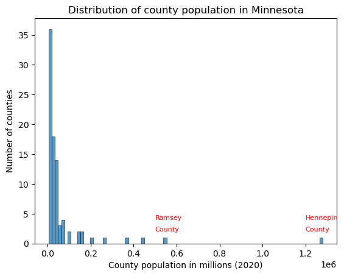
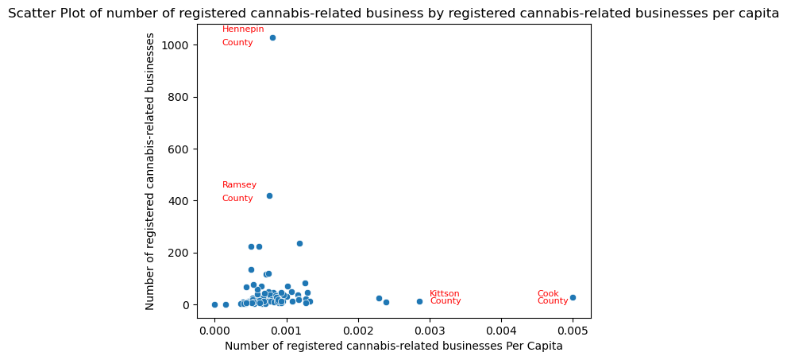
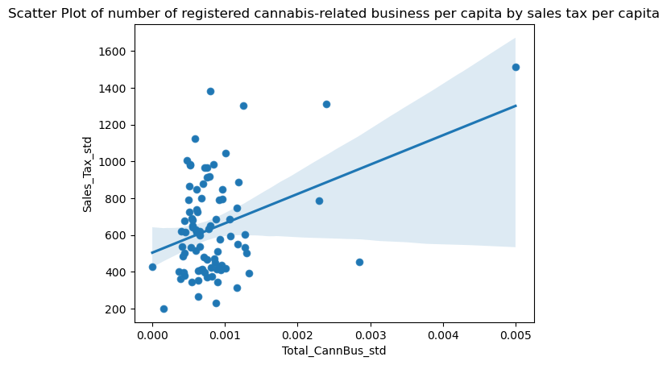
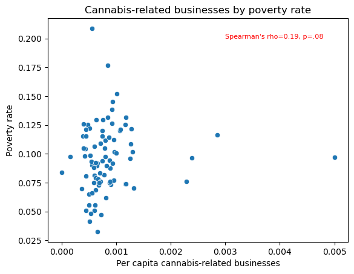
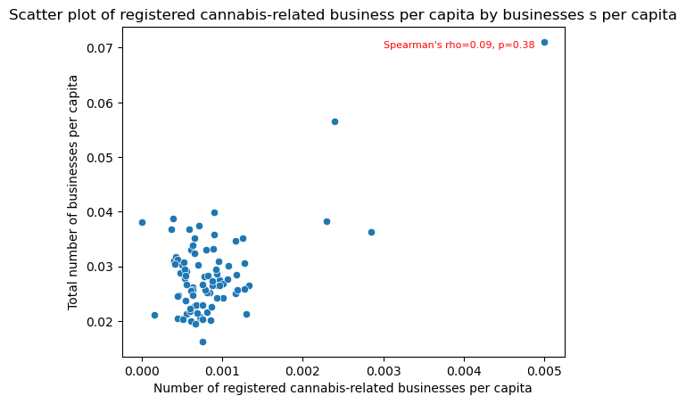
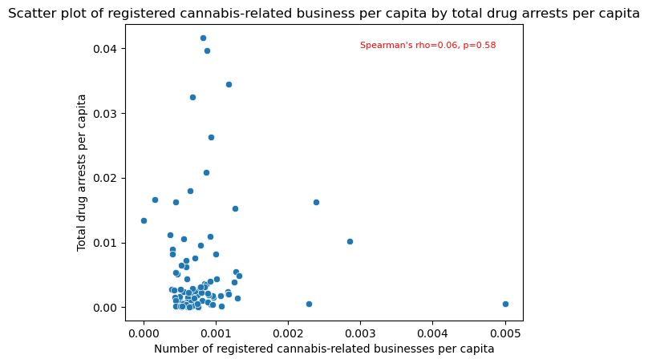
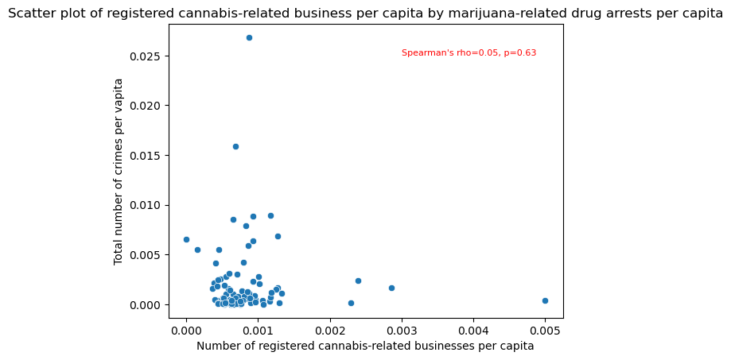
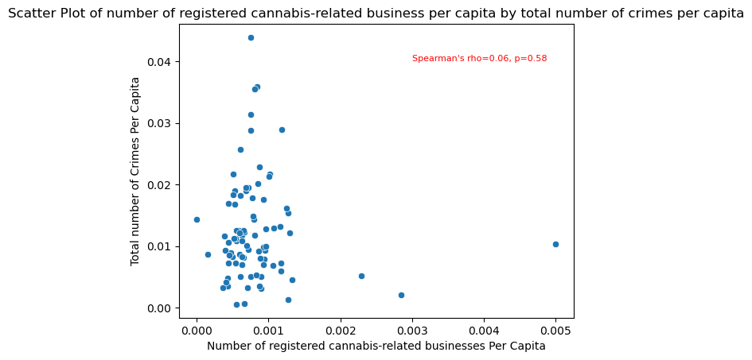

# Minnesota Cannabis-Releated Businesses Following Legalization

Cannabis was legalized in Minnesota for medicinal use in 2014 and for recreational use in 2023. As part of the 2023 legislation, the Office of Cannabis Management was established to set up a regulatory framework along with 12 types of commercial licenses. In 2023, 39 states had legalized cannabis for medical purposes and 24 states had legalized it for recreational purposes with several states legalizing cannabis as early as 2013. A recent review of the social and economic effects ([Brown, Cohen, and Felix, 2024](https://www.kansascityfed.org/Research%20Working%20Papers/documents/9825/rwp23-10browncohenfelix.pdf)) by the Federal Reserve of Kansas City across states that had legalized cannabis found overall that states both increased state income and property values but also homelesseness, substance use disorders, and arrests.

This analysis aims to answer the following questions about cannabis-related businesses following legalization:
* How are cannabis-related businesses distributed across the state?
* Is the distribution of businesses related to any economic or social indicators?
* What has impacted the early distribution of cannabis-related businsses in the state?

In order to answer these questions, we will take the following steps to conduct an exploratory data analysis:
* Identification and cleaning of data on Minnesota cannabis-related businesses
* Creating a county-level dataset that combines data on cannabis-related businesses and social and economic indicators
* Conducting bivariate analysis to examine the relationship between cannabis-related businesses and other indicators
* Examining the geographic distribution of cannabis-related businesses using chloropleth maps
  
# Data on Cannabis-Related Businesses in Minnesota
The Office of Cannabis Management (OCM) provides a downloaded list of registered businesses that sell products in person or online and manufacturers/wholesalers that have voluntarily registered. https://mn.gov/ocm/businesses/cannabinoid-products/registered-businesses.jsp

The following steps were taken in Excel to correct data records:
* Add county information to four businesses with Minnesota street addresses had no county identification.
* In state code, three variations of MN were all coded to MN.
* One business in Tulsa, OK, was coded as Tulsa for county. No such county exists in Minnesota and it was recoded with county identification.
* A county was idnetified as "New Prauge", which is not a county. It was recoced as Le Sueur County based on its street address.

In total, there were 4,244 cases identified as having a Minnesota County based on street address and 137 cases with "None" for County.
representing out-of-state businesses. This data was then imported into a jupityer notebook.


## Identifying businesses with multiple licenses under the same name and address
In the data file, we check for duplicate cases by identifying cases with the same name and same street address. However, duplicate case here means likely indicates the business has multiple types of licenses with the Office of Cannabis Management rather than an error in record keeping. Since the unit of analysis is the individual business, a decision was made to drop cases where the same business name and street address was identical, indicating the same business had multiple licenses. Since information on specific types of licenses is unavailable, the questions about which types of licenses were held by these business is out of scope. There are 33 duplicate records of business with more than one license. For example:
* Purple Noodle Botanicals LLC        4041 Washington St NE   
* Purple Noodle Botanicals LLC        4041 Washington St NE

## Identifying out-of-state versus businesses registered in Minnesota
After removing businesses with the same name and street address, 96.9% of the businesses are located in Minnesota. The states with the highest
numers of cannabis-related businesses outside of Minnesota (but still registered in Minnesota) were:
* Wisconsin            21
* California           21
* Colorado             15
* Florida              15
* Illinois              9
* Iowa                  6
* North Carolina        4

## Identifying businesses with different locations under the same name
We also check for duplicate cases as defined only by having the same business name. These however, have different street addresses. Based on inspection of the data, there are 449 cases listing a business name that has multiple business locations. Since we are interested in number of businesses, this data is kept in the dataset. Those businesses with 10 or more locations in Minnesota are:

* Super One Foods                           22
* Yayin Gadol, LLC dba Top Ten Liquors      15
* CAPL Retail LLC                           13
* Coborn's Liquor                           12
* European Wax Center                       11
* Cash Wise Liquor                          11
* Cub Wine & Spirits                        10
* Haskell's Inc                             10


# Build county-level data set for integration with data on number of cannabis-related businesses
After removing duplicates with the same business name and address, the data set was aggregated into a county-level data set for integration with other county-level measures and use with chloropleth maps.
I imported and select county-level data for analysis with cannabis businesses from the [Association of Minnesota Counties](https://www.mncounties.org/information_and_jobs/county_data.php).
Specifically, we would like to compare the growth of cannabis businesses against population, economic, and social indicators. Data cleaning from this data included removing asterisks and notes from the worksheets. This data was then merged with the aggregated county-level dataset of county by number of cannabis-related businesses

From worksheet: Demographics
* 2020 Population
* 2020 Households
* Below Poverty Line: All Ages (2020) (Estimate)
* Percent Below Poverty Line: All Ages (2020) (Estimate)

From worksheet: Taxes_State Aids:
* Total Tax (2020)
* Number of Businesses (2020)

From worksheet: Public Safety
* Total Serious Crimes (2021)
* Drug Abuse Arrests: Marijuana (2020)
* Drug Abuse Arrests: Total (2020)


<table border="1" class="dataframe">
  <thead>
    <tr style="text-align: right;">
      <th></th>
      <th>Population</th>
      <th>Households</th>
      <th>Poverty_Perc</th>
      <th>Sales_Tax</th>
      <th>Businesses</th>
      <th>Total_crimes</th>
      <th>Marijuana_DrugArrests</th>
      <th>Total_DrugArrests</th>
      <th>Total_CannBus</th>
    </tr>
  </thead>
  <tbody>
    <tr>
      <th>count</th>
      <td>8.700000e+01</td>
      <td>87.000000</td>
      <td>87.000000</td>
      <td>8.700000e+01</td>
      <td>87.000000</td>
      <td>86.000000</td>
      <td>87.000000</td>
      <td>87.000000</td>
      <td>87.000000</td>
    </tr>
    <tr>
      <th>mean</th>
      <td>6.561394e+04</td>
      <td>25909.528736</td>
      <td>0.096179</td>
      <td>5.879315e+07</td>
      <td>1580.551724</td>
      <td>1562.546512</td>
      <td>62.632184</td>
      <td>165.724138</td>
      <td>48.586207</td>
    </tr>
    <tr>
      <th>std</th>
      <td>1.596184e+05</td>
      <td>64539.926591</td>
      <td>0.029108</td>
      <td>2.012913e+08</td>
      <td>3808.607997</td>
      <td>5641.053745</td>
      <td>129.843566</td>
      <td>344.764587</td>
      <td>122.779302</td>
    </tr>
    <tr>
      <th>min</th>
      <td>3.360000e+03</td>
      <td>1439.000000</td>
      <td>0.032510</td>
      <td>1.301824e+06</td>
      <td>102.000000</td>
      <td>4.000000</td>
      <td>0.000000</td>
      <td>1.000000</td>
      <td>0.000000</td>
    </tr>
    <tr>
      <th>25%</th>
      <td>1.107900e+04</td>
      <td>4573.500000</td>
      <td>0.075946</td>
      <td>5.178800e+06</td>
      <td>357.500000</td>
      <td>71.250000</td>
      <td>6.500000</td>
      <td>21.500000</td>
      <td>8.500000</td>
    </tr>
    <tr>
      <th>50%</th>
      <td>2.229000e+04</td>
      <td>8923.000000</td>
      <td>0.094384</td>
      <td>1.282542e+07</td>
      <td>670.000000</td>
      <td>220.000000</td>
      <td>17.000000</td>
      <td>57.000000</td>
      <td>18.000000</td>
    </tr>
    <tr>
      <th>75%</th>
      <td>4.437300e+04</td>
      <td>17378.500000</td>
      <td>0.115306</td>
      <td>3.120732e+07</td>
      <td>1186.000000</td>
      <td>764.000000</td>
      <td>59.500000</td>
      <td>167.000000</td>
      <td>38.000000</td>
    </tr>
    <tr>
      <th>max</th>
      <td>1.281565e+06</td>
      <td>528547.000000</td>
      <td>0.208834</td>
      <td>1.769021e+09</td>
      <td>32248.000000</td>
      <td>45545.000000</td>
      <td>992.000000</td>
      <td>2880.000000</td>
      <td>1029.000000</td>
    </tr>
  </tbody>
</table>
</div>


# Merge with county-level data on number of cannabis-related businesses per county and rename variables.

```python
df4=pd.read_csv('agg_regbus.csv')

# Merge the result with 
countycann_df = pd.merge(county_df, df4, on='County', how='outer')


```python
countycann_df.rename(columns={'2020 Population': 'Population', '2020 Households': 'Households', 'Percent Below Poverty Line: All Ages (2020 Estimate)': 'Poverty_Perc', 
                              'Total Tax (2020)': 'Sales_Tax', 'Number of Businesses (2020)': 'Businesses', 
                              'Total serious crimes (2021)': 'Total_crimes', 'Drug Abuse Arrests: Marijuana (2020)': 'Marijuana_DrugArrests', 
                              'Drug Abuse Arrests: Total (2020)': 'Total_DrugArrests', 'Business Name': 'Total_CannBus'}, inplace=True)

countycann_df.head()
```

<table border="1" class="dataframe">
  <thead>
    <tr style="text-align: right;">
      <th></th>
      <th>County</th>
      <th>Population</th>
      <th>Households</th>
      <th>Poverty_Perc</th>
      <th>Sales_Tax</th>
      <th>Businesses</th>
      <th>Total_crimes</th>
      <th>Marijuana_DrugArrests</th>
      <th>Total_DrugArrests</th>
      <th>Total_CannBus</th>
    </tr>
  </thead>
  <tbody>
    <tr>
      <th>0</th>
      <td>Aitkin</td>
      <td>15697.0</td>
      <td>7199.0</td>
      <td>0.121807</td>
      <td>9470509.0</td>
      <td>481.0</td>
      <td>242.0</td>
      <td>26.0</td>
      <td>86.0</td>
      <td>20.0</td>
    </tr>
    <tr>
      <th>1</th>
      <td>Anoka</td>
      <td>363887.0</td>
      <td>133879.0</td>
      <td>0.055704</td>
      <td>267942597.0</td>
      <td>7297.0</td>
      <td>6642.0</td>
      <td>162.0</td>
      <td>543.0</td>
      <td>223.0</td>
    </tr>
    <tr>
      <th>2</th>
      <td>Becker</td>
      <td>35183.0</td>
      <td>14371.0</td>
      <td>0.101981</td>
      <td>27972843.0</td>
      <td>967.0</td>
      <td>451.0</td>
      <td>17.0</td>
      <td>53.0</td>
      <td>34.0</td>
    </tr>
    <tr>
      <th>3</th>
      <td>Beltrami</td>
      <td>46228.0</td>
      <td>17678.0</td>
      <td>0.176668</td>
      <td>45388132.0</td>
      <td>1169.0</td>
      <td>1659.0</td>
      <td>33.0</td>
      <td>165.0</td>
      <td>39.0</td>
    </tr>
    <tr>
      <th>4</th>
      <td>Benton</td>
      <td>41379.0</td>
      <td>16479.0</td>
      <td>0.081128</td>
      <td>35083441.0</td>
      <td>924.0</td>
      <td>510.0</td>
      <td>18.0</td>
      <td>33.0</td>
      <td>25.0</td>
    </tr>
  </tbody>
</table>
</div>

# Checking merged datafile
Looking at the descriptive statistics for the data set, almost all indicators are heavily skewed because over 63% of the
state's population lives in the Minneapolis-St. Paul Metropolitan Area with approximately 20% of the state's population living 
in Hennepin County alone.There are also some missing values. Since it's a small dataset, I will look to see where the missing values are.
One problem is a county is named Saint Louis in one data set and St. Louis in another. Another problem is that Traverse County has no cannabis-related businesses so that is showing up as missing data. In the notes removed, one note for Lake of the Woods, "In 2021, crime data was not reported for all twelve months.
We confirmed in original list of registered businesses that none were present for Traverse County. So we will leave total crimes for Lake of the Woods County as  missing value.

```
countycann_df.describe()
```
<table border="1" class="dataframe">
  <thead>
    <tr style="text-align: right;">
      <th></th>
      <th>Population</th>
      <th>Households</th>
      <th>Poverty_Perc</th>
      <th>Sales_Tax</th>
      <th>Businesses</th>
      <th>Total_crimes</th>
      <th>Marijuana_DrugArrests</th>
      <th>Total_DrugArrests</th>
      <th>Total_CannBus</th>
    </tr>
  </thead>
  <tbody>
    <tr>
      <th>count</th>
      <td>8.700000e+01</td>
      <td>87.000000</td>
      <td>87.000000</td>
      <td>8.700000e+01</td>
      <td>87.000000</td>
      <td>86.000000</td>
      <td>87.000000</td>
      <td>87.000000</td>
      <td>86.000000</td>
    </tr>
    <tr>
      <th>mean</th>
      <td>6.561394e+04</td>
      <td>25909.528736</td>
      <td>0.096179</td>
      <td>5.879315e+07</td>
      <td>1580.551724</td>
      <td>1562.546512</td>
      <td>62.632184</td>
      <td>165.724138</td>
      <td>49.151163</td>
    </tr>
    <tr>
      <th>std</th>
      <td>1.596184e+05</td>
      <td>64539.926591</td>
      <td>0.029108</td>
      <td>2.012913e+08</td>
      <td>3808.607997</td>
      <td>5641.053745</td>
      <td>129.843566</td>
      <td>344.764587</td>
      <td>123.385624</td>
    </tr>
    <tr>
      <th>min</th>
      <td>3.360000e+03</td>
      <td>1439.000000</td>
      <td>0.032510</td>
      <td>1.301824e+06</td>
      <td>102.000000</td>
      <td>4.000000</td>
      <td>0.000000</td>
      <td>1.000000</td>
      <td>1.000000</td>
    </tr>
    <tr>
      <th>25%</th>
      <td>1.107900e+04</td>
      <td>4573.500000</td>
      <td>0.075946</td>
      <td>5.178800e+06</td>
      <td>357.500000</td>
      <td>71.250000</td>
      <td>6.500000</td>
      <td>21.500000</td>
      <td>9.000000</td>
    </tr>
    <tr>
      <th>50%</th>
      <td>2.229000e+04</td>
      <td>8923.000000</td>
      <td>0.094384</td>
      <td>1.282542e+07</td>
      <td>670.000000</td>
      <td>220.000000</td>
      <td>17.000000</td>
      <td>57.000000</td>
      <td>18.000000</td>
    </tr>
    <tr>
      <th>75%</th>
      <td>4.437300e+04</td>
      <td>17378.500000</td>
      <td>0.115306</td>
      <td>3.120732e+07</td>
      <td>1186.000000</td>
      <td>764.000000</td>
      <td>59.500000</td>
      <td>167.000000</td>
      <td>38.500000</td>
    </tr>
    <tr>
      <th>max</th>
      <td>1.281565e+06</td>
      <td>528547.000000</td>
      <td>0.208834</td>
      <td>1.769021e+09</td>
      <td>32248.000000</td>
      <td>45545.000000</td>
      <td>992.000000</td>
      <td>2880.000000</td>
      <td>1029.000000</td>
    </tr>
  </tbody>
</table>
</div>

```

```python
# Replace missing value for Traverse County with 0.
countycann_df['Total_CannBus'] = countycann_df['Total_CannBus'].fillna(0)

#Merge Saint Louis and St. Louis into one record.
import pandas as pd

# Step 1: Select rows to merge
rows_to_merge = countycann_df.iloc[[68, 72]]

# Step 2: Replace missing values
merged_row = rows_to_merge.iloc[0].combine_first(rows_to_merge.iloc[1])  # Fill missing values from the second row

# Step 3: Create a new row with a combined ID
merged_row['County'] = '1-2'  # Custom ID for the merged row

# Step 5: Drop old rows
countycann_df = countycann_df.drop(index=[68, 72])

# Step 6: Append the merged row
countycann_df = pd.concat([countycann_df, pd.DataFrame([merged_row])], ignore_index=True)
```
# Exploring the data


   

    
   



    
# Exploring bivariate relationships
To begin exploring the relationship between the number of cannabis-related businesses per capita with other social and economic indiators,
we first create new variables by dividing by county population for sales tax, number of businesses, total number of crimes, marijuana-related drug 
arrests, and drug-related arrests. The poverty rate is already a per capita index. Note that the social and economic indicators are measured in 2022 or earlier, shortly prior to the legalization of recreational cannabis. Spearman's rho is calculated for each relationship and shown in the scatter graphs below. Spearman's rho is a non-parametric alternative to Pearson's and does not rely on the assumptions of underlying distributions of each indicator. 


```python
# Standardize by population
#Sales_Tax, Businesses, Total_crimes, Marijuana_DrugArrests, Total_DrugArrests, Total_CannBus

countycann_df["Sales_Tax_std"] = countycann_df["Sales_Tax"] / countycann_df["Population"]
countycann_df["Businesses_std"] = countycann_df["Businesses"] / countycann_df["Population"]
countycann_df["Total_crimes_std"] = countycann_df["Total_crimes"] / countycann_df["Population"]
countycann_df["Marijuana_DrugArrests_std"] = countycann_df["Marijuana_DrugArrests"] / countycann_df["Population"]
countycann_df["Total_DrugArrests_std"] = countycann_df["Total_DrugArrests"] / countycann_df["Population"]
countycann_df["Total_CannBus_std"] = countycann_df["Total_CannBus"] / countycann_df["Population"]

df_sorted = countycann_df.sort_values(by='Total_CannBus_std')
df_sorted

```


    

    

      

    

    

    

    

    


```python
# In preparation for merging this data with a geojson file, we need to make sure the key variables are named the same.                                                       
countycann_df['COUNTY_NAM'] = countycann_df['County'].replace({'1-2': 'Saint Louis', 'Lac qui Parle': 'Lac Qui Parle'})

countycann_df
```
<table border="1" class="dataframe">
  <thead>
    <tr style="text-align: right;">
      <th></th>
      <th>County</th>
      <th>Population</th>
      <th>Households</th>
      <th>Poverty_Perc</th>
      <th>Sales_Tax</th>
      <th>Businesses</th>
      <th>Total_crimes</th>
      <th>Marijuana_DrugArrests</th>
      <th>Total_DrugArrests</th>
      <th>Total_CannBus</th>
      <th>Sales_Tax_std</th>
      <th>Businesses_std</th>
      <th>Total_crimes_std</th>
      <th>Marijuana_DrugArrests_std</th>
      <th>Total_DrugArrests_std</th>
      <th>Total_CannBus_std</th>
      <th>COUNTY_NAM</th>
    </tr>
  </thead>
  <tbody>
    <tr>
      <th>0</th>
      <td>Aitkin</td>
      <td>15697.0</td>
      <td>7199.0</td>
      <td>0.121807</td>
      <td>9.470509e+06</td>
      <td>481.0</td>
      <td>242.0</td>
      <td>26.0</td>
      <td>86.0</td>
      <td>20.0</td>
      <td>603.332420</td>
      <td>0.030643</td>
      <td>0.015417</td>
      <td>0.001656</td>
      <td>0.005479</td>
      <td>0.001274</td>
      <td>Aitkin</td>
    </tr>
    <tr>
      <th>1</th>
      <td>Anoka</td>
      <td>363887.0</td>
      <td>133879.0</td>
      <td>0.055704</td>
      <td>2.679426e+08</td>
      <td>7297.0</td>
      <td>6642.0</td>
      <td>162.0</td>
      <td>543.0</td>
      <td>223.0</td>
      <td>736.334623</td>
      <td>0.020053</td>
      <td>0.018253</td>
      <td>0.000445</td>
      <td>0.001492</td>
      <td>0.000613</td>
      <td>Anoka</td>
    </tr>
    <tr>
      <th>2</th>
      <td>Becker</td>
      <td>35183.0</td>
      <td>14371.0</td>
      <td>0.101981</td>
      <td>2.797284e+07</td>
      <td>967.0</td>
      <td>451.0</td>
      <td>17.0</td>
      <td>53.0</td>
      <td>34.0</td>
      <td>795.067021</td>
      <td>0.027485</td>
      <td>0.012819</td>
      <td>0.000483</td>
      <td>0.001506</td>
      <td>0.000966</td>
      <td>Becker</td>
    </tr>
    <tr>
      <th>3</th>
      <td>Beltrami</td>
      <td>46228.0</td>
      <td>17678.0</td>
      <td>0.176668</td>
      <td>4.538813e+07</td>
      <td>1169.0</td>
      <td>1659.0</td>
      <td>33.0</td>
      <td>165.0</td>
      <td>39.0</td>
      <td>981.832050</td>
      <td>0.025288</td>
      <td>0.035887</td>
      <td>0.000714</td>
      <td>0.003569</td>
      <td>0.000844</td>
      <td>Beltrami</td>
    </tr>
    <tr>
      <th>4</th>
      <td>Benton</td>
      <td>41379.0</td>
      <td>16479.0</td>
      <td>0.081128</td>
      <td>3.508344e+07</td>
      <td>924.0</td>
      <td>510.0</td>
      <td>18.0</td>
      <td>33.0</td>
      <td>25.0</td>
      <td>847.856183</td>
      <td>0.022330</td>
      <td>0.012325</td>
      <td>0.000435</td>
      <td>0.000798</td>
      <td>0.000604</td>
      <td>Benton</td>
    </tr>
    <tr>
      <th>5</th>
      <td>Big Stone</td>
      <td>5166.0</td>
      <td>2224.0</td>
      <td>0.115370</td>
      <td>1.870009e+06</td>
      <td>200.0</td>
      <td>60.0</td>
      <td>11.0</td>
      <td>14.0</td>
      <td>2.0</td>
      <td>361.983933</td>
      <td>0.038715</td>
      <td>0.011614</td>
      <td>0.002129</td>
      <td>0.002710</td>
      <td>0.000387</td>
      <td>Big Stone</td>
    </tr>
    <tr>
      <th>6</th>
      <td>Blue Earth</td>
      <td>69112.0</td>
      <td>27193.0</td>
      <td>0.152072</td>
      <td>7.209664e+07</td>
      <td>1855.0</td>
      <td>1501.0</td>
      <td>144.0</td>
      <td>299.0</td>
      <td>70.0</td>
      <td>1043.185496</td>
      <td>0.026840</td>
      <td>0.021718</td>
      <td>0.002084</td>
      <td>0.004326</td>
      <td>0.001013</td>
      <td>Blue Earth</td>
    </tr>
    <tr>
      <th>7</th>
      <td>Brown</td>
      <td>25912.0</td>
      <td>10970.0</td>
      <td>0.065105</td>
      <td>2.049685e+07</td>
      <td>783.0</td>
      <td>216.0</td>
      <td>14.0</td>
      <td>29.0</td>
      <td>13.0</td>
      <td>791.017791</td>
      <td>0.030218</td>
      <td>0.008336</td>
      <td>0.000540</td>
      <td>0.001119</td>
      <td>0.000502</td>
      <td>Brown</td>
    </tr>
    <tr>
      <th>8</th>
      <td>Carlton</td>
      <td>36207.0</td>
      <td>13789.0</td>
      <td>0.101555</td>
      <td>1.807917e+07</td>
      <td>770.0</td>
      <td>442.0</td>
      <td>7.0</td>
      <td>50.0</td>
      <td>47.0</td>
      <td>499.327975</td>
      <td>0.021267</td>
      <td>0.012208</td>
      <td>0.000193</td>
      <td>0.001381</td>
      <td>0.001298</td>
      <td>Carlton</td>
    </tr>
    <tr>
      <th>9</th>
      <td>Carver</td>
      <td>106922.0</td>
      <td>38863.0</td>
      <td>0.032510</td>
      <td>6.401514e+07</td>
      <td>2428.0</td>
      <td>875.0</td>
      <td>112.0</td>
      <td>246.0</td>
      <td>70.0</td>
      <td>598.708760</td>
      <td>0.022708</td>
      <td>0.008184</td>
      <td>0.001047</td>
      <td>0.002301</td>
      <td>0.000655</td>
      <td>Carver</td>
    </tr>
    <tr>
      <th>10</th>
      <td>Cass</td>
      <td>30066.0</td>
      <td>12614.0</td>
      <td>0.125557</td>
      <td>2.247913e+07</td>
      <td>1044.0</td>
      <td>396.0</td>
      <td>9.0</td>
      <td>70.0</td>
      <td>35.0</td>
      <td>747.659449</td>
      <td>0.034724</td>
      <td>0.013171</td>
      <td>0.000299</td>
      <td>0.002328</td>
      <td>0.001164</td>
      <td>Cass</td>
    </tr>
    <tr>
      <th>11</th>
      <td>Chippewa</td>
      <td>12598.0</td>
      <td>5150.0</td>
      <td>0.090332</td>
      <td>8.099470e+06</td>
      <td>368.0</td>
      <td>7.0</td>
      <td>3.0</td>
      <td>8.0</td>
      <td>7.0</td>
      <td>642.917130</td>
      <td>0.029211</td>
      <td>0.000556</td>
      <td>0.000238</td>
      <td>0.000635</td>
      <td>0.000556</td>
      <td>Chippewa</td>
    </tr>
    <tr>
      <th>12</th>
      <td>Chisago</td>
      <td>56621.0</td>
      <td>20900.0</td>
      <td>0.061638</td>
      <td>2.384225e+07</td>
      <td>1228.0</td>
      <td>666.0</td>
      <td>30.0</td>
      <td>61.0</td>
      <td>46.0</td>
      <td>421.084880</td>
      <td>0.021688</td>
      <td>0.011762</td>
      <td>0.000530</td>
      <td>0.001077</td>
      <td>0.000812</td>
      <td>Chisago</td>
    </tr>
    <tr>
      <th>13</th>
      <td>Clay</td>
      <td>65318.0</td>
      <td>24931.0</td>
      <td>0.119952</td>
      <td>3.036245e+07</td>
      <td>1063.0</td>
      <td>2045.0</td>
      <td>35.0</td>
      <td>121.0</td>
      <td>49.0</td>
      <td>464.840457</td>
      <td>0.016274</td>
      <td>0.031308</td>
      <td>0.000536</td>
      <td>0.001852</td>
      <td>0.000750</td>
      <td>Clay</td>
    </tr>
    <tr>
      <th>14</th>
      <td>Clearwater</td>
      <td>8524.0</td>
      <td>3487.0</td>
      <td>0.145354</td>
      <td>3.501348e+06</td>
      <td>226.0</td>
      <td>67.0</td>
      <td>2.0</td>
      <td>3.0</td>
      <td>8.0</td>
      <td>410.763491</td>
      <td>0.026513</td>
      <td>0.007860</td>
      <td>0.000235</td>
      <td>0.000352</td>
      <td>0.000939</td>
      <td>Clearwater</td>
    </tr>
    <tr>
      <th>15</th>
      <td>Cook</td>
      <td>5600.0</td>
      <td>2711.0</td>
      <td>0.096964</td>
      <td>8.480895e+06</td>
      <td>398.0</td>
      <td>58.0</td>
      <td>2.0</td>
      <td>3.0</td>
      <td>28.0</td>
      <td>1514.445536</td>
      <td>0.071071</td>
      <td>0.010357</td>
      <td>0.000357</td>
      <td>0.000536</td>
      <td>0.005000</td>
      <td>Cook</td>
    </tr>
    <tr>
      <th>16</th>
      <td>Cottonwood</td>
      <td>11517.0</td>
      <td>4671.0</td>
      <td>0.112442</td>
      <td>5.035504e+06</td>
      <td>356.0</td>
      <td>107.0</td>
      <td>10.0</td>
      <td>20.0</td>
      <td>11.0</td>
      <td>437.223583</td>
      <td>0.030911</td>
      <td>0.009291</td>
      <td>0.000868</td>
      <td>0.001737</td>
      <td>0.000955</td>
      <td>Cottonwood</td>
    </tr>
    <tr>
      <th>17</th>
      <td>Crow Wing</td>
      <td>66123.0</td>
      <td>27872.0</td>
      <td>0.096169</td>
      <td>8.604776e+07</td>
      <td>2331.0</td>
      <td>1071.0</td>
      <td>102.0</td>
      <td>255.0</td>
      <td>83.0</td>
      <td>1301.328781</td>
      <td>0.035252</td>
      <td>0.016197</td>
      <td>0.001543</td>
      <td>0.003856</td>
      <td>0.001255</td>
      <td>Crow Wing</td>
    </tr>
    <tr>
      <th>18</th>
      <td>Dakota</td>
      <td>439882.0</td>
      <td>168008.0</td>
      <td>0.055640</td>
      <td>3.814711e+08</td>
      <td>8999.0</td>
      <td>9557.0</td>
      <td>290.0</td>
      <td>716.0</td>
      <td>223.0</td>
      <td>867.212434</td>
      <td>0.020458</td>
      <td>0.021726</td>
      <td>0.000659</td>
      <td>0.001628</td>
      <td>0.000507</td>
      <td>Dakota</td>
    </tr>
    <tr>
      <th>19</th>
      <td>Dodge</td>
      <td>20867.0</td>
      <td>7903.0</td>
      <td>0.047060</td>
      <td>8.270258e+06</td>
      <td>429.0</td>
      <td>196.0</td>
      <td>17.0</td>
      <td>53.0</td>
      <td>15.0</td>
      <td>396.331912</td>
      <td>0.020559</td>
      <td>0.009393</td>
      <td>0.000815</td>
      <td>0.002540</td>
      <td>0.000719</td>
      <td>Dodge</td>
    </tr>
    <tr>
      <th>20</th>
      <td>Douglas</td>
      <td>39006.0</td>
      <td>16557.0</td>
      <td>0.075142</td>
      <td>4.374868e+07</td>
      <td>1438.0</td>
      <td>491.0</td>
      <td>62.0</td>
      <td>243.0</td>
      <td>23.0</td>
      <td>1121.588499</td>
      <td>0.036866</td>
      <td>0.012588</td>
      <td>0.001589</td>
      <td>0.006230</td>
      <td>0.000590</td>
      <td>Douglas</td>
    </tr>
    <tr>
      <th>21</th>
      <td>Faribault</td>
      <td>13921.0</td>
      <td>6086.0</td>
      <td>0.104375</td>
      <td>5.534870e+06</td>
      <td>436.0</td>
      <td>49.0</td>
      <td>5.0</td>
      <td>21.0</td>
      <td>6.0</td>
      <td>397.591409</td>
      <td>0.031320</td>
      <td>0.003520</td>
      <td>0.000359</td>
      <td>0.001509</td>
      <td>0.000431</td>
      <td>Faribault</td>
    </tr>
    <tr>
      <th>22</th>
      <td>Fillmore</td>
      <td>21228.0</td>
      <td>8605.0</td>
      <td>0.090588</td>
      <td>1.319767e+07</td>
      <td>701.0</td>
      <td>106.0</td>
      <td>0.0</td>
      <td>1.0</td>
      <td>13.0</td>
      <td>621.710383</td>
      <td>0.033022</td>
      <td>0.004993</td>
      <td>0.000000</td>
      <td>0.000047</td>
      <td>0.000612</td>
      <td>Fillmore</td>
    </tr>
    <tr>
      <th>23</th>
      <td>Freeborn</td>
      <td>30895.0</td>
      <td>13076.0</td>
      <td>0.094384</td>
      <td>2.111853e+07</td>
      <td>819.0</td>
      <td>707.0</td>
      <td>34.0</td>
      <td>109.0</td>
      <td>27.0</td>
      <td>683.558149</td>
      <td>0.026509</td>
      <td>0.022884</td>
      <td>0.001101</td>
      <td>0.003528</td>
      <td>0.000874</td>
      <td>Freeborn</td>
    </tr>
    <tr>
      <th>24</th>
      <td>Goodhue</td>
      <td>47582.0</td>
      <td>19499.0</td>
      <td>0.081943</td>
      <td>3.020361e+07</td>
      <td>1341.0</td>
      <td>847.0</td>
      <td>66.0</td>
      <td>146.0</td>
      <td>37.0</td>
      <td>634.769661</td>
      <td>0.028183</td>
      <td>0.017801</td>
      <td>0.001387</td>
      <td>0.003068</td>
      <td>0.000778</td>
      <td>Goodhue</td>
    </tr>
    <tr>
      <th>25</th>
      <td>Grant</td>
      <td>6074.0</td>
      <td>2540.0</td>
      <td>0.091538</td>
      <td>3.271126e+06</td>
      <td>214.0</td>
      <td>4.0</td>
      <td>2.0</td>
      <td>5.0</td>
      <td>4.0</td>
      <td>538.545604</td>
      <td>0.035232</td>
      <td>0.000659</td>
      <td>0.000329</td>
      <td>0.000823</td>
      <td>0.000659</td>
      <td>Grant</td>
    </tr>
    <tr>
      <th>26</th>
      <td>Hennepin</td>
      <td>1281565.0</td>
      <td>528547.0</td>
      <td>0.097743</td>
      <td>1.769021e+09</td>
      <td>32248.0</td>
      <td>45545.0</td>
      <td>992.0</td>
      <td>2880.0</td>
      <td>1029.0</td>
      <td>1380.360055</td>
      <td>0.025163</td>
      <td>0.035539</td>
      <td>0.000774</td>
      <td>0.002247</td>
      <td>0.000803</td>
      <td>Hennepin</td>
    </tr>
    <tr>
      <th>27</th>
      <td>Houston</td>
      <td>18843.0</td>
      <td>8013.0</td>
      <td>0.073927</td>
      <td>5.879341e+06</td>
      <td>471.0</td>
      <td>113.0</td>
      <td>14.0</td>
      <td>39.0</td>
      <td>22.0</td>
      <td>312.017248</td>
      <td>0.024996</td>
      <td>0.005997</td>
      <td>0.000743</td>
      <td>0.002070</td>
      <td>0.001168</td>
      <td>Houston</td>
    </tr>
    <tr>
      <th>28</th>
      <td>Hubbard</td>
      <td>21344.0</td>
      <td>8885.0</td>
      <td>0.111460</td>
      <td>1.389392e+07</td>
      <td>707.0</td>
      <td>307.0</td>
      <td>91.0</td>
      <td>204.0</td>
      <td>17.0</td>
      <td>650.951977</td>
      <td>0.033124</td>
      <td>0.014383</td>
      <td>0.004263</td>
      <td>0.009558</td>
      <td>0.000796</td>
      <td>Hubbard</td>
    </tr>
    <tr>
      <th>29</th>
      <td>Isanti</td>
      <td>41135.0</td>
      <td>15615.0</td>
      <td>0.072663</td>
      <td>3.284880e+07</td>
      <td>947.0</td>
      <td>783.0</td>
      <td>25.0</td>
      <td>117.0</td>
      <td>28.0</td>
      <td>798.560788</td>
      <td>0.023022</td>
      <td>0.019035</td>
      <td>0.000608</td>
      <td>0.002844</td>
      <td>0.000681</td>
      <td>Isanti</td>
    </tr>
    <tr>
      <th>30</th>
      <td>Itasca</td>
      <td>45014.0</td>
      <td>18968.0</td>
      <td>0.120296</td>
      <td>3.077557e+07</td>
      <td>1244.0</td>
      <td>307.0</td>
      <td>16.0</td>
      <td>80.0</td>
      <td>48.0</td>
      <td>683.688808</td>
      <td>0.027636</td>
      <td>0.006820</td>
      <td>0.000355</td>
      <td>0.001777</td>
      <td>0.001066</td>
      <td>Itasca</td>
    </tr>
    <tr>
      <th>31</th>
      <td>Jackson</td>
      <td>9989.0</td>
      <td>4307.0</td>
      <td>0.073180</td>
      <td>5.081199e+06</td>
      <td>398.0</td>
      <td>31.0</td>
      <td>5.0</td>
      <td>19.0</td>
      <td>9.0</td>
      <td>508.679447</td>
      <td>0.039844</td>
      <td>0.003103</td>
      <td>0.000501</td>
      <td>0.001902</td>
      <td>0.000901</td>
      <td>Jackson</td>
    </tr>
    <tr>
      <th>32</th>
      <td>Kanabec</td>
      <td>16032.0</td>
      <td>6530.0</td>
      <td>0.093875</td>
      <td>5.920621e+06</td>
      <td>367.0</td>
      <td>81.0</td>
      <td>0.0</td>
      <td>3.0</td>
      <td>12.0</td>
      <td>369.300212</td>
      <td>0.022892</td>
      <td>0.005052</td>
      <td>0.000000</td>
      <td>0.000187</td>
      <td>0.000749</td>
      <td>Kanabec</td>
    </tr>
    <tr>
      <th>33</th>
      <td>Kandiyohi</td>
      <td>43732.0</td>
      <td>17079.0</td>
      <td>0.098806</td>
      <td>4.304423e+07</td>
      <td>1214.0</td>
      <td>831.0</td>
      <td>83.0</td>
      <td>285.0</td>
      <td>23.0</td>
      <td>984.272981</td>
      <td>0.027760</td>
      <td>0.019002</td>
      <td>0.001898</td>
      <td>0.006517</td>
      <td>0.000526</td>
      <td>Kandiyohi</td>
    </tr>
    <tr>
      <th>34</th>
      <td>Kittson</td>
      <td>4207.0</td>
      <td>1846.0</td>
      <td>0.116473</td>
      <td>1.901161e+06</td>
      <td>153.0</td>
      <td>9.0</td>
      <td>7.0</td>
      <td>43.0</td>
      <td>12.0</td>
      <td>451.904207</td>
      <td>0.036368</td>
      <td>0.002139</td>
      <td>0.001664</td>
      <td>0.010221</td>
      <td>0.002852</td>
      <td>Kittson</td>
    </tr>
    <tr>
      <th>35</th>
      <td>Koochiching</td>
      <td>12062.0</td>
      <td>5604.0</td>
      <td>0.121290</td>
      <td>7.145964e+06</td>
      <td>364.0</td>
      <td>156.0</td>
      <td>0.0</td>
      <td>2.0</td>
      <td>13.0</td>
      <td>592.436080</td>
      <td>0.030177</td>
      <td>0.012933</td>
      <td>0.000000</td>
      <td>0.000166</td>
      <td>0.001078</td>
      <td>Koochiching</td>
    </tr>
    <tr>
      <th>36</th>
      <td>Lac qui Parle</td>
      <td>6719.0</td>
      <td>2954.0</td>
      <td>0.087662</td>
      <td>2.303964e+06</td>
      <td>241.0</td>
      <td>34.0</td>
      <td>1.0</td>
      <td>5.0</td>
      <td>6.0</td>
      <td>342.902813</td>
      <td>0.035868</td>
      <td>0.005060</td>
      <td>0.000149</td>
      <td>0.000744</td>
      <td>0.000893</td>
      <td>Lac Qui Parle</td>
    </tr>
    <tr>
      <th>37</th>
      <td>Lake</td>
      <td>10905.0</td>
      <td>4869.0</td>
      <td>0.076020</td>
      <td>8.563339e+06</td>
      <td>418.0</td>
      <td>56.0</td>
      <td>2.0</td>
      <td>6.0</td>
      <td>25.0</td>
      <td>785.267217</td>
      <td>0.038331</td>
      <td>0.005135</td>
      <td>0.000183</td>
      <td>0.000550</td>
      <td>0.002293</td>
      <td>Lake</td>
    </tr>
    <tr>
      <th>38</th>
      <td>Lake of the Woods</td>
      <td>3763.0</td>
      <td>1745.0</td>
      <td>0.096466</td>
      <td>4.936857e+06</td>
      <td>213.0</td>
      <td>NaN</td>
      <td>9.0</td>
      <td>61.0</td>
      <td>9.0</td>
      <td>1311.947117</td>
      <td>0.056604</td>
      <td>NaN</td>
      <td>0.002392</td>
      <td>0.016210</td>
      <td>0.002392</td>
      <td>Lake of the Woods</td>
    </tr>
    <tr>
      <th>39</th>
      <td>Le Sueur</td>
      <td>28674.0</td>
      <td>11287.0</td>
      <td>0.079096</td>
      <td>1.155788e+07</td>
      <td>753.0</td>
      <td>201.0</td>
      <td>2.0</td>
      <td>4.0</td>
      <td>18.0</td>
      <td>403.078817</td>
      <td>0.026261</td>
      <td>0.007010</td>
      <td>0.000070</td>
      <td>0.000139</td>
      <td>0.000628</td>
      <td>Le Sueur</td>
    </tr>
    <tr>
      <th>40</th>
      <td>Lincoln</td>
      <td>5640.0</td>
      <td>2452.0</td>
      <td>0.109043</td>
      <td>2.712791e+06</td>
      <td>211.0</td>
      <td>18.0</td>
      <td>17.0</td>
      <td>43.0</td>
      <td>4.0</td>
      <td>480.991312</td>
      <td>0.037411</td>
      <td>0.003191</td>
      <td>0.003014</td>
      <td>0.007624</td>
      <td>0.000709</td>
      <td>Lincoln</td>
    </tr>
    <tr>
      <th>41</th>
      <td>Lyon</td>
      <td>25269.0</td>
      <td>10137.0</td>
      <td>0.125252</td>
      <td>2.536655e+07</td>
      <td>730.0</td>
      <td>224.0</td>
      <td>65.0</td>
      <td>129.0</td>
      <td>12.0</td>
      <td>1003.860461</td>
      <td>0.028889</td>
      <td>0.008865</td>
      <td>0.002572</td>
      <td>0.005105</td>
      <td>0.000475</td>
      <td>Lyon</td>
    </tr>
    <tr>
      <th>42</th>
      <td>Mahnomen</td>
      <td>5411.0</td>
      <td>2014.0</td>
      <td>0.208834</td>
      <td>3.690860e+06</td>
      <td>115.0</td>
      <td>68.0</td>
      <td>15.0</td>
      <td>57.0</td>
      <td>3.0</td>
      <td>682.103123</td>
      <td>0.021253</td>
      <td>0.012567</td>
      <td>0.002772</td>
      <td>0.010534</td>
      <td>0.000554</td>
      <td>Mahnomen</td>
    </tr>
    <tr>
      <th>43</th>
      <td>Marshall</td>
      <td>9040.0</td>
      <td>3836.0</td>
      <td>0.070133</td>
      <td>3.549591e+06</td>
      <td>240.0</td>
      <td>41.0</td>
      <td>10.0</td>
      <td>44.0</td>
      <td>12.0</td>
      <td>392.653872</td>
      <td>0.026549</td>
      <td>0.004535</td>
      <td>0.001106</td>
      <td>0.004867</td>
      <td>0.001327</td>
      <td>Marshall</td>
    </tr>
    <tr>
      <th>44</th>
      <td>Martin</td>
      <td>20025.0</td>
      <td>8748.0</td>
      <td>0.126042</td>
      <td>1.240133e+07</td>
      <td>622.0</td>
      <td>187.0</td>
      <td>10.0</td>
      <td>179.0</td>
      <td>8.0</td>
      <td>619.292385</td>
      <td>0.031061</td>
      <td>0.009338</td>
      <td>0.000499</td>
      <td>0.008939</td>
      <td>0.000400</td>
      <td>Martin</td>
    </tr>
    <tr>
      <th>45</th>
      <td>McLeod</td>
      <td>36771.0</td>
      <td>15004.0</td>
      <td>0.068723</td>
      <td>2.663848e+07</td>
      <td>946.0</td>
      <td>434.0</td>
      <td>3.0</td>
      <td>7.0</td>
      <td>23.0</td>
      <td>724.442686</td>
      <td>0.025727</td>
      <td>0.011803</td>
      <td>0.000082</td>
      <td>0.000190</td>
      <td>0.000625</td>
      <td>McLeod</td>
    </tr>
    <tr>
      <th>46</th>
      <td>Meeker</td>
      <td>23400.0</td>
      <td>9263.0</td>
      <td>0.065855</td>
      <td>1.526442e+07</td>
      <td>624.0</td>
      <td>253.0</td>
      <td>24.0</td>
      <td>55.0</td>
      <td>13.0</td>
      <td>652.325513</td>
      <td>0.026667</td>
      <td>0.010812</td>
      <td>0.001026</td>
      <td>0.002350</td>
      <td>0.000556</td>
      <td>Meeker</td>
    </tr>
    <tr>
      <th>47</th>
      <td>Mille Lacs</td>
      <td>26459.0</td>
      <td>10593.0</td>
      <td>0.106240</td>
      <td>1.630407e+07</td>
      <td>675.0</td>
      <td>679.0</td>
      <td>37.0</td>
      <td>115.0</td>
      <td>16.0</td>
      <td>616.201330</td>
      <td>0.025511</td>
      <td>0.025662</td>
      <td>0.001398</td>
      <td>0.004346</td>
      <td>0.000605</td>
      <td>Mille Lacs</td>
    </tr>
    <tr>
      <th>48</th>
      <td>Morrison</td>
      <td>34010.0</td>
      <td>13688.0</td>
      <td>0.098765</td>
      <td>1.804770e+07</td>
      <td>1003.0</td>
      <td>570.0</td>
      <td>1.0</td>
      <td>2.0</td>
      <td>18.0</td>
      <td>530.658483</td>
      <td>0.029491</td>
      <td>0.016760</td>
      <td>0.000029</td>
      <td>0.000059</td>
      <td>0.000529</td>
      <td>Morrison</td>
    </tr>
    <tr>
      <th>49</th>
      <td>Mower</td>
      <td>40029.0</td>
      <td>15700.0</td>
      <td>0.131829</td>
      <td>1.887791e+07</td>
      <td>809.0</td>
      <td>808.0</td>
      <td>52.0</td>
      <td>124.0</td>
      <td>34.0</td>
      <td>471.605786</td>
      <td>0.020210</td>
      <td>0.020185</td>
      <td>0.001299</td>
      <td>0.003098</td>
      <td>0.000849</td>
      <td>Mower</td>
    </tr>
    <tr>
      <th>50</th>
      <td>Murray</td>
      <td>8179.0</td>
      <td>3581.0</td>
      <td>0.069935</td>
      <td>3.283575e+06</td>
      <td>301.0</td>
      <td>27.0</td>
      <td>13.0</td>
      <td>91.0</td>
      <td>3.0</td>
      <td>401.464115</td>
      <td>0.036802</td>
      <td>0.003301</td>
      <td>0.001589</td>
      <td>0.011126</td>
      <td>0.000367</td>
      <td>Murray</td>
    </tr>
    <tr>
      <th>51</th>
      <td>Nicollet</td>
      <td>34454.0</td>
      <td>12728.0</td>
      <td>0.078336</td>
      <td>1.404796e+07</td>
      <td>670.0</td>
      <td>421.0</td>
      <td>1.0</td>
      <td>5.0</td>
      <td>23.0</td>
      <td>407.730800</td>
      <td>0.019446</td>
      <td>0.012219</td>
      <td>0.000029</td>
      <td>0.000145</td>
      <td>0.000668</td>
      <td>Nicollet</td>
    </tr>
    <tr>
      <th>52</th>
      <td>Nobles</td>
      <td>22290.0</td>
      <td>7851.0</td>
      <td>0.115523</td>
      <td>1.370935e+07</td>
      <td>550.0</td>
      <td>191.0</td>
      <td>123.0</td>
      <td>363.0</td>
      <td>10.0</td>
      <td>615.044729</td>
      <td>0.024675</td>
      <td>0.008569</td>
      <td>0.005518</td>
      <td>0.016285</td>
      <td>0.000449</td>
      <td>Nobles</td>
    </tr>
    <tr>
      <th>53</th>
      <td>Norman</td>
      <td>6441.0</td>
      <td>2733.0</td>
      <td>0.091601</td>
      <td>2.762739e+06</td>
      <td>185.0</td>
      <td>63.0</td>
      <td>57.0</td>
      <td>169.0</td>
      <td>6.0</td>
      <td>428.930135</td>
      <td>0.028722</td>
      <td>0.009781</td>
      <td>0.008850</td>
      <td>0.026238</td>
      <td>0.000932</td>
      <td>Norman</td>
    </tr>
    <tr>
      <th>54</th>
      <td>Olmsted</td>
      <td>162847.0</td>
      <td>65242.0</td>
      <td>0.076004</td>
      <td>1.572277e+08</td>
      <td>3403.0</td>
      <td>3179.0</td>
      <td>15.0</td>
      <td>56.0</td>
      <td>117.0</td>
      <td>965.493150</td>
      <td>0.020897</td>
      <td>0.019521</td>
      <td>0.000092</td>
      <td>0.000344</td>
      <td>0.000718</td>
      <td>Olmsted</td>
    </tr>
    <tr>
      <th>55</th>
      <td>Otter Tail</td>
      <td>60081.0</td>
      <td>25123.0</td>
      <td>0.083521</td>
      <td>5.280998e+07</td>
      <td>1815.0</td>
      <td>606.0</td>
      <td>4.0</td>
      <td>83.0</td>
      <td>42.0</td>
      <td>878.979761</td>
      <td>0.030209</td>
      <td>0.010086</td>
      <td>0.000067</td>
      <td>0.001381</td>
      <td>0.000699</td>
      <td>Otter Tail</td>
    </tr>
    <tr>
      <th>56</th>
      <td>Pennington</td>
      <td>13992.0</td>
      <td>6077.0</td>
      <td>0.104774</td>
      <td>1.282542e+07</td>
      <td>359.0</td>
      <td>207.0</td>
      <td>5.0</td>
      <td>44.0</td>
      <td>11.0</td>
      <td>916.625357</td>
      <td>0.025658</td>
      <td>0.014794</td>
      <td>0.000357</td>
      <td>0.003145</td>
      <td>0.000786</td>
      <td>Pennington</td>
    </tr>
    <tr>
      <th>57</th>
      <td>Pine</td>
      <td>28876.0</td>
      <td>11442.0</td>
      <td>0.100914</td>
      <td>1.202572e+07</td>
      <td>702.0</td>
      <td>616.0</td>
      <td>81.0</td>
      <td>237.0</td>
      <td>29.0</td>
      <td>416.460833</td>
      <td>0.024311</td>
      <td>0.021333</td>
      <td>0.002805</td>
      <td>0.008208</td>
      <td>0.001004</td>
      <td>Pine</td>
    </tr>
    <tr>
      <th>58</th>
      <td>Pipestone</td>
      <td>9424.0</td>
      <td>3948.0</td>
      <td>0.098154</td>
      <td>4.549692e+06</td>
      <td>299.0</td>
      <td>45.0</td>
      <td>17.0</td>
      <td>25.0</td>
      <td>4.0</td>
      <td>482.777165</td>
      <td>0.031728</td>
      <td>0.004775</td>
      <td>0.001804</td>
      <td>0.002653</td>
      <td>0.000424</td>
      <td>Pipestone</td>
    </tr>
    <tr>
      <th>59</th>
      <td>Polk</td>
      <td>31192.0</td>
      <td>12534.0</td>
      <td>0.114228</td>
      <td>1.401611e+07</td>
      <td>706.0</td>
      <td>285.0</td>
      <td>185.0</td>
      <td>651.0</td>
      <td>27.0</td>
      <td>449.349545</td>
      <td>0.022634</td>
      <td>0.009137</td>
      <td>0.005931</td>
      <td>0.020871</td>
      <td>0.000866</td>
      <td>Polk</td>
    </tr>
    <tr>
      <th>60</th>
      <td>Pope</td>
      <td>11308.0</td>
      <td>4862.0</td>
      <td>0.080916</td>
      <td>5.681456e+06</td>
      <td>354.0</td>
      <td>82.0</td>
      <td>2.0</td>
      <td>11.0</td>
      <td>5.0</td>
      <td>502.428016</td>
      <td>0.031305</td>
      <td>0.007252</td>
      <td>0.000177</td>
      <td>0.000973</td>
      <td>0.000442</td>
      <td>Pope</td>
    </tr>
    <tr>
      <th>61</th>
      <td>Ramsey</td>
      <td>552352.0</td>
      <td>218077.0</td>
      <td>0.129423</td>
      <td>5.048308e+08</td>
      <td>11271.0</td>
      <td>24233.0</td>
      <td>23.0</td>
      <td>46.0</td>
      <td>418.0</td>
      <td>913.965705</td>
      <td>0.020405</td>
      <td>0.043872</td>
      <td>0.000042</td>
      <td>0.000083</td>
      <td>0.000757</td>
      <td>Ramsey</td>
    </tr>
    <tr>
      <th>62</th>
      <td>Red Lake</td>
      <td>3935.0</td>
      <td>1653.0</td>
      <td>0.108513</td>
      <td>2.095928e+06</td>
      <td>102.0</td>
      <td>5.0</td>
      <td>27.0</td>
      <td>60.0</td>
      <td>5.0</td>
      <td>532.637357</td>
      <td>0.025921</td>
      <td>0.001271</td>
      <td>0.006861</td>
      <td>0.015248</td>
      <td>0.001271</td>
      <td>Red Lake</td>
    </tr>
    <tr>
      <th>63</th>
      <td>Redwood</td>
      <td>15425.0</td>
      <td>6318.0</td>
      <td>0.089854</td>
      <td>9.577056e+06</td>
      <td>499.0</td>
      <td>194.0</td>
      <td>132.0</td>
      <td>278.0</td>
      <td>10.0</td>
      <td>620.878833</td>
      <td>0.032350</td>
      <td>0.012577</td>
      <td>0.008558</td>
      <td>0.018023</td>
      <td>0.000648</td>
      <td>Redwood</td>
    </tr>
    <tr>
      <th>64</th>
      <td>Renville</td>
      <td>14723.0</td>
      <td>6153.0</td>
      <td>0.093255</td>
      <td>5.085911e+06</td>
      <td>416.0</td>
      <td>165.0</td>
      <td>1.0</td>
      <td>8.0</td>
      <td>8.0</td>
      <td>345.439856</td>
      <td>0.028255</td>
      <td>0.011207</td>
      <td>0.000068</td>
      <td>0.000543</td>
      <td>0.000543</td>
      <td>Renville</td>
    </tr>
    <tr>
      <th>65</th>
      <td>Rice</td>
      <td>67097.0</td>
      <td>23416.0</td>
      <td>0.088037</td>
      <td>3.446224e+07</td>
      <td>1467.0</td>
      <td>818.0</td>
      <td>10.0</td>
      <td>26.0</td>
      <td>40.0</td>
      <td>513.618239</td>
      <td>0.021864</td>
      <td>0.012191</td>
      <td>0.000149</td>
      <td>0.000387</td>
      <td>0.000596</td>
      <td>Rice</td>
    </tr>
    <tr>
      <th>66</th>
      <td>Rock</td>
      <td>9704.0</td>
      <td>3892.0</td>
      <td>0.089448</td>
      <td>3.616212e+06</td>
      <td>275.0</td>
      <td>51.0</td>
      <td>77.0</td>
      <td>404.0</td>
      <td>8.0</td>
      <td>372.651690</td>
      <td>0.028339</td>
      <td>0.005256</td>
      <td>0.007935</td>
      <td>0.041632</td>
      <td>0.000824</td>
      <td>Rock</td>
    </tr>
    <tr>
      <th>67</th>
      <td>Roseau</td>
      <td>15331.0</td>
      <td>6340.0</td>
      <td>0.073903</td>
      <td>8.439028e+06</td>
      <td>437.0</td>
      <td>111.0</td>
      <td>137.0</td>
      <td>529.0</td>
      <td>18.0</td>
      <td>550.455156</td>
      <td>0.028504</td>
      <td>0.007240</td>
      <td>0.008936</td>
      <td>0.034505</td>
      <td>0.001174</td>
      <td>Roseau</td>
    </tr>
    <tr>
      <th>68</th>
      <td>Scott</td>
      <td>150928.0</td>
      <td>52645.0</td>
      <td>0.051018</td>
      <td>1.022730e+08</td>
      <td>3093.0</td>
      <td>2559.0</td>
      <td>8.0</td>
      <td>17.0</td>
      <td>67.0</td>
      <td>677.628041</td>
      <td>0.020493</td>
      <td>0.016955</td>
      <td>0.000053</td>
      <td>0.000113</td>
      <td>0.000444</td>
      <td>Scott</td>
    </tr>
    <tr>
      <th>69</th>
      <td>Sherburne</td>
      <td>97183.0</td>
      <td>34035.0</td>
      <td>0.050966</td>
      <td>6.114554e+07</td>
      <td>2174.0</td>
      <td>847.0</td>
      <td>304.0</td>
      <td>699.0</td>
      <td>58.0</td>
      <td>629.179352</td>
      <td>0.022370</td>
      <td>0.008716</td>
      <td>0.003128</td>
      <td>0.007193</td>
      <td>0.000597</td>
      <td>Sherburne</td>
    </tr>
    <tr>
      <th>70</th>
      <td>Sibley</td>
      <td>14836.0</td>
      <td>5989.0</td>
      <td>0.074818</td>
      <td>3.417308e+06</td>
      <td>406.0</td>
      <td>52.0</td>
      <td>398.0</td>
      <td>588.0</td>
      <td>13.0</td>
      <td>230.338905</td>
      <td>0.027366</td>
      <td>0.003505</td>
      <td>0.026827</td>
      <td>0.039633</td>
      <td>0.000876</td>
      <td>Sibley</td>
    </tr>
    <tr>
      <th>71</th>
      <td>Stearns</td>
      <td>160211.0</td>
      <td>60587.0</td>
      <td>0.115242</td>
      <td>1.548148e+08</td>
      <td>4270.0</td>
      <td>4621.0</td>
      <td>45.0</td>
      <td>92.0</td>
      <td>120.0</td>
      <td>966.318193</td>
      <td>0.026652</td>
      <td>0.028843</td>
      <td>0.000281</td>
      <td>0.000574</td>
      <td>0.000749</td>
      <td>Stearns</td>
    </tr>
    <tr>
      <th>72</th>
      <td>Steele</td>
      <td>37406.0</td>
      <td>14823.0</td>
      <td>0.077180</td>
      <td>3.163907e+07</td>
      <td>993.0</td>
      <td>374.0</td>
      <td>10.0</td>
      <td>13.0</td>
      <td>36.0</td>
      <td>845.828717</td>
      <td>0.026547</td>
      <td>0.009998</td>
      <td>0.000267</td>
      <td>0.000348</td>
      <td>0.000962</td>
      <td>Steele</td>
    </tr>
    <tr>
      <th>73</th>
      <td>Stevens</td>
      <td>9671.0</td>
      <td>3697.0</td>
      <td>0.122428</td>
      <td>9.466972e+06</td>
      <td>298.0</td>
      <td>109.0</td>
      <td>6.0</td>
      <td>27.0</td>
      <td>5.0</td>
      <td>978.903112</td>
      <td>0.030814</td>
      <td>0.011271</td>
      <td>0.000620</td>
      <td>0.002792</td>
      <td>0.000517</td>
      <td>Stevens</td>
    </tr>
    <tr>
      <th>74</th>
      <td>Swift</td>
      <td>9838.0</td>
      <td>4064.0</td>
      <td>0.105103</td>
      <td>5.271690e+06</td>
      <td>300.0</td>
      <td>41.0</td>
      <td>41.0</td>
      <td>81.0</td>
      <td>4.0</td>
      <td>535.849766</td>
      <td>0.030494</td>
      <td>0.004168</td>
      <td>0.004168</td>
      <td>0.008233</td>
      <td>0.000407</td>
      <td>Swift</td>
    </tr>
    <tr>
      <th>75</th>
      <td>Todd</td>
      <td>25262.0</td>
      <td>9898.0</td>
      <td>0.129681</td>
      <td>6.699592e+06</td>
      <td>627.0</td>
      <td>210.0</td>
      <td>2.0</td>
      <td>2.0</td>
      <td>16.0</td>
      <td>265.204339</td>
      <td>0.024820</td>
      <td>0.008313</td>
      <td>0.000079</td>
      <td>0.000079</td>
      <td>0.000633</td>
      <td>Todd</td>
    </tr>
    <tr>
      <th>76</th>
      <td>Traverse</td>
      <td>3360.0</td>
      <td>1439.0</td>
      <td>0.083929</td>
      <td>1.436739e+06</td>
      <td>128.0</td>
      <td>48.0</td>
      <td>22.0</td>
      <td>45.0</td>
      <td>0.0</td>
      <td>427.600893</td>
      <td>0.038095</td>
      <td>0.014286</td>
      <td>0.006548</td>
      <td>0.013393</td>
      <td>0.000000</td>
      <td>Traverse</td>
    </tr>
    <tr>
      <th>77</th>
      <td>Wabasha</td>
      <td>21387.0</td>
      <td>8923.0</td>
      <td>0.075887</td>
      <td>8.834195e+06</td>
      <td>709.0</td>
      <td>171.0</td>
      <td>13.0</td>
      <td>45.0</td>
      <td>19.0</td>
      <td>413.063777</td>
      <td>0.033151</td>
      <td>0.007996</td>
      <td>0.000608</td>
      <td>0.002104</td>
      <td>0.000888</td>
      <td>Wabasha</td>
    </tr>
    <tr>
      <th>78</th>
      <td>Wadena</td>
      <td>14065.0</td>
      <td>5815.0</td>
      <td>0.138571</td>
      <td>1.111486e+07</td>
      <td>414.0</td>
      <td>99.0</td>
      <td>32.0</td>
      <td>57.0</td>
      <td>13.0</td>
      <td>790.249627</td>
      <td>0.029435</td>
      <td>0.007039</td>
      <td>0.002275</td>
      <td>0.004053</td>
      <td>0.000924</td>
      <td>Wadena</td>
    </tr>
    <tr>
      <th>79</th>
      <td>Waseca</td>
      <td>18968.0</td>
      <td>7387.0</td>
      <td>0.074757</td>
      <td>7.823664e+06</td>
      <td>407.0</td>
      <td>369.0</td>
      <td>301.0</td>
      <td>616.0</td>
      <td>13.0</td>
      <td>412.466470</td>
      <td>0.021457</td>
      <td>0.019454</td>
      <td>0.015869</td>
      <td>0.032476</td>
      <td>0.000685</td>
      <td>Waseca</td>
    </tr>
    <tr>
      <th>80</th>
      <td>Washington</td>
      <td>267568.0</td>
      <td>99507.0</td>
      <td>0.041612</td>
      <td>1.942568e+08</td>
      <td>5453.0</td>
      <td>4896.0</td>
      <td>16.0</td>
      <td>32.0</td>
      <td>136.0</td>
      <td>726.009142</td>
      <td>0.020380</td>
      <td>0.018298</td>
      <td>0.000060</td>
      <td>0.000120</td>
      <td>0.000508</td>
      <td>Washington</td>
    </tr>
    <tr>
      <th>81</th>
      <td>Watonwan</td>
      <td>11253.0</td>
      <td>4476.0</td>
      <td>0.121390</td>
      <td>4.251631e+06</td>
      <td>276.0</td>
      <td>120.0</td>
      <td>28.0</td>
      <td>60.0</td>
      <td>5.0</td>
      <td>377.822003</td>
      <td>0.024527</td>
      <td>0.010664</td>
      <td>0.002488</td>
      <td>0.005332</td>
      <td>0.000444</td>
      <td>Watonwan</td>
    </tr>
    <tr>
      <th>82</th>
      <td>Wilkin</td>
      <td>6506.0</td>
      <td>2735.0</td>
      <td>0.097295</td>
      <td>1.301824e+06</td>
      <td>138.0</td>
      <td>56.0</td>
      <td>36.0</td>
      <td>108.0</td>
      <td>1.0</td>
      <td>200.095911</td>
      <td>0.021211</td>
      <td>0.008607</td>
      <td>0.005533</td>
      <td>0.016600</td>
      <td>0.000154</td>
      <td>Wilkin</td>
    </tr>
    <tr>
      <th>83</th>
      <td>Winona</td>
      <td>49671.0</td>
      <td>20111.0</td>
      <td>0.126190</td>
      <td>2.870016e+07</td>
      <td>1203.0</td>
      <td>873.0</td>
      <td>315.0</td>
      <td>540.0</td>
      <td>46.0</td>
      <td>577.805057</td>
      <td>0.024219</td>
      <td>0.017576</td>
      <td>0.006342</td>
      <td>0.010872</td>
      <td>0.000926</td>
      <td>Winona</td>
    </tr>
    <tr>
      <th>84</th>
      <td>Wright</td>
      <td>141337.0</td>
      <td>50509.0</td>
      <td>0.048402</td>
      <td>9.769519e+07</td>
      <td>3363.0</td>
      <td>1024.0</td>
      <td>19.0</td>
      <td>31.0</td>
      <td>76.0</td>
      <td>691.221619</td>
      <td>0.023794</td>
      <td>0.007245</td>
      <td>0.000134</td>
      <td>0.000219</td>
      <td>0.000538</td>
      <td>Wright</td>
    </tr>
    <tr>
      <th>85</th>
      <td>Yellow Medicine</td>
      <td>9528.0</td>
      <td>4040.0</td>
      <td>0.092464</td>
      <td>3.352272e+06</td>
      <td>323.0</td>
      <td>103.0</td>
      <td>4.0</td>
      <td>22.0</td>
      <td>6.0</td>
      <td>351.833753</td>
      <td>0.033900</td>
      <td>0.010810</td>
      <td>0.000420</td>
      <td>0.002309</td>
      <td>0.000630</td>
      <td>Yellow Medicine</td>
    </tr>
    <tr>
      <th>86</th>
      <td>1-2</td>
      <td>200231.0</td>
      <td>86540.0</td>
      <td>0.131633</td>
      <td>1.776540e+08</td>
      <td>5144.0</td>
      <td>5800.0</td>
      <td>245.0</td>
      <td>401.0</td>
      <td>237.0</td>
      <td>887.245007</td>
      <td>0.025690</td>
      <td>0.028967</td>
      <td>0.001224</td>
      <td>0.002003</td>
      <td>0.001184</td>
      <td>Saint Louis</td>
    </tr>
  </tbody>
</table>
</div>


```python
countycann_df.to_csv('countycann.csv', index=False)
```
