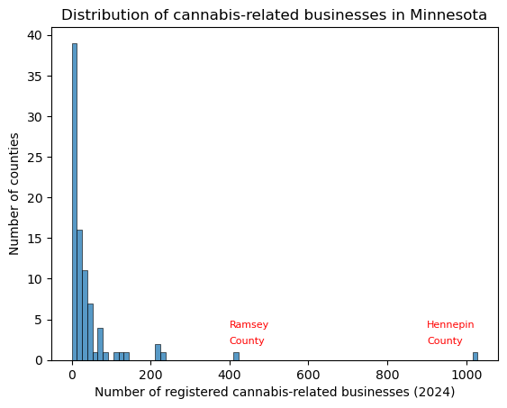
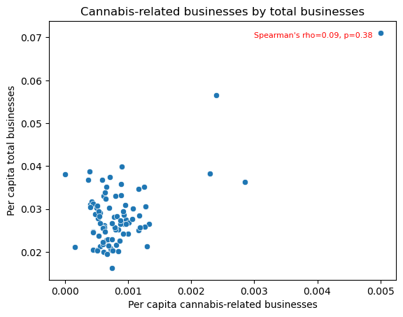
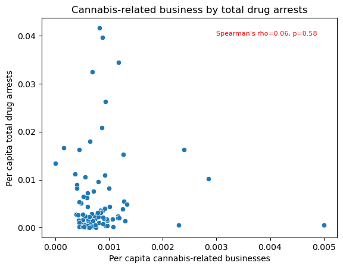
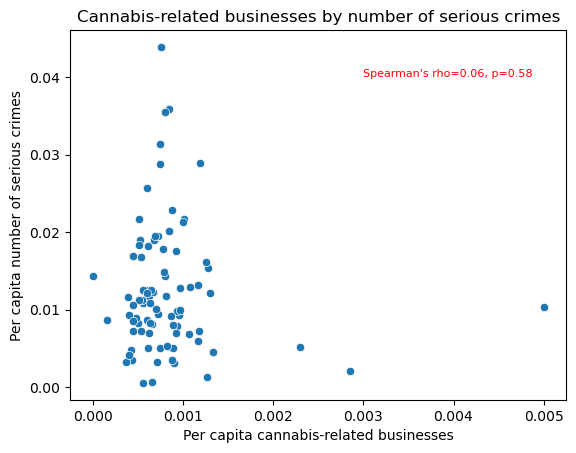

# Minnesota Cannabis-Releated Businesses Following Legalization

Cannabis was legalized in Minnesota for medicinal use in 2014 and for recreational use in 2023. As part of the 2023 legislation, the Office of Cannabis Management was established to set up a regulatory framework along with 12 types of commercial licenses. These licenses apply to cannabis productions, distribution, and retail including hemp-derived products including those using CBD and found in beverages and foods. This framework was slow to be implemented, however, and in 2024 
only (35.6% of license applications)[https://mn.gov/ocm/businesses/equity-applicants/verification-and-licensing-timeline.jsp] were approved. Minnesota's Indian Tribal government are exempt from license requirements and were among the first to open up public dispensaries. 

In 2023, 39 states had legalized cannabis for medical purposes and 24 states had legalized it for recreational purposes with several states legalizing cannabis as early as 2013. A recent review of the social and economic effects ([Brown, Cohen, and Felix, 2024](https://www.kansascityfed.org/Research%20Working%20Papers/documents/9825/rwp23-10browncohenfelix.pdf)) by the Federal Reserve of Kansas City across states that had legalized cannabis found overall that states both increased state income and property values but also homelesseness, substance use disorders, and arrests.

This analysis aims to answer the following questions about cannabis-related businesses following legalization:
* How are cannabis-related businesses distributed across the state?
* Is the distribution of businesses related to any economic or social indicators?
* What has impacted the early distribution of cannabis-related businsses in the state?

In order to answer these questions, we will take the following steps to conduct an exploratory data analysis:
* Identification and cleaning of data on Minnesota cannabis-related businesses
* Creating a county-level dataset that combines data on cannabis-related businesses and social and economic indicators
* Conducting bivariate analysis to examine the relationship between cannabis-related businesses and other indicators
* Examining the geographic distribution of cannabis-related businesses using chloropleth maps
  
# Data on Cannabis-Related Businesses in Minnesota
The Office of Cannabis Management (OCM) provides a downloaded list of registered businesses that sell products in person or online and manufacturers/wholesalers that have voluntarily registered. https://mn.gov/ocm/businesses/cannabinoid-products/registered-businesses.jsp

The following steps were taken in Excel to correct data records:
* Add county information to four businesses with Minnesota street addresses had no county identification.
* In state code, three variations of MN were all coded to MN.
* One business in Tulsa, OK, was coded as Tulsa for county. No such county exists in Minnesota and it was recoded with county identification.
* A county was idnetified as "New Prauge", which is not a county. It was recoced as Le Sueur County based on its street address.

In total, there were 4,244 cases identified as having a Minnesota County based on street address and 137 cases with "None" for County.
representing out-of-state businesses. This data was then imported into a jupityer notebook.

## Identifying businesses with multiple licenses under the same name and address
In the data file, we check for duplicate cases by identifying cases with the same name and same street address. However, duplicate case here means likely indicates the business has multiple types of licenses with the Office of Cannabis Management rather than an error in record keeping. Since the unit of analysis is the individual business, a decision was made to drop cases where the same business name and street address was identical, indicating the same business had multiple licenses. Since information on specific types of licenses is unavailable, the questions about which types of licenses were held by these business is out of scope. There are 33 duplicate records of business with more than one license. For example:
* Purple Noodle Botanicals LLC        4041 Washington St NE   
* Purple Noodle Botanicals LLC        4041 Washington St NE

## Identifying out-of-state versus businesses registered in Minnesota
After removing businesses with the same name and street address, 96.9% of the businesses are located in Minnesota. The states with the highest
numers of cannabis-related businesses outside of Minnesota (but still registered in Minnesota) were:
* Wisconsin            21
* California           21
* Colorado             15
* Florida              15
* Illinois              9
* Iowa                  6
* North Carolina        4

## Identifying businesses with different locations under the same name
We also check for duplicate cases as defined only by having the same business name. These however, have different street addresses. Based on inspection of the data, there are 449 cases listing a business name that has multiple business locations. Since we are interested in number of businesses, this data is kept in the dataset. Those businesses with 10 or more locations in Minnesota are:

* Super One Foods                           22
* Yayin Gadol, LLC dba Top Ten Liquors      15
* CAPL Retail LLC                           13
* Coborn's Liquor                           12
* European Wax Center                       11
* Cash Wise Liquor                          11
* Cub Wine & Spirits                        10
* Haskell's Inc                             10

# Build county-level data set for integration with data on number of cannabis-related businesses
After removing duplicates with the same business name and address, the data set was aggregated into a county-level data set for integration with other county-level measures and use with chloropleth maps.
I imported and select county-level data for analysis with cannabis businesses from the [Association of Minnesota Counties](https://www.mncounties.org/information_and_jobs/county_data.php).
Specifically, we would like to compare the growth of cannabis businesses against population, economic, and social indicators. Data cleaning from this data included removing asterisks and notes from the worksheets. This data was then merged with the aggregated county-level dataset of county by number of cannabis-related businesses. One missing values was for Traverse County which had no cannabis-related businesses. This was recoded from missing to 0. Another was merging county data from Saint Louis County and St. Louis County. Finally, no crime data was reported from Lake of the Woods County in 2021 so that remained as a missing value. 

From worksheet: Demographics
* 2020 Population
* 2020 Households
* Below Poverty Line: All Ages (2020) (Estimate)
* Percent Below Poverty Line: All Ages (2020) (Estimate)

From worksheet: Taxes_State Aids:
* Total Tax (2020)
* Number of Businesses (2020)

From worksheet: Public Safety
* Total Serious Crimes (2021)
* Drug Abuse Arrests: Marijuana (2020)
* Drug Abuse Arrests: Total (2020)

# Exploring county-level data
Looking at the descriptive statistics for the data set, almost all indicators are heavily skewed because over 63% of the
state's population lives in the Minneapolis-St. Paul Metropolitan Area with approximately 20% of the state's population living 
in Hennepin County alone.

<table border="1" class="dataframe">
  <thead>
    <tr style="text-align: right;">
      <th></th>
      <th>Population</th>
      <th>Households</th>
      <th>Poverty_Perc</th>
      <th>Sales_Tax</th>
      <th>Businesses</th>
      <th>Total_crimes</th>
      <th>Marijuana_DrugArrests</th>
      <th>Total_DrugArrests</th>
      <th>Total_CannBus</th>
    </tr>
  </thead>
  <tbody>
    <tr>
      <th>count</th>
      <td>8.700000e+01</td>
      <td>87.000000</td>
      <td>87.000000</td>
      <td>8.700000e+01</td>
      <td>87.000000</td>
      <td>86.000000</td>
      <td>87.000000</td>
      <td>87.000000</td>
      <td>87.000000</td>
    </tr>
    <tr>
      <th>mean</th>
      <td>6.561394e+04</td>
      <td>25909.528736</td>
      <td>0.096179</td>
      <td>5.879315e+07</td>
      <td>1580.551724</td>
      <td>1562.546512</td>
      <td>62.632184</td>
      <td>165.724138</td>
      <td>48.586207</td>
    </tr>
    <tr>
      <th>std</th>
      <td>1.596184e+05</td>
      <td>64539.926591</td>
      <td>0.029108</td>
      <td>2.012913e+08</td>
      <td>3808.607997</td>
      <td>5641.053745</td>
      <td>129.843566</td>
      <td>344.764587</td>
      <td>122.779302</td>
    </tr>
    <tr>
      <th>min</th>
      <td>3.360000e+03</td>
      <td>1439.000000</td>
      <td>0.032510</td>
      <td>1.301824e+06</td>
      <td>102.000000</td>
      <td>4.000000</td>
      <td>0.000000</td>
      <td>1.000000</td>
      <td>0.000000</td>
    </tr>
    <tr>
      <th>25%</th>
      <td>1.107900e+04</td>
      <td>4573.500000</td>
      <td>0.075946</td>
      <td>5.178800e+06</td>
      <td>357.500000</td>
      <td>71.250000</td>
      <td>6.500000</td>
      <td>21.500000</td>
      <td>8.500000</td>
    </tr>
    <tr>
      <th>50%</th>
      <td>2.229000e+04</td>
      <td>8923.000000</td>
      <td>0.094384</td>
      <td>1.282542e+07</td>
      <td>670.000000</td>
      <td>220.000000</td>
      <td>17.000000</td>
      <td>57.000000</td>
      <td>18.000000</td>
    </tr>
    <tr>
      <th>75%</th>
      <td>4.437300e+04</td>
      <td>17378.500000</td>
      <td>0.115306</td>
      <td>3.120732e+07</td>
      <td>1186.000000</td>
      <td>764.000000</td>
      <td>59.500000</td>
      <td>167.000000</td>
      <td>38.000000</td>
    </tr>
    <tr>
      <th>max</th>
      <td>1.281565e+06</td>
      <td>528547.000000</td>
      <td>0.208834</td>
      <td>1.769021e+09</td>
      <td>32248.000000</td>
      <td>45545.000000</td>
      <td>992.000000</td>
      <td>2880.000000</td>
      <td>1029.000000</td>
    </tr>
  </tbody>
</table>

   

    
# Exploring bivariate relationships
To begin exploring the relationship between the number of cannabis-related businesses per capita with other social and economic indiators,
we first create new variables by dividing by county population for sales tax, number of businesses, total number of crimes, marijuana-related drug 
arrests, and drug-related arrests. The poverty rate is already a per capita index.  Spearman's rho is calculated for each relationship and shown in the scatter graphs below. Spearman's rho is a non-parametric alternative to Pearson's and does not rely on the assumptions of underlying distributions of each indicator. 

None of the graphs below suggest an association between a social or economic indicator and the number of cannabis-related businesses. In addition, none of
Spearman rho correlation coefficients indicate a statistically significant association. Note that the social and economic indicators are measured in 2022 or earlier, shortly prior to the legalization of recreational cannabis. There is no preliminary evidence that cannabis-related businesses are either
disproportionately located in areas of high or low prosperity or crime in the first couple years of legalization. 
    

    

      

    

    

    

    

# Examining the geographic distribution of cannabis-related businsses

In preparation for merging this data with a geojson file, we need to make sure the key variables are named the same.  'Lac qui Parle' as 'Lac Qui Parle' to match.
The merged case for "Saint Louis" / "St. Louis" is coded as "Saint Louis". 

County boundary data obtained from [Minnesota Geospatial Commons](https://gisdata.mn.gov/dataset/bdry-counties). I converted SHP files to geojson data using [Mygeodata](https://mygeodata.cloud/converter/shp-to-geojson).

# Mapping cannabis-related businesses in Minnesota
There were no clear associations of the distribution of cannabis-related businesses in Minnesota based on social or economic indicators. To examine the
geographic distribution of cannabis-related businesses, we use folium to build chloropleth maps. Minnesota county boundary maps data is dowloaded 
from the Minnesota Geospatial Commons (https://gisdata.mn.gov/en_AU/dataset/us-mn-state-metc-bdry-census2020counties-ctus). It is not available for 
download in the required geojson format so we convert the SHP files to geojson data using a free service from Mygeodata (https://mygeodata.cloud/converter/shp-to-geojson). I then used folium to construct chloropleth maps that combined county-level data with Minnesota county geographic boundaries.

## MN counties with number of cannabis-related businesses
The map below shows the number of cannabis-related businesses by county. As expected, the darker regions are located in areas of high
population around the Minneapolis-St. Paul area.

## MN counties with number of per capital cannabis-related businesses
The map below shows the same map of Minnesota except with cannabis-related businesses per capita. The map shows a much different pattern
of distribution with counties in northern Minnesota having the highest density of cannabis-related businesses, topped off by Cook County
in the far northeast of the state. There is somewhat lesser density in the southern counties though both regions are clearly more 
dense in the number of businesses than the most populous Twin Cities.

## Marking off locations of 11 of Minnesota's Indian Tribal governments
To this same map of cannabis-related businesses per capita, we add the locations of the headquarters of 11 federally recognized Indian tribes 
in Minnesota. In northern Minnesota, the density of cannabis-related businesses appears to align to Minnesota tribal areas. Under the 2023
Minnesota state statute legalizing recreational Minnesota, tribal areas are exempt from licensing requirements which were anticipated to
take 1-2 two years to be fully implemented. Minnesota tribes are to enter into compacts with Minnesota state government regarding the 
regulation of businesses but this still allows businesses on tribal lands to operate pending finalization of those compacts. Not 
surprisingly, some cannabis-related businesses were immedidately opened on tribal land.

* Bois Forte Band of Chippewa	Nett Lake, MN	48.1000° N	93.0000° W
* Fond du Lac Band of Lake Superior Chippewa	Cloquet, MN	46.7211° N	92.4597° W
* Grand Portage Band of Lake Superior Chippewa	Grand Portage, MN	47.9633° N	89.6917° W
* Leech Lake Band of Ojibwe	Cass Lake, MN	47.3800° N	94.6000° W
* Lower Sioux Indian Community	Near Morton, MN	44.5511° N	94.9844° W
* Mille Lacs Band of Ojibwe	Near Onamia, MN	46.0819° N	93.6672° W
* Prairie Island Indian Community	Near Red Wing, MN	44.6514° N	92.6302° W
* Red Lake Nation	Red Lake, MN	47.8761° N	95.0000° W
* Shakopee Mdewakanton Sioux Community	Prior Lake, MN	44.7133° N	93.4225° W
* Upper Sioux Community	Near Granite Falls, MN	44.7500° N	95.4600° W
* White Earth Nation	White Earth, MN	47.0900° N	95.8500° 

